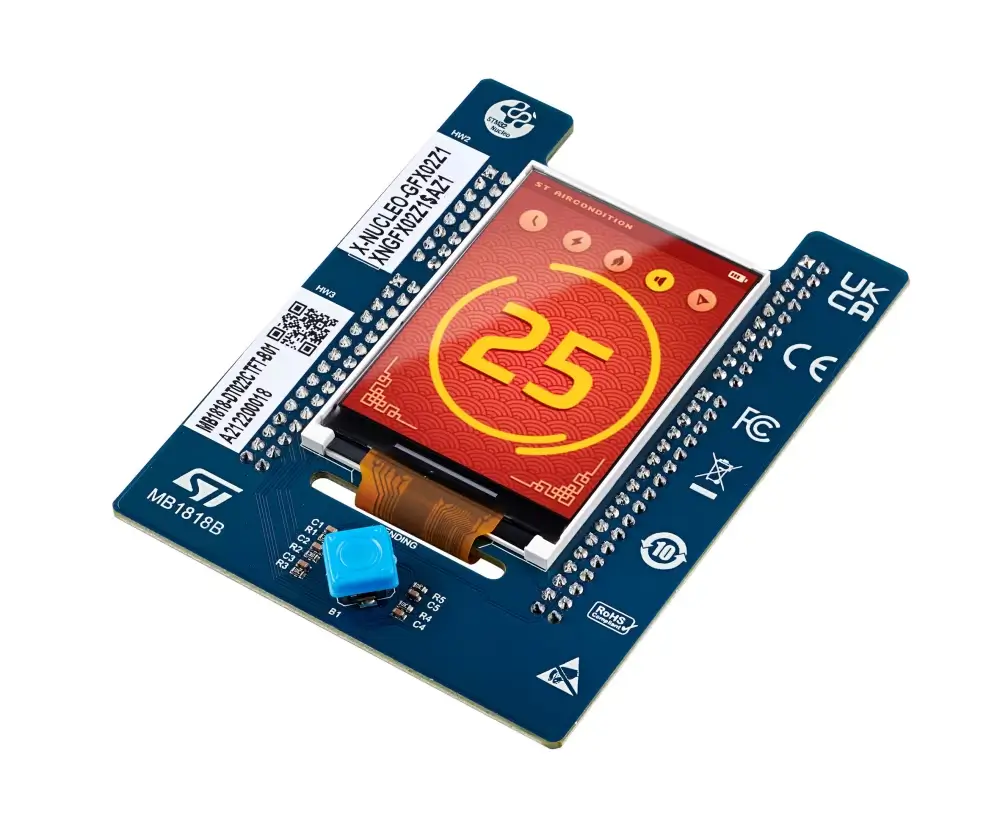

.. _x_nucleo_gfx02z1_shield:

X-NUCLEO-GFX02Z1 Display expansion board
########################################

Overview
********

The X-NUCLEO-GFX02Z1 expansion board adds graphic user interface (GUI)
capability to STM32 Nucleo-144 boards. It features a 2.2" TFT display driven
through an 8-bit Intel 8080 parallel interface, as well as a 64-Mbit Quad-SPI
NOR Flash memory for storing graphic images, texts and textures. The expansion
board also offers a 5-way joystick for GUI navigation.

The board comes in two panel variants, identified by the product
identification code printed on the sticker:

- ``XNGFX02Z1$AZ1``: DT022CTFT panel with an ILI9341V controller
- ``XNGFX02Z1$AZ2``: TCXD022IBLON-5 panel with an ST7789V controller

This shield supports the ``$AZ2`` (ST7789V) variant.

The parallel display is compatible with the ``sitronix,st7789v`` driver, and
the Quad-SPI NOR Flash is compatible with the ``st,stm32-ospi-nor`` driver.

More information about the board can be found at the
`X-NUCLEO-GFX02Z1 website`_.

Requirements
************

This shield can only be used with STM32 Nucleo-144 boards that provide a
configuration for the Zio connectors and expose the ``st_zio_fmc`` connector
(an FMC / Flexible Memory Controller peripheral for the parallel display) and
the ``st_zio_qspi`` connector (an OCTOSPI peripheral for the Quad-SPI NOR
Flash). The shield uses:

- 8-bit Intel 8080 parallel interface (FMC / MIPI DBI Type B) for the display
- Quad-SPI (OCTOSPI) for the NOR Flash memory
- GPIO for the joystick input

Consult the X-NUCLEO-GFX02Z1 user manual for the FMC, OCTOSPI and joystick
pinouts used on your development board:

- `X-NUCLEO-GFX02Z1 User Manual`_

Currently supported boards:

- ``nucleo_u575zi_q``
- ``nucleo_f446ze``

Hardware configuration
**********************

The pin assignments for the parallel display (FMC), the Quad-SPI NOR Flash and
the joystick are board specific and are provided by the shield's board-level
overlays. The Quad-SPI NOR Flash is driven by a different controller peripheral
depending on the board:

- :zephyr_file:`boards/shields/x_nucleo_gfx02z1/boards/nucleo_u575zi_q.overlay`
  for the NUCLEO-U575ZI-Q, where the NOR Flash is wired to the OCTOSPI controller
- :zephyr_file:`boards/shields/x_nucleo_gfx02z1/boards/nucleo_f446ze.overlay`
  for the NUCLEO-F446ZE, where the NOR Flash is wired to the QUADSPI controller

Samples
*******

The :zephyr:code-sample:`display`, :zephyr:code-sample:`jesd216`,
:zephyr:code-sample:`flash-shell` and :zephyr:code-sample:`input-dump` samples
can be used to test out the expansion board's functionality.

Programming
***********

Set ``--shield x_nucleo_gfx02z1_az2`` when you invoke ``west build``. For
example:

.. zephyr-app-commands::
   :zephyr-app: samples/drivers/display/
   :board: nucleo_u575zi_q
   :shield: x_nucleo_gfx02z1_az2
   :goals: build

.. _X-NUCLEO-GFX02Z1 website:
   https://www.st.com/en/evaluation-tools/x-nucleo-gfx02z1.html

.. _X-NUCLEO-GFX02Z1 User Manual:
   https://www.st.com/resource/en/user_manual/um2905-display-expansion-board-for-stm32-nucleo144-stmicroelectronics.pdf

.. _ST7789V TFT LCD Display Controller Datasheet:
   https://www.newhavendisplay.com/appnotes/datasheets/LCDs/ST7789V.pdf

.. _MX25L6433F Serial Q-SPI bus NOR FLASH Datasheet:
   https://www1.futureelectronics.com/doc/Macronix/MX25L6433FZNI-08G.pdf
