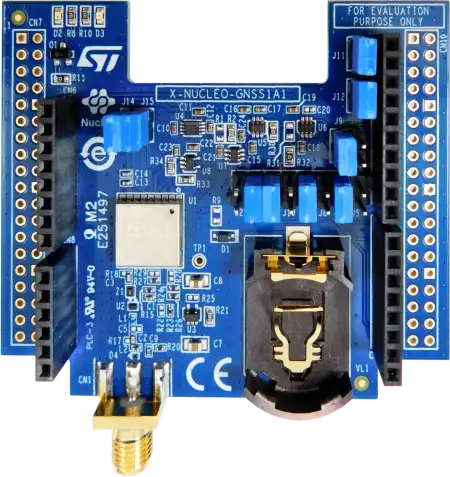

.. _x-nucleo-gnss1a1:

X-NUCLEO-GNSS1A1: GNSS expansion board based on Teseo-LIV3F
###########################################################

Overview
********
The X-NUCLEO-GNSS1A1 is a GNSS expansion board for STM32 Nucleo, based on the ST Teseo-LIV3F module.
It is compatible with the Arduino UNO R3 connector and supports GPS, Galileo, GLONASS, BeiDou and
QZSS constellations.

The Teseo-LIV3F communicates via UART at 9600 baud (8N1) using standard NMEA 0183 sentences.

More information about the board can be found at the `X-NUCLEO-GNSS1A1 website`_.

Hardware
********

Key features:

 - Teseo-LIV3F GNSS module (9.7 x 10.1 mm)
 - Multi-constellation: GPS, Galileo, GLONASS, BeiDou, QZSS
 - Sensitivity: -162 dBm (tracking mode)
 - On-board 26 MHz TCXO and 32 KHz RTC oscillator
 - UART and I2C interfaces
 - SMA antenna connector
 - Battery holder for backup
 - Operating voltage: 3.3 - 5 V

Jumper configuration
********************

The X-NUCLEO-GNSS1A1 uses jumpers to route signals between the Teseo-LIV3F module and the Arduino
header pins.  The UART can be routed to two different sets of pins.

**Default factory jumper settings** route UART to D8/D2 (active: J3/J4).  These pins do not map to
a hardware UART on all STM32 Nucleo boards.

For boards where D0/D1 are connected to a USART peripheral (e.g. ``nucleo_wl55jc``), change the
jumpers as follows:

+----------+---------+-----------------+
| Jumper   | Default | Required change |
+==========+=========+=================+
| J3 (D8)  | Closed  | **Open**        |
+----------+---------+-----------------+
| J4 (D2)  | Closed  | **Open**        |
+----------+---------+-----------------+
| J2 (D1)  | Open    | **Close**       |
+----------+---------+-----------------+
| J5 (D0)  | Open    | **Close**       |
+----------+---------+-----------------+

This routes the GNSS UART through Arduino D0 (RX) / D1 (TX), which maps to USART1 on many STM32
Nucleo-64 boards.

.. note::
   On boards where SPI1 drives Arduino D13 (e.g. ``nucleo_wl55jc``), SPI1 must be disabled because
   D13 is shared with the Teseo-LIV3F WAKEUP signal (active via jumper J9).  The board-specific
   overlay handles this automatically.

The remaining jumpers can be left at their defaults:

+--------------------+---------+---------------+
| Signal             | Jumper  | Default       |
+====================+=========+===============+
| Reset (D7)         | J13     | Closed        |
+--------------------+---------+---------------+
| Wakeup (D13)       | J9      | Closed        |
+--------------------+---------+---------------+
| PPS (D6)           | J6      | Closed        |
+--------------------+---------+---------------+
| I2C-SCL (D15)      | J11     | Open          |
+--------------------+---------+---------------+
| I2C-SDA (D14)      | J12     | Open          |
+--------------------+---------+---------------+

Programming
***********

Set ``--shield x_nucleo_gnss1a1`` when you invoke ``west build``.  For example, using the GNSS
sample application:

 .. zephyr-app-commands::
    :app: samples/drivers/gnss
    :board: nucleo_wl55jc
    :shield: x_nucleo_gnss1a1
    :goals: build

References
**********

.. target-notes::

.. _X-NUCLEO-GNSS1A1 website:
   https://www.st.com/en/ecosystems/x-nucleo-gnss1a1.html

.. _X-NUCLEO-GNSS1A1 user manual:
   https://www.st.com/resource/en/user_manual/um2327-getting-started-with-the-xnucleognss1a1-expansion-board-based-on-teseoliv3f-tiny-gnss-module-for-stm32-nucleo-stmicroelectronics.pdf
