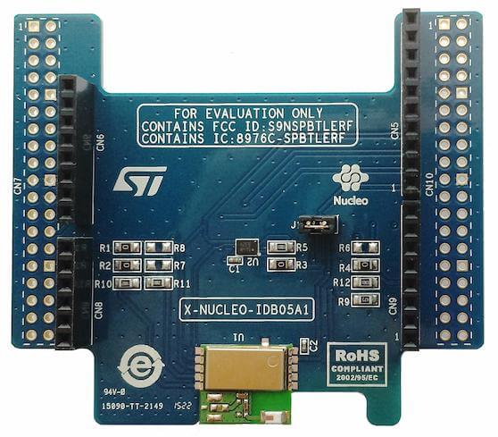

.. _x-nucleo-idb05a1:

X-NUCLEO-IDB05A1: BLE expansion board
#####################################

Overview
********
The X-NUCLEO-IDB05A1 is a Bluetooth Low Energy evaluation board based on the
SPBTLE-RF BlueNRG-MS RF module to allow expansion of the STM32 Nucleo boards.
The SPBTLE-RF module is FCC (FCC ID: S9NSPBTLERF) and IC certified
(IC: 8976C-SPBTLERF).

The X-NUCLEO-IDB05A1 is compatible with the ST Morpho and Arduino UNO R3
connector layout (the user can mount the ST Morpho connectors, if required). The
X-NUCLEO-IDB05A1 interfaces with the host microcontroller via the SPI pin, and
the user can change the default SPI clock, the SPI chip select and SPI IRQ by
changing one resistor on the evaluation board.

Note : This shield is compatible out of the box with Arduino UNO R3 connectors,
but CS and SCK signals are not the standard Arduino SPI_CS and SPI_SCK signals.
Please refer to "Hardware configuration" section.

More information about the board can be found at the
`X-NUCLEO-IDB05A1 website`_.

Hardware configuration
**********************

Out of the box, X-NUCLEO-IDB05A1 shield expects SPI SCK to be available on
Arduino pin D3 instead of usual Arduino UNO R3 SPI SCK D13.
This is not a problem if SPI SCK from nucleo board is available on D3,
otherwise shield configuration can be changed (see below).
Also shield expects SPI CS to be available on Arduino pin A1 instead of usual
Arduino UNO R3 SPI CS D10.
This is not a problem as CS signal is software driven gpio on Arduino A1
see cs-gpios in x_nucleo_idb05a1.overlay

Shield configuration could be modified by moving resistors as
follows:

 - SPI SCK: to use D13 instead of D3, remove R4 and add R6

Additionally, depending on your host board, some modifications of the BLE
expansion board could be made:

 - CS: To use D10 instead of A1, remove R2 and add R7
 - IRQ: To use D9 instead of A0, remove R1 and add R8

You could check Figure 3 in `X-NUCLEO-IDB05A1 databrief`_ for more details.

The stm32mp157c_dk2 board is known to need those CS/IRQ pin modifications
(see boards/stm32mp157c_dk2.overlay)
whereas nucleo_l476rg doesn't need hardware modifications.

Hardware
********

X-NUCLEO-IDB05A1 provides a SPBTLE-RF chip with the following key features:

 - Bluetooth Low Energy FCC and IC certified module based on Bluetooth ® SMART
   4.1 network processor BlueNRG-MS
 - Integrated Balun (BALF-NRG-01D3)
 - Chip antenna

More information about X-NUCLEO-IDB05A1 can be found here:
       - `X-NUCLEO-IDB05A1 databrief`_

Programming
***********

You can use the X-NUCLEO-IDB05A1 as a Bluetooth Low-Energy controller
shield with an SPI host controller interface (HCI-SPI).  Activate the presence
of the shield for the project build by adding the ``-DSHIELD`` arg to the
build command:

 .. zephyr-app-commands::
    :zephyr-app: your_app
    :board: your_board_name
    :shield: x_nucleo_idb05a1
    :goals: build

Alternatively, set use of this shield in the project's ``CMakeLists.txt`` file:

.. code-block:: none

	set(SHIELD x_nucleo_idb05a1)

References
**********

.. target-notes::

.. _X-NUCLEO-IDB05A1 website:
   http://www.st.com/en/ecosystems/x-nucleo-idb05a1.html

.. _X-NUCLEO-IDB05A1 databrief:
   https://www.st.com/resource/en/data_brief/x-nucleo-idb05a1.pdf
