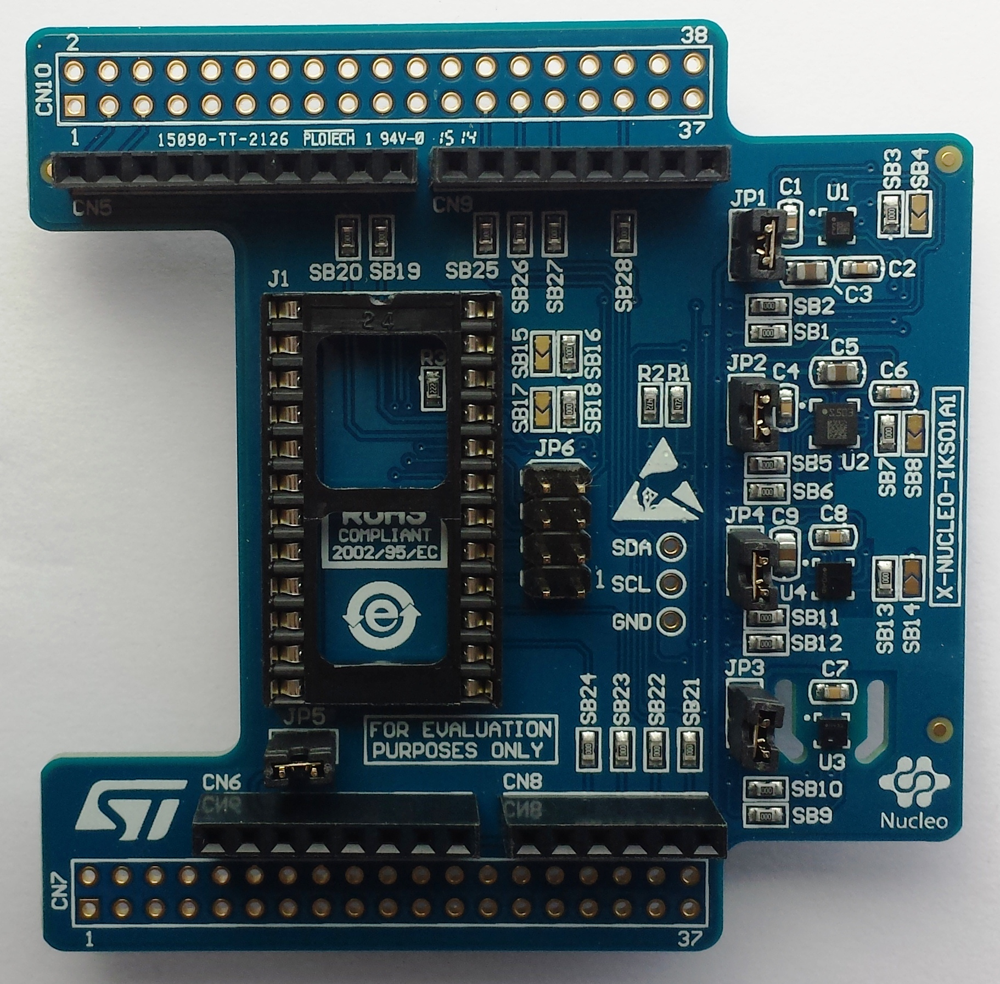

.. _x-nucleo-iks01a1:

X-NUCLEO-IKS01A1: MEMS Inertial and Environmental Multi sensor shield
#####################################################################

Overview
********
The X-NUCLEO-IKS01A1 is a motion MEMS and environmental sensor
evaluation board system, compatible with the Arduino UNO R3 connector
layout.  It includes an STMicroelectronics’ LSM6DS0 3-axis accelerometer
and 3-axis gyroscope, the LIS3MDL 3-axis magnetometer, the HTS221
humidity and temperature sensor, and the LPS25HB pressure sensor.

The X-NUCLEO-IKS01A1 interfaces with the main board via an I2C interface.

More information about the board can be found at the
`X-NUCLEO-IKS01A1 website`_.

Hardware
********

X-NUCLEO-IKS01A1 provides the following key features:

 - LSM6DS0: MEMS 3D accelerometer (±2/±4/±8 g) + 3D gyroscope (±245/±500/±2000
   dps)
 - LIS3MDL: MEMS 3D magnetometer (±4/ ±8/ ±12/ 16 gauss)
 - LPS25HB: MEMS pressure sensor, 260-1260 hPa absolute digital output barometer
 - HTS221: capacitive digital relative humidity and temperature
 - DIL 24-pin socket available for additional MEMS adapters and other sensors
   (UV index)
 - Equipped with Arduino UNO R3 connector
 - RoHS compliant

More information about X-NUCLEO-IKS01A1 can be found here:
       - `X-NUCLEO-IKS01A1 data sheet`_

Programming
***********

An example on how to use the ``x-nucleo-iks01a1`` shield is available
in the :ref:`x-nucleo-iks01a1-sample` application documentation
(see :ref:`shields` for more details).

References
**********

.. target-notes::

.. _X-NUCLEO-IKS01A1 website:
   http://www.st.com/en/ecosystems/x-nucleo-iks01a1.html

.. _X-NUCLEO-IKS01A1 data sheet:
   http://www.st.com/resource/en/datasheet/x-nucleo-iks01a1.pdf
