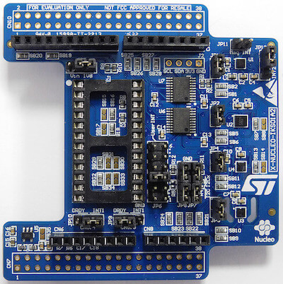

.. _x-nucleo-iks01a2:

X-NUCLEO-IKS01A2: MEMS Inertial and Environmental Multi sensor shield
#####################################################################

Overview
********
The X-NUCLEO-IKS01A2 is a motion MEMS and environmental sensor expansion board
for the STM32 Nucleo. It is equipped with Arduino UNO R3 connector layout, and
is designed around the LSM6DSL 3D accelerometer and 3D gyroscope, the LSM303AGR
3D accelerometer and 3D magnetometer, the HTS221 humidity and temperature sensor
and the LPS22HB pressure sensor.

The X-NUCLEO-IKS01A2 interfaces with the STM32 microcontroller via the I2C pin,
and it is possible to change the default I2C port.

More information about the board can be found at the
`X-NUCLEO-IKS01A2 website`_.

Hardware
********

X-NUCLEO-IKS01A2 provides the following key features:

 - LSM6DSL MEMS 3D accelerometer (±2/±4/±8/±16 g) and
   3D gyroscope (±125/±245/±500/±1000/±2000 dps)
 - LM303AGR MEMS 3D accelerometer (±2/±4/±8/±16 g) and
   MEMS3D magnetometer (±50 gauss)
 - LPS22HB MEMS pressure sensor, 260-1260 hPa absolute digital output barometer
 - HTS221: capacitive digital relative humidity and temperature
 - DIL24 socket for additional MEMS adapters and other sensors
 - I²C sensor hub features on LSM6DSL available
 - Equipped with Arduino UNO R3 connector
 - RoHS compliant

More information about X-NUCLEO-IKS01A2 can be found here:
       - `X-NUCLEO-IKS01A2 databrief`_

Programming
***********

Using the ``x-nucleo-iks01a2`` shield is quite similar to use the shield
``x-nucleo-iks01a1`` for which the :ref:`x-nucleo-iks01a1-sample` application
is provided (see :ref:`shields` for more details).

References
**********

.. target-notes::

.. _X-NUCLEO-IKS01A2 website:
   http://www.st.com/en/ecosystems/x-nucleo-iks01a2.html

.. _X-NUCLEO-IKS01A2 databrief:
   http://www.st.com/resource/en/data_brief/x-nucleo-iks01a2.pdf
