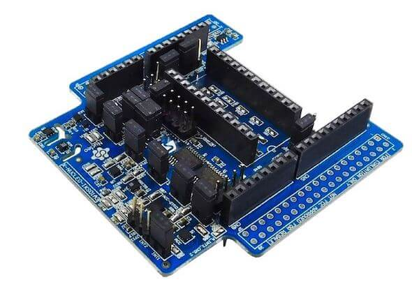

.. _x-nucleo-iks01a3:

X-NUCLEO-IKS01A3: MEMS Inertial and Environmental Multi sensor shield
#####################################################################

Overview
********
The X-NUCLEO-IKS01A3 is a motion MEMS and environmental sensor expansion board
for the STM32 Nucleo. It is equipped with Arduino UNO R3 connector layout, and
is designed around the LSM6DSO 3D accelerometer and 3D gyroscope, the LIS2MDL
3-axis magnetometer, the LIS2DW12 3-axis accelerometer, the HTS221 humidity and
temperature sensor, the LPS22HH pressure sensor, and the STTS751 temperature sensor.

The X-NUCLEO-IKS01A3 interfaces with the STM32 microcontroller via the I2C pin,
and it is possible to change the default I2C port.

More information about the board can be found at the
`X-NUCLEO-IKS01A3 website`_.

Hardware Description
********************

X-NUCLEO-IKS01A3 provides the following key features:

 - LSM6DO MEMS 3D accelerometer (±2/±4/±8/±16 g) and
   3D gyroscope (±125/±250/±500/±1000/±2000 dps)
 - LIS2MDL MEMS 3D magnetometer (±50 gauss)
 - LIS2DW12 MEMS 3D accelerometer (±2/±4/±8/±16 g)
 - LPS22HH MEMS pressure sensor, 260-1260 hPa absolute digital output barometer
 - HTS221 capacitive digital relative humidity and temperature
 - STTS751 Temperature sensor (-40 °C to +125 °C)
 - DIL24 socket for additional MEMS adapters and other sensors (configurable in I2C or SPI)
 - I2C sensor hub features on LSM6DSO available
 - Compatible with STM32 Nucleo boards
 - Equipped with Arduino UNO R3 connector
 - RoHS compliant
 - WEEE compliant

Hardware Configuration
**********************

X-NUCLEO-IKS01A3 board connects the various devices on two separate I2C bus:

- LIS2DW12 and LSM6DO are on I2C2
- LIS2MDL, LPS22HH, HTS221 are STTS751 are on I2C1

X-NUCLEO-IKS01A3 board can be configured in two different ways: Mode 1 and Mode 2

Mode 1: Standard Mode
=====================

In standard I2C mode the two buses are connected together. As a consequence, all devices on the shield
reside on the same I2C bus and are accessible from the main board through I2C bus.

The jumper configuration to activate this mode is:

- JP7 => 1-2, 3-4 (I2C1 = I2C2, I2Cx=GND)
- JP8 => 1-2, 3-4 (I2C1 = I2C2, I2Cx=GND)

Mode 2: SensorHub Mode
======================

In SensorHub mode LSM6DSO and LIS2DW12 are connected to I2C2 and are accessible from the main board.
All the other devices are connected to LSM6DSO master through I2C1.

The jumper configuration to activate this mode is:

- JP7 => 2-3 (I2C1 = I2Cx)
- JP8 => 2-3 (I2C1 = I2Cx)

More information about X-NUCLEO-IKS01A3 configuration modes can be found in the
`X-NUCLEO-IKS01A3 user manual`_

Programming
***********

Two samples are provided as examples for ``x-nucleo-iks01a3`` shield:

- :ref:`x-nucleo-iks01a3-std-sample` application, to be used when the shield is configured
  in Standard Mode
- :ref:`x-nucleo-iks01a3-shub-sample` application, to be used when the shield is configured
  in SensorHub Mode

See also :ref:`shields` for more details.

References
**********

.. target-notes::

.. _X-NUCLEO-IKS01A3 website:
   http://www.st.com/en/ecosystems/x-nucleo-iks01a3.html

.. _X-NUCLEO-IKS01A3 user manual:
   https://www.st.com/resource/en/user_manual/dm00601501.pdf
