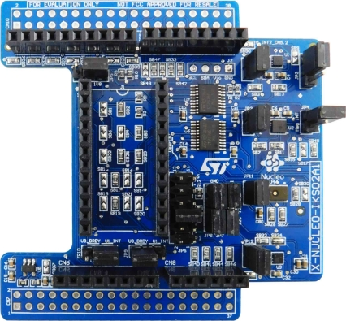

.. _x-nucleo-iks02a1:

X-NUCLEO-IKS02A1: MEMS Inertial and Environmental Multi sensor shield
#####################################################################

Overview
********
The X-NUCLEO-IKS02A1 is a motion MEMS expansion board for the STM32 Nucleo,
fitting the requirements of industrial applications.
It is equipped with Arduino UNO R3 connector layout, and
is designed around the ISM330DHCX 3-axis accelerometer and 3-axis gyroscope,
the IIS2MDC 3-axis magnetometer, the IIS2DLPC 3-axis accelerometer and
the IMP34DT05 digital microphone.

The X-NUCLEO-IKS02A1 interfaces with the STM32 microcontroller via the I2C pin,
and it is possible to change the default I2C port.

More information about the board can be found at the
`X-NUCLEO-IKS02A1 website`_.

Hardware Description
********************

X-NUCLEO-IKS02A1 provides the following key features:

 - ISM330DHCX MEMS 3D accelerometer (±2/±4/±8/±16 g) and
   3D gyroscope (±125/±250/±500/±1000/±2000 dps)
 - IIS2MDC MEMS 3D magnetometer (±50 gauss)
 - IIS2DLPC MEMS 3D accelerometer low power (±2/±4/±8/±16 g)
 - IMP34DT05 MEMS digital omnidirectional microphone (-26 dBFS, ±3 dB sensitivity)
 - DIL24 socket for additional MEMS adapters and other sensors (configurable in I2C or SPI)
 - I2C sensor hub features on ISM330DHCX available
 - Compatible with STM32 Nucleo boards
 - Equipped with Arduino UNO R3 connector
 - RoHS compliant
 - WEEE compliant

Hardware Configuration
**********************

X-NUCLEO-IKS02A1 board connects the various devices on two separate I2C bus:

- IIS2DLPC and ISM330DHCX are on I2C2
- IIS2MDC is on I2C1

X-NUCLEO-IKS02A1 board can be configured in two different hardware modes, Mode 1 and Mode 2,
using the JP7/JP8 jumpers to modify to what the I2C1 bus connects to.

Mode 1: Standard Mode
=====================

In standard I2C mode the two buses are connected together. As a consequence, all devices on the shield
reside on the same I2C bus and are accessible from the main board mcu.

The jumper configuration to activate this mode is:

- JP7 => 1-2, 3-4 (I2C1 = I2C2, I2Cx=GND)
- JP8 => 1-2, 3-4 (I2C1 = I2C2, I2Cx=GND)

Mode 2: SensorHub Mode
======================

In SensorHub mode ISM330DHCX and IIS2DLPC are connected to I2C2 and are accessible from the main board mcu.
Instead, the IIS2MDC device is connected only to ISM330DHCX sensor through its SCx/SDX (I2Cx) pins.

The jumper configuration to activate this mode is:

- JP7 => 2-3 (I2C1 = I2Cx)
- JP8 => 2-3 (I2C1 = I2Cx)

More information about X-NUCLEO-IKS02A1 configuration modes can be found in the
`X-NUCLEO-IKS02A1 user manual`_

Programming
***********

Three samples are provided as examples for ``x-nucleo-iks02a1`` shield:

- :zephyr:code-sample:`x-nucleo-iks02a1-std` application, to be used when the shield is configured
  in Standard Mode
- :zephyr:code-sample:`x-nucleo-iks02a1-shub` application, to be used when the shield is configured
  in SensorHub Mode
- :zephyr:code-sample:`x-nucleo-iks02a1-mic` application, to be used to acquire data through the
  on-board PDM microphone

See also :ref:`shields` for more details.

References
**********

.. target-notes::

.. _X-NUCLEO-IKS02A1 website:
   https://www.st.com/en/ecosystems/x-nucleo-iks02a1.html

.. _X-NUCLEO-IKS02A1 user manual:
   https://www.st.com/resource/en/user_manual/DM00651686.pdf
