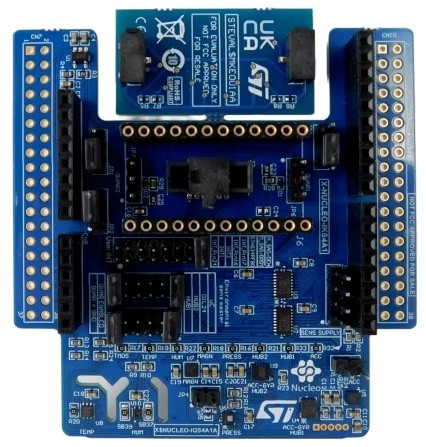

.. _x-nucleo-iks4a1:

X-NUCLEO-IKS4A1: MEMS Inertial and Environmental Multi sensor shield
####################################################################

Overview
********
The X-NUCLEO-IKS4A1 is a motion MEMS and environmental sensor expansion board
for the STM32 Nucleo. It is equipped with Arduino UNO R3 connector layout, and
allows application development with features like sensor HUB (LSM6DSO16IS and
LSM6DSV16X), camera module integration and Qvar touch/swipe gestures (thanks to
the equipped electrode).

More general information about the board can be found at the
`X-NUCLEO-IKS4A1 website`_.

Hardware Description
********************

X-NUCLEO-IKS4A1 provides the following key features:

 - LSM6DSO16IS: MEMS 3D accelerometer (±2/±4/±8/±16 g) + 3D gyroscope
   (±125/±250/±500/±1000/±2000 dps) with ISPU (Intelligent Processing Unit)
 - LIS2MDL: MEMS 3D magnetometer (±50 gauss)
 - LIS2DUXS12: Ultra low-power MEMS 3D accelerometer (±2/±4/±8/±16 g) with
   Qvar, AI, & anti-aliasing
 - LPS22DF: Low-power and high-precision MEMS pressure sensor, 260-1260 hPa
   absolute digital output barometer
 - SHT40AD1B: High-accuracy, ultra-low-power relative humidity and temperature
   sensor (by Sensirion)
 - STTS22H: Low-voltage, ultralow-power, 0.5 °C accuracy temperature sensor
   (–40 °C to +125 °C)
 - LSM6DSV16X: MEMS 3D accelerometer (±2/±4/±8/±16 g) + 3D gyroscope
   (±125/±250/±500/±1000/±2000/±4000 dps) with embedded sensor fusion, AI, Qvar
 - DIL 24-pin socket available for additional MEMS adapters and other sensors
 - Free comprehensive development firmware library and example for all sensors
   compatible with STM32Cube firmware
 - Equipped with Qvar touch/swipe electrode
 - I²C sensor hub features on LSM6DSO and LSM6DSV16X available
 - MIPI I3C® compatibility for communication with LIS2DUXS12, LSM6DSV16X and
   LPS22DF
 - Compatible with STM32 Nucleo boards
 - Equipped with Arduino UNO R3 connector
 - Equipped with industrial connector for IR sensor (STHS34PF80) application
   development. It can be connected at the same time of external MEMS through
   DIL24 adapter
 - Available interface for external camera module applications coupled with
   LSM6DSV16X through aux SPI (3/4 w)
 - RoHS compliant
 - WEEE compliant
 - UKCA compliant

Hardware Configuration
**********************

X-NUCLEO-IKS4A1 board can be configured in five different modes, which can be
selected through J4 and J5 jumpers. Additional information about X-NUCLEO-IKS4A1
configuration modes and how sensors are connected together can be found in the
`X-NUCLEO-IKS4A1 user manual`_

.. _x-nucleo-iks4a1-mode-1:

Mode 1: Standard Mode
=====================

In standard I2C mode, all devices are connected to an external main board via the
same I2C bus.

The board configuration is:

 - J4: 1-2, 11-12 (STM_SDA = SENS_SDA, HUB_SDx = GND)
 - J5: 1-2, 11-12 (STM_SCL = SENS_SCL, HUB_SCx = GND)

.. _x-nucleo-iks4a1-mode-2:

Mode 2: LSM6DSO16IS SensorHub Mode (SHUB2)
==========================================

In this sensor hub I2C mode, it is possible to power-up the 6-axes IMU
(Inertial Measurement Unit) functionalities by collecting external data
through a direct control of the on-board environmental sensors (temperature,
pressure and magnetometer) and external sensor (DIL24) through the auxiliary
I2Cz bus "SENS_I2C". LSM6DSV16X, LIS2DUXS12 and SHT40AD1B remains connected
to the main bus "uC_I2C" coming from the external board.

The board configuration is:

 - J4: 7-8 (HUB2_SDx = SENS_SDA)
 - J5: 7-8 (HUB2_SCx = SENS_SCL)

.. _x-nucleo-iks4a1-mode-3:

Mode 3: LSM6DSV16X SensorHub Mode (SHUB1)
=========================================

In this sensor hub, it is possible to power-up the 6-axes IMU (Inertial
Measurement Unit) functionalities by collecting external data through
a direct control of the on-board environmental sensors (temperature,
pressure and magnetometer) and external sensor (DIL24) through the auxiliary
I2C bus "SENS_I2C". LSM6DSO16IS, LIS2DUXS12 and SHT40AD1B remains connected
to the main bus "uC_I2C" coming from the external board.

The board configuration is:

 - J4: 5-6 (HUB1_SDx = SENS_SDA)
 - J5: 5-6 (HUB1_SDx = SENS_SDA)

Mode 4: DIL24 SensorHub Mode
============================

In case a sensor with sensor hub embedded functionality is mounted to the
board through DIL24 adapter, it is possible to exploit this functionality
as for LSM6DSO16IS and the LSM6DSV16X. In this configuration, may be necessary
to connect the DIL24 to the external board through SPI lines in order to
avoid an address conflict on I2C bus with the LSM6DSO16IS and the LSM6DSV16X.
This is done by changing the SBx configuration.

The board configuration is:

 - J4: 9-10 (DIL_SDx = SENS_SDA)
 - J5: 9-10 (DIL_SDx = SENS_SDA)

Mode 5: LSM6DSO16IS as Qvar controller
======================================

In this configuration, it is possible to use the equipped Qvar swipe electrode
(by plugging it on JP6 and JP7 connectors) through the LSM6DSO16IS.

The board configuration is:

 - J4: 3-4 (HUB1_SDx = QVAR1)
 - J5: 3-4 (HUB1_Scx = QVAR2)

Devicetree Overlays
*******************

There are three predefined DT overlays in the board:

- :zephyr_file:`boards/shields/x_nucleo_iks4a1/x_nucleo_iks4a1.overlay`
  This overlay describes sensor connections (and matching h/w configuration to be done)
  as explained in Standard Mode (:ref:`x-nucleo-iks4a1-mode-1`)
- :zephyr_file:`boards/shields/x_nucleo_iks4a1/x_nucleo_iks4a1_shub1.overlay`
  This overlay describes sensor connections (and matching h/w configuration to be done)
  as explained in SHUB1 Mode (:ref:`x-nucleo-iks4a1-mode-3`)
- :zephyr_file:`boards/shields/x_nucleo_iks4a1/x_nucleo_iks4a1_shub2.overlay`
  This overlay describes sensor connections (and matching h/w configuration to be done)
  as explained in SHUB2 Mode (:ref:`x-nucleo-iks4a1-mode-2`)

.. _X-NUCLEO-IKS4A1 website:
   http://www.st.com/en/ecosystems/x-nucleo-iks4a1.html

.. _X-NUCLEO-IKS4A1 user manual:
   https://www.st.com/resource/en/user_manual/um3239-getting-started-with-the-xnucleoiks4a1-motion-mems-and-environmental-sensor-expansion-board-for-stm32-nucleo-stmicroelectronics.pdf
