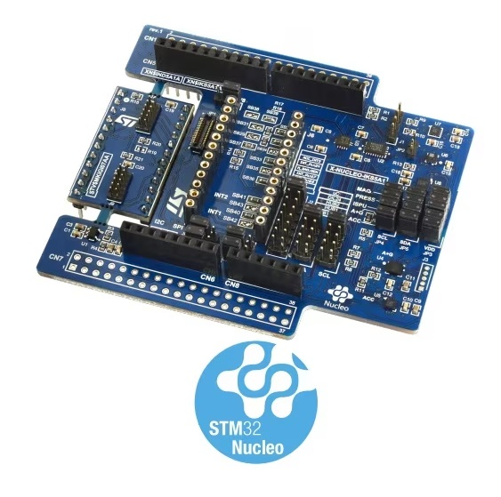

.. _x-nucleo-iks5a1:

X-NUCLEO-IKS5A1: MEMS Inertial and Environmental Multi sensor shield
####################################################################

Overview
********
The X-NUCLEO-IKS5A1 is an industrial motion MEMS and environmental sensor evaluation board
kit composed by:

 - X-NUCLEO-IND5A1: the main board, it hosts the motion MEMS and environmental sensors.
 - STEVAL-MKGI07A: a detachable add-on board, which hosts two industrial connectors.

The X-NUCLEO-IKS5A1 expansion board allows application development with features like FSM,
MLC, ISPU, and sensor hub (with ISM330IS and ISM6HG256X onboard).

More general information about the board can be found at the
`X-NUCLEO-IKS5A1 website`_.

Hardware Description
********************

X-NUCLEO-IKS5A1 provides the following key features:

- Wide range of industrial motion and environmental sensors:

  - ISM6HG256X: intelligent IMU with simultaneous low-g and high-g acceleration detection
  - ISM330IS: 6-axis IMU, always-on 3-axis accelerometer and 3-axis gyroscope with ISPU
  - IIS2DULPX: intelligent ultralow power accelerometer for industrial applications
  - ILPS22QS: dual full-scale, 1260 hPa and 4060 hPa, absolute digital output barometer
  - IIS2MDC: high accuracy, ultralow power, 3-axis digital output magnetometer

- DIL24 socket and industrial connectors for external sensors
- Compatible with X-CUBE-MEMS1, an expansion software package for STM32Cube
- I2C sensor hub features on ISM330IS and ISM6HG256X available
- Supported by MEMS-Studio, a software solution for MEMS sensors with graphical no-code design
  of algorithms and development of embedded AI features
- Compatible with STM32 Nucleo boards
- Equipped with Arduino UNO R3 connector
- RoHS compliant and WEEE compliant

Hardware Configuration
**********************

X-NUCLEO-IKS5A1 board can be configured in five different modes, which can be
selected through J4 and J5 jumpers. Additional information about X-NUCLEO-IKS5A1
configuration modes and how sensors are connected together can be found in the
`X-NUCLEO-IKS5A1 user manual`_

.. _x-nucleo-iks5a1-mode-1:

Mode 1: Standard Mode
=====================

In standard I2C mode, all devices are connected to an external main board via the
same I2C bus.

The board configuration is:

 - J4: 1-2, 9-10 (HUB2_SCx = GND, STM_SCL = SENS_SCL)
 - J5: 1-2, 9-10 (HUB2_SDx = GND, STM_SDA = SENS_SDA)
 - JP6, JP8, JP9, JP10 closed in I2C

.. _x-nucleo-iks5a1-mode-2:

Mode 2: ISM330IS SensorHub Mode (SHUB2)
=======================================

In this sensor hub I2C mode, it is possible to power up the 6-axes inertial
measurement unit (IMU) functionalities by collecting external data through a
direct control of the on-board environmental sensors (magnetometer, sensor)
and external sensor (DIL24) through the auxiliary I2C bus "SENS_I2C".
ISM6HG256X and IIS2DULPX remain connected to the main bus "uC_I2C" coming from
the external boards.

The board configuration is:

 - J4: 3-4 (HUB1_SCx = SENS_SCL)
 - J5: 3-4 (HUB1_SDx = SENS_SDA)

.. _x-nucleo-iks5a1-mode-3:

Mode 3: ISM6HG256X I2C sensor hub
=================================

In this sensor hub I2C mode, it is possible to power up the 6-axes IMU
functionalities by collecting external data through a direct control of the
on-board environmental sensors (magnetometer, sensor) and external sensor
(DIL24) through the auxiliary I2C bus "SENS_I2C".
ISM330IS and IIS2DULPX remain connected to the main bus "uC_I2C" coming from
the external boards.

The board configuration is:

 - J4: 5-6 (HUB_SCx = SENS_SCL)
 - J5: 5-6 (HUB_SDx = SENS_SDA)

Mode 4: DIL24 SensorHub Mode
============================

In this case, a sensor with embedded sensor hub functionality is mounted to
the X-NUCLEO-IKS5A1 through the DIL24 adapter to exploit this functionality,
as for ISM330IS and ISM6HG256X.

The board configuration is:

 - J4: 7-8 (DIL_SDx = SENS_SDA)
 - J5: 7-8 (DIL_SDx = SENS_SDA)

Mode 5: DIL24 SPI communication
===============================

In X-NUCLEO-IKS5A1, there is the possibility to use SPI instead of I2C using
the DIL24 adapter. In this configuration, all lines bypass the level shifter.
For this reason, the signal must be 3.3 V instead of 1.8 V (default).

The board configuration is:

 - Close jumper JP7 to select 3.3 V instead of 1.8 V.
 - Desolder SB39 and solder SB38 to select VDDIO as VDD.
 - Close JP6, JP8, JP9, and JP10 to 2-3 to select SPI communication.
 - Remove SB40 and SB4 and solder SB42 and SB43 (INT1 and INT2

Devicetree Overlays
*******************

There are two predefined DT overlays in the board:

- :zephyr_file:`boards/shields/x_nucleo_iks5a1/x_nucleo_iks5a1.overlay`
  This overlay describes sensor connections as explained in Standard Mode
  (:ref:`x-nucleo-iks5a1-mode-1`).
  The sensor currently supported are ISM6HG256X, IIS2MDC and ILPS22QS.
- :zephyr_file:`boards/shields/x_nucleo_iks5a1/x_nucleo_iks5a1_stream.overlay`
  This overlay is used to stream data from the sensor's FIFO. It configures the shield with
  only the ISM6HG256X sensor.

Samples
*******

The sensors on shield can be accessed using generic samples.
Let's see few examples assuming the shield is on top of a
:zephyr:board:`nucleo_h503rb` board.

- To stream ISM6HG256X accelerometer data from its fifo you may use
  :zephyr:code-sample:`stream_fifo` sample:

.. zephyr-app-commands::
   :zephyr-app: samples/sensor/stream_fifo
   :board: nucleo_h503rb
   :shield: x_nucleo_iks5a1_stream
   :goals: build flash
   :compact:

- To poll ISM6HG256X accelerometer data you may use
  :zephyr:code-sample:`accel_polling` sample:

.. zephyr-app-commands::
   :zephyr-app: samples/sensor/accel_polling
   :board: nucleo_h503rb
   :shield: x_nucleo_iks5a1
   :goals: build flash
   :compact:

- To poll ILPS22QS pressure data you may use
  :zephyr:code-sample:`pressure_polling` sample:

.. zephyr-app-commands::
   :zephyr-app: samples/sensor/pressure_polling
   :board: nucleo_h503rb
   :shield: x_nucleo_iks5a1
   :goals: build flash
   :compact:

- To receive IIS2MDC magnetometer data on data ready you may use
  :zephyr:Code-sample:`magn-trig` sample:

.. zephyr-app-commands::
   :zephyr-app: samples/sensor/magn_trig
   :board: nucleo_h503rb
   :shield: x_nucleo_iks5a1
   :goals: build flash
   :compact:

See also :ref:`shields` for more details.

.. _X-NUCLEO-IKS5A1 website:
   https://www.st.com/en/evaluation-tools/x-nucleo-iks5a1.html

.. _X-NUCLEO-IKS5A1 user manual:
   https://www.st.com/resource/en/user_manual/um3550-getting-started-with-the-xnucleoiks5a1-motion-mems-and-environmental-sensor-expansion-board-for-stm32-nucleo-stmicroelectronics.pdf
