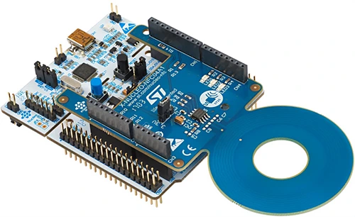

.. _x-nucleo-nfc04a1:

X-NUCLEO-NFC04A1: Dynamic NFC/RFID tag shield
#####################################################################

Overview
********
The X-NUCLEO-NFC04A1 dynamic NFC/RFID tag IC expansion board is based on the
ST25DV04K NFC Type V/RFID tag IC with a dual interface 4 Kbits EEPROM that
also features an I²C interface. It can be powered by the pin of Arduino
connector or directly by the received carrier electromagnetic field.

The X-NUCLEO-NFC04A1 expansion board is compatible with the Arduino
UNO R3 connector pin assignment and can easily be plugged onto any STM32
Nucleo board. Various expansion boards can also be stacked to evaluate
different devices operating together with the dynamic NFC tag. The board
also features an antenna with a 54 mm ISO 24.2 diameter, single layer,
copper etched on PCB.

     X-NUCLEO-NFC04A1 shield (Credit: STMicroelectronics)

More information about the board can be found at the
`X-NUCLEO-NFC04A1 website`_.

Hardware Description
********************

X-NUCLEO-NFC04A1 provides the following key features:

 - Expansion board based on the ST25DV04K dynamic NFC/RFID tag for STM32 Nucleo
 - Up to 4-Kbit memory with NDEF support
 - 54 mm diameter, single layer circular antenna
 - Compatible with STM32 Nucleo boards
 - Equipped with Arduino™ UNO R3 connector
 - Self-powered or powered through the Arduino™ UNO R3 connectors
 - Three general purpose LEDs
 - Scalable solution, capable of cascading multiple boards for larger systems
 - Free comprehensive development firmware library and example for ST25DV04K, compatible with STM32Cube firmware
 - FCC and IC verified
 - RoHS compliant

Hardware Configuration
**********************

X-NUCLEO-NFC04A1 board connects a ST25DV04K on I2C1 through PB8 and PB9.

Three LEDs are also present on the shield.:
- LED1 (green) on PB4
- LED2 (blue) on PB5
- LED3 (yellow) on PA10

Programming
***********

The `samples/shields/x_nucleo_nfc04a1` sample can be used with this shield.

References
**********

.. target-notes::

.. _X-NUCLEO-NFC04A1 website:
   https://www.st.com/en/ecosystems/x-nucleo-nfc04a1.html

.. _X-NUCLEO-NFC04A1 user manual:
   https://www.st.com/resource/en/user_manual/um2235-getting-started-with-the-xnucleonfc04a1-nfcrfid-tag-ic-expansion-board-based-on-st25dv04k-for-stm32-nucleo-stmicroelectronics.pdf
