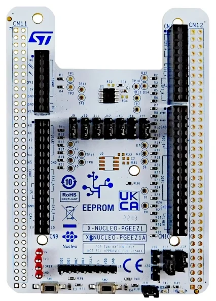

.. SPDX-FileCopyrightText: Copyright 2026 EXALT Technologies
.. SPDX-License-Identifier: Apache-2.0

.. _x_nucleo_pgeez1_shield:

X-NUCLEO-PGEEZ1 page EEPROM expansion board
################################################

Overview
********

The X-NUCLEO-PGEEZ1 expansion board carries an ST M95P32 32-Mbit SPI
page EEPROM. The device supports single, dual, and quad output reads and
NOR-compatible array operations described by SFDP.

Zephyr exposes the M95P32 main memory array through the Flash API over MSPI.
The shield configuration uses a 1-1-4 quad read and a single-line page
program because the M95P32 does not provide a quad page-program command.
The M95P32 is compatible with the generic ``jedec,nor`` MSPI driver.

More information about the expansion board is available on the
`X-NUCLEO-PGEEZ1 product page`_.

Requirements
************

The shield requires a board-specific connection to an MSPI controller.
Currently, the :zephyr:board:`nucleo_u575zi_q` is supported.

Programming
***********

Build the MSPI flash sample with the shield enabled:

.. zephyr-app-commands::
   :zephyr-app: samples/drivers/mspi/mspi_flash
   :board: nucleo_u575zi_q
   :shield: x_nucleo_pgeez1
   :goals: build

The optional ``nucleo_u575zi_q_mcumgr.overlay`` replaces the board's
internal secondary MCUboot slot with a partition on the M95P32 and selects
the UART used by MCUmgr. Applications using that overlay must apply it to
both the application and MCUboot sysbuild images. Swap using offset also
requires ``SB_CONFIG_MCUBOOT_MODE_SWAP_USING_OFFSET=y`` in the sysbuild
configuration and ``CONFIG_FLASH_MSPI_NOR_LAYOUT_PAGE_SIZE=8192`` in both
images so the external layout matches the STM32U575 internal flash layout.

.. _X-NUCLEO-PGEEZ1 product page:
   https://www.st.com/en/evaluation-tools/x-nucleo-pgeez1.html
