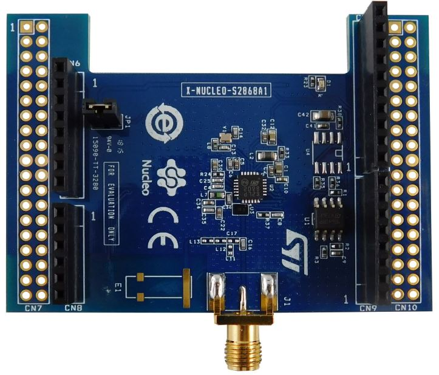

.. _x-nucleo-s2868a1:

X-NUCLEO-S2868A1: S2LP radio shield
###################################

Overview
********
The X-NUCLEO-S2868A1 expansion board is based on the S2-LP radio and operates
in the 868 MHz ISM frequency band. The expansion board is compatible with ST
morpho and Arduino UNO R3 connectors. The X-NUCLEO-S2868A1 interfaces with
the STM32 Nucleo microcontroller via SPI connections and GPIO pins. You can
change some of the GPIOs by mounting or removing the resistors.

More information about the board can be found at the `X-NUCLEO-S2868A1 website`_

Hardware
********

X-NUCLEO-S2868A1 provides the following key features:

 - Based on S2-LP radio
 - S2-LP narrow band ultra-low power sub-1 GHz transceiver tuned for 860 - 940 MHz frequency band
 - Programmable RF output power up to +16 dBm
 - Modulation schemes: 2-FSK, 2-GFSK, 4-FSK, 4-GFSK, OOK and ASK
 - Air data rate from 0.1 to 500 kbps
 - Ultra-low power consumption: 7 mA RX and 10 mA TX at +10 dBm
 - IEEE 802.15.4g hardware packet support with whitening, FEC, CRC and dual SYNC word detection
 - RX and TX 128 byte FIFO buffers
 - Support to wireless M-Bus
 - Excellent performance of receiver sensitivity (up to -130 dBm)
 - Automatic acknowledgment, retransmission and timeout protocol engine
 - Compatible with STM32 Nucleo boards
 - Compatible with Arduino UNO R3 connectors
 - Support to SMD and SMA antennas
 - BALF-SPI2-01D3 IPD balun for matching network and harmonics filter
 - Sigfox compatible
 - 6LoWPAN compatible
 - RoHS compliant

More information about X-NUCLEO-S2868A1 can be found in the
`X-NUCLEO-S2868A1 data sheet`_.

References
**********

.. target-notes::

.. _X-NUCLEO-S2868A1 website:
  https://www.st.com/en/ecosystems/x-nucleo-s2868a1.html

.. _X-NUCLEO-S2868A1 data sheet:
  https://www.st.com/resource/en/data_brief/x-nucleo-s2868a1.pdf
