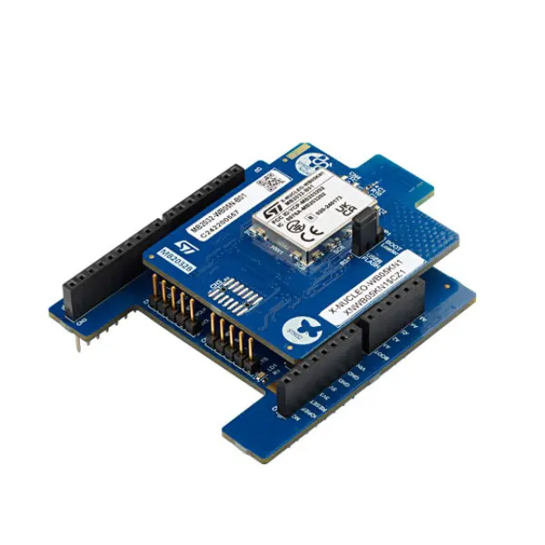

.. _x-nucleo-wb05kn1:

X-NUCLEO-WB05KN1: BLE expansion board
#####################################

Overview
********
The X-NUCLEO-WB05KN1 is a Bluetooth Low Energy evaluation board which allows the
expansion of the STM32 Nucleo boards.
The RF module is FCC (FCC ID: YCP-MB203202) and IC certified (IC: 8976A-MB203202).

The X-NUCLEO-WB05KN1 is compatible out of the box with the Arduino UNO R3 connector.
The board interfaces with the host microcontroller via UART (default) or SPI peripheral.

More information about the board can be found at the
`X-NUCLEO-WB05KN1 website`_.

Configurations
**************

X-NUCLEO-WB05KN1 can be utilized as a Bluetooth Low-Energy controller shield
with a UART or SPI host controller interface (HCI-UART/HCI-SPI).

The UART default settings are:

* Baudrate: 921600 bps
* 8 bits, no parity, 1 stop bit

+----------+-----------------------+
| UART Pin | Arduino Connector Pin |
+==========+=======================+
| RX       | D0                    |
+----------+-----------------------+
| TX       | D1                    |
+----------+-----------------------+

.. note::
   Please, bear in mind in order to use SPI interface you need to change the shield firmware
   to ``DTM_SPI_WITH_UPDATER_CONTROLLER`` according to the SDK provided by ST at `X-CUBE-WB05N`_.

IRQ and reset pins are also necessary in addition to SPI pins.

+----------------+-----------------------+
| SPI Config Pin | Arduino Connector Pin |
+================+=======================+
| SCK            | D13                   |
+----------------+-----------------------+
| MISO           | D12                   |
+----------------+-----------------------+
| MOSI           | D11                   |
+----------------+-----------------------+
| CS             | D10                   |
+----------------+-----------------------+
| IRQ            | A0                    |
+----------------+-----------------------+
| RESET          | D7                    |
+----------------+-----------------------+

More information about X-NUCLEO-WB05KN1 can be found here:
       - `X-NUCLEO-WB05KN1 datasheet`_

Programming
***********

Activate the presence of the shield for the project build by adding the
``--shield x_nucleo_wb05kn1_uart`` or ``--shield x_nucleo_wb05kn1_spi`` when you invoke
``west build`` based on UART or SPI interface:

 .. zephyr-app-commands::
    :app: your_app
    :board: your_board_name
    :shield: x_nucleo_wb05kn1_uart
    :goals: build

or

 .. zephyr-app-commands::
    :app: your_app
    :board: your_board_name
    :shield: x_nucleo_wb05kn1_spi
    :goals: build

References
**********

.. target-notes::

.. _X-NUCLEO-WB05KN1 website:
   https://www.st.com/en/evaluation-tools/x-nucleo-wb05kn1.html

.. _X-CUBE-WB05N:
   https://www.st.com/en/embedded-software/x-cube-wb05n.html

.. _X-NUCLEO-WB05KN1 datasheet:
   https://www.st.com/resource/en/datasheet/stm32wb05kn.pdf
