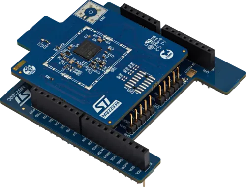

.. _x-nucleo-wba25a1:

X-NUCLEO-WBA25A1: BLE expansion board
#####################################

Overview
********

The X-NUCLEO-WBA25A1 is a Bluetooth® v6.0 compliant expansion board based on the STM32WBA25CE
MCU and featuring preloaded network coprocessor firmware with a UART interface.
The RF module is FCC (FCC ID: YCP-MB229301) and IC certified (IC: 8976A-MB229301).

The X-NUCLEO-WBA25A1 is compatible out of the box with the Arduino UNO R3 connector.
The board interfaces with the host microcontroller via UART (default) or SPI peripheral.
However, the out-of-the-box firmware is not compatible with Zephyr; therefore, a controller-only
image should be flashed on the board using CN8 pin headers described in section 9.1 of the
`UM3608`_.

More information about the board can be found at the
`X-NUCLEO-WBA25A1 website`_.

How to change the firmware
**************************

* Step 1: Download and install `X-CUBE-WBA`_ and `STM32CubeProg`_.
* Step 2: Open the STM32CubeProgrammer (STM32CubeProg), and erase the STM32WBA25CE flash memory.
* Step 3: Load the ``BLE_TransparentMode_UART_STM32WBA2_RCP.bin`` or
          ``BLE_TransparentMode_SPI_STM32WBA2_RCP.bin``, depending on the use case, from the
          firmware available in the X-CUBE-WBA installation folder:
          ``Utilities/BLE_TransparentMode_RCP``.
* Step 4. Use 0x08000000 as the start address to program the SoC.

Configurations
**************

X-NUCLEO-WBA25A1 can be utilized as a Bluetooth Low-Energy controller shield
with a UART or SPI host controller interface (HCI-UART/HCI-SPI).

The UART default settings are:

* Baudrate: 115200 bps
* 8 bits, no parity, 1 stop bit

+----------+-----------------------+
| UART Pin | Arduino Connector Pin |
+==========+=======================+
| RX       | D0                    |
+----------+-----------------------+
| TX       | D1                    |
+----------+-----------------------+

The SPI default settings are:

* Mode: Full-duplex slave
* Frame format: Motorola
* Data size: 8 bits, MSB first
* Clock Polarity: High (CPOL=1)
* Clock Phase: 2 Edge (CPHA=1)
* CS type: Software-controlled

IRQ and reset pins are also necessary in addition to SPI pins.

+----------------+-----------------------+
| SPI Config Pin | Arduino Connector Pin |
+================+=======================+
| SCK            | D13                   |
+----------------+-----------------------+
| MISO           | D12                   |
+----------------+-----------------------+
| MOSI           | D11                   |
+----------------+-----------------------+
| CS             | D10                   |
+----------------+-----------------------+
| IRQ            | A0                    |
+----------------+-----------------------+
| RESET          | D7                    |
+----------------+-----------------------+

Programming
***********

Activate the presence of the shield for the project build by adding the
``--shield x_nucleo_wba25a1_uart`` or ``--shield x_nucleo_wba25a1_spi`` when you invoke
``west build`` based on UART or SPI interface:

 .. zephyr-app-commands::
    :app: your_app
    :board: your_board_name
    :shield: x_nucleo_wba25a1_uart
    :goals: build

Or

 .. zephyr-app-commands::
    :app: your_app
    :board: your_board_name
    :shield: x_nucleo_wba25a1_spi
    :goals: build

References
**********

.. target-notes::

.. _UM3608:
   https://www.st.com/resource/en/user_manual/um3608-bluetooth-le-expansion-board-based-on-the-stm32wba25ce-mcu-for-stm32-nucleo-boards-stmicroelectronics.pdf

.. _X-NUCLEO-WBA25A1 website:
   https://www.st.com/en/evaluation-tools/x-nucleo-wba25a1.html

.. _X-CUBE-WBA:
   https://www.st.com/en/embedded-software/x-cube-wba.html

.. _STM32CubeProg:
   https://www.st.com/en/development-tools/stm32cubeprog
