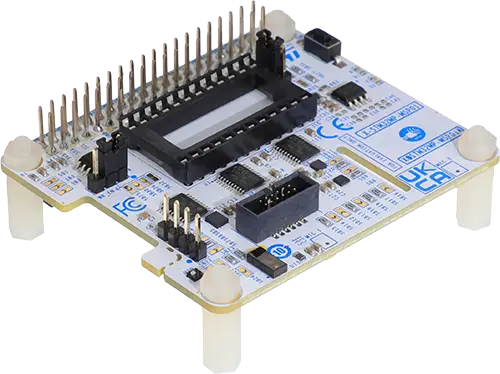

.. _x_stm32mp_msp01:

X-STM32MP-MSP01
###############

Overview
********
The X-STM32MP-MSP01 is a multisensor evaluation board that embeds motion
MEMS, environmental, ambient light and Time-of-Flight sensors, a digital
microphone, and an NFC tag. This board works with the STM32MPU discovery kit. It
can be used with the X-LINUX-MSP1 to read the sensors.
The X-STM32MP-MSP01 main devices are the ISM330DHCX 3-axis accelerometer
and gyroscope, the IIS2MDC 3-axis magnetometer, and the LPS22HH MEMS nano
pressure sensor.

The board also includes the STTS22H digital temperature sensor, the VD6283TX
ambient light sensor, the IIS2DLPC 3-axis accelerometer, the VL53L5CX multizone
ranging sensor, and the MP23DB02MM digital MEMS microphone. The on-board
dynamic NFC/RFID tag IC can work with a dual interface for the I2C, through a 13.56
MHz RFID reader, or via an NFC phone.

The X-STM32MP-MSP01 interfaces with the STM32MP1Dev via a 40-pin GPIO
connector pins using I2C, SPI, and general GPIO pins. It is compatible with
STM32MP135F-DK, STM32MP157F-DK2 and a Raspberry Pi GPIO connector layout.

More information about the board can be found at the
`X-STM32MP-MSP01 website`_.

Hardware Description
********************
X-STM32MP-MSP01 provides the following key features:

- Included sensors:

  - ISM330DHCX: 3-axis accelerometer and 3-axis gyroscope
  - IIS2MDC: 3-axis digital magnetometer
  - IIS2DLPC: 3-axis accelerometer for industrial applications
  - STTS22H: digital temperature sensor
  - LPS22HH: nano pressure sensor
  - VD6283TX: ambient light sensor
  - VL53L5CX: Time-of-Flight (ToF) multizone ranging sensor
- Dynamic NFC/RFID tag
- Digital microphone
- Standard DIL 24 pin socket for adapter boards
- Compatible with STM32MP135F-DK, STM32MP157F-DK2 and Raspberry Pi

Programming
***********
Set ``--shield x_stm32mp_msp01`` when you invoke ``west build``. For example:

.. zephyr-app-commands::
   :zephyr-app: samples/sensor/sensor_shell
   :board: stm32mp135f_dk
   :shield: x_stm32mp_msp01
   :goals: build

References
**********

.. target-notes::

.. _X-STM32MP-MSP01 website:
   https://www.st.com/en/evaluation-tools/x-stm32mp-msp01.html

.. _X-STM32MP-MSP01 user manual:
   https://www.st.com/resource/en/user_manual/um3076-getting-started-with-the-xstm32mpmsp01-expansion-board-for-the-stm32mp157fdk2-discovery-kit-stmicroelectronics.pdf
