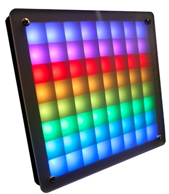

.. _zhaw_lumamatrix:

ZHAW Luma Matrix Shield
#######################

Overview
********

The `ZHAW Luma Matrix Shield`_ is a 8x8 grid of WS2812B RGB LEDs, which Adafruit refers to as “neopixels”.
There is a joystick and a switch on the backside.
The shield is designed to be compatible with Raspberry Pi Pico 1.
The Luma Matrix is used in the Lumatrix Workshop of the Zurich University of Applied Sciences.

   ZHAW Luma Matrix Shield (Credit: ZHAW)

Pin Assignments
===============

+-----------------------+---------------------------------------------+
| Shield Connector Pin  | Function                                    |
+=======================+=============================================+
| J9_4                  | Joystick left                               |
+-----------------------+---------------------------------------------+
| J9_5                  | Joystick up                                 |
+-----------------------+---------------------------------------------+
| J9_9                  | Joystick down                               |
+-----------------------+---------------------------------------------+
| J9_11                 | Joystick center                             |
+-----------------------+---------------------------------------------+
| J9_12                 | Dip-Switch                                  |
+-----------------------+---------------------------------------------+
| J8_16                 | WS2812B driver pin                          |
+-----------------------+---------------------------------------------+

Requirements
************

The shield can be used with Raspbery Pi Pico 1.

Programming
***********

LED Strip Sample
=================

Set ``--shield zhaw_lumamatrix`` when you invoke ``west build``. For example:

.. zephyr-app-commands::
   :zephyr-app: samples/drivers/led/led_strip
   :board: rpi_pico
   :shield: zhaw_lumamatrix
   :goals: build
