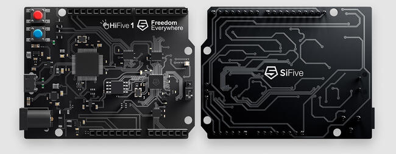
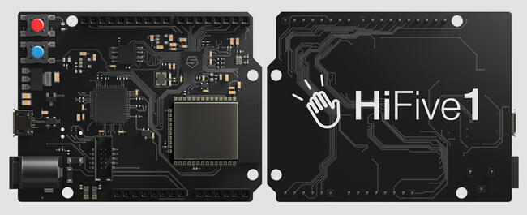

.. zephyr:board:: hifive1

Overview
********

The HiFive1 is an Arduino-compatible development board with
an FE310 RISC-V SoC. Two revisions of this board are supported in Zephyr:
`HiFive1 <https://www.sifive.com/boards/hifive1>`__ (also known as HiFive1 Rev A)
and `HiFive1 Rev B <https://www.sifive.com/boards/hifive1-rev-b>`__.

   SiFive HiFive1 board (image courtesy of SiFive)

   SiFive HiFive1 Rev B board (image courtesy of SiFive)

Programming and debugging
*************************

.. zephyr:board-supported-runners::

Building
========

Applications for the HiFive1 board configuration can be built as usual (see
:ref:`build_an_application`) using the corresponding board name:

.. tabs::

   .. group-tab:: HiFive1

      .. zephyr-app-commands::
         :board: hifive1
         :goals: build

   .. group-tab:: HiFive1 Rev B

      .. zephyr-app-commands::
         :board: hifive1@B
         :goals: build

Flashing
========

HiFive1
-------

.. tabs::

   .. group-tab:: HiFive1

      In order to upload the application to the device, you'll need OpenOCD with
      RISC-V support. Download the tarball for your OS from the `SiFive website
      <https://www.sifive.com/boards>`_ and extract it.

      The Zephyr SDK uses a bundled version of OpenOCD by default. You can
      overwrite that behavior by adding the
      ``-DOPENOCD=<path/to/riscv-openocd/bin/openocd>`` parameter when building:

      .. zephyr-app-commands::
         :board: hifive1
         :goals: build
         :gen-args: -DOPENOCD=<path/to/riscv-openocd/bin/openocd>

      When using a custom toolchain it should be enough to have the downloaded
      version of the binary in your ``PATH``.

   .. group-tab:: HiFive1 Rev B

      The HiFive 1 Rev B uses Segger J-Link OB for flashing and debugging. To flash and
      debug the board, you'll need to install the
      `Segger J-Link Software and Documentation Pack
      <https://www.segger.com/downloads/jlink#J-LinkSoftwareAndDocumentationPack>`_
      and choose version V6.46a or later (Downloads for Windows, Linux, and macOS are
      available).

Now you can flash the application as usual (see :ref:`build_an_application` and
:ref:`application_run` for more details):

.. code-block:: console

   west flash

Depending on your OS you might have to run the flash command as superuser.

Debugging
=========

Refer to the detailed overview about :ref:`application_debugging`.
