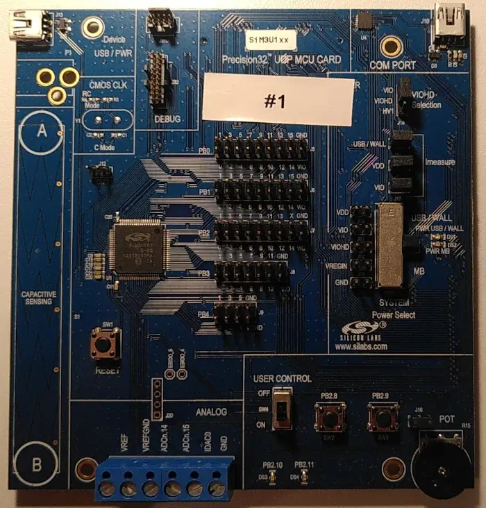

.. _sim3u1xx_dk:

Silicon Labs SiM3U1xx 32-bit MCU USB Development Kit
####################################################

Overview
********

This is a `development kit`_ that is used to develop software for the SiM3U1xx MCUs.

Hardware
********

- Silicon Labs SiM3U167-B-GM SoC
- CPU core: ARM Cortex®-M3
- Flash memory: 256 kB
- RAM: 32 kB
- IO:

  - 2x user LEDs
  - 2x user push buttons
  - 2x power LEDs
  - Reset push button
  - Potentiometer
  - Analog terminals
  - Capacitive sensing slider and button
  - USB virtual COM port

For more information about the SiM3U167 SoC and the SiM3U1xx board, refer to these documents:

- Silicon Labs SiM3U1xx_
- Silicon Labs SiM3U167-B-GM_
- Silicon Labs SiM3U1xx-B-DK_
- Silicon Labs SiM3U1xx-B-DK MCU card `user's guide`_
- Silicon Labs SiM3U1xx and SiM3C1xx Revision B Errata_

.. _SiM3U1xx: https://www.silabs.com/mcu/32-bit-microcontrollers/precision32-sim3u1xx
.. _SiM3U167-B-GM: https://www.silabs.com/mcu/32-bit-microcontrollers/precision32-sim3u1xx/device.sim3u167-b-gm
.. _SiM3U1xx-B-DK: https://www.silabs.com/development-tools/mcu/32-bit/sim3u1xx-development-kit
.. _user's guide: https://www.silabs.com/documents/public/user-guides/UPMU-M3U160.pdf
.. _Errata: https://www.silabs.com/documents/public/errata/SiM3U1xx-SiM3C1xxErrata.pdf

Supported Features
==================

The board configuration supports the following hardware features:

+-----------+------------+-------------------------------------+
| Interface | Controller | Driver/Component                    |
+===========+============+=====================================+
| NVIC      | on-chip    | nested vector interrupt controller  |
+-----------+------------+-------------------------------------+
| SYSTICK   | on-chip    | systick                             |
+-----------+------------+-------------------------------------+
| DMA       | on-chip    | dma                                 |
+-----------+------------+-------------------------------------+
| FLASH     | on-chip    | flash memory                        |
+-----------+------------+-------------------------------------+
| GPIO      | on-chip    | gpio                                |
+-----------+------------+-------------------------------------+
| UART      | on-chip    | serial port-polling;                |
|           |            | serial port-interrupt               |
+-----------+------------+-------------------------------------+

Connections and IOs
===================

+--------+--------------------------+----------------------------------------------------+
| Pin    | Name                     | Note                                               |
+========+==========================+====================================================+
| PB1.12 | TX (O)                   | Serial connection to host via USB virtual COM port |
+--------+--------------------------+                                                    |
| PB1.13 | RX (I)                   |                                                    |
+--------+--------------------------+                                                    |
| PB1.14 | RTS (O)                  |                                                    |
+--------+--------------------------+                                                    |
| PB1.15 | CTS (I)                  |                                                    |
+--------+--------------------------+----------------------------------------------------+
| PB2.8  | Push button switch (SW2) |                                                    |
+--------+--------------------------+----------------------------------------------------+
| PB2.9  | Push button switch (SW3) |                                                    |
+--------+--------------------------+----------------------------------------------------+
| PB2.10 | Red LED (DS3)            |                                                    |
+--------+--------------------------+----------------------------------------------------+
| PB2.11 | Yellow LED (DS4)         |                                                    |
+--------+--------------------------+----------------------------------------------------+
| PB1.5  | Potentiometer            |                                                    |
+--------+--------------------------+----------------------------------------------------+
| PB2.12 | Potentiometer bias       |                                                    |
+--------+--------------------------+----------------------------------------------------+

Programming and Debugging
*************************

Flashing
========

The sample application :zephyr:code-sample:`hello_world` is used for this example. Build the Zephyr kernel and
application:

.. zephyr-app-commands::
   :zephyr-app: samples/hello_world
   :board: sim3u1xx_dk
   :goals: build

Connect the sim3u1xx_dk to your host computer using both USB port and you should see a USB serial
connection.

Open a serial terminal (minicom, putty, etc.) with the following settings:

- Speed: 115200
- Data: 8 bits
- Parity: None
- Stop bits: 1

Reset the board and you'll see the following message on the corresponding serial port
terminal session:

.. code-block:: console

   Hello World! sim3u1xx_dk/sim3u167

References
**********

.. target-notes::

.. _development kit:
   https://www.silabs.com/development-tools/mcu/32-bit/sim3u1xx-development-kit
