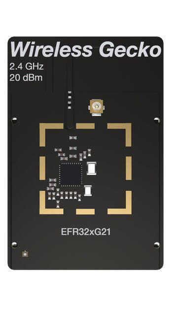

.. _slwrb4180a:

EFR32xG21 2.4 GHz 20 dBm (SLWRB4180A)
#####################################

Overview
********

The EFR32MG21 Mighty Gecko Radio Board is one of the two
radio boards delivered with `EFR32-SLWSTK6006A Website`_. It contains
a Wireless System-On-Chip from the EFR32MG21 family built on an
ARM Cortex®-M33F processor with excellent low power capabilities.

   SLWRB4180A (image courtesy of Silicon Labs)

The BRD4180A a.k.a. SLWRB4180A radio board plugs into the Wireless Starter Kit
Mainboard BRD4001A and is supported as one of :ref:`silabs_radio_boards`.

Hardware
********

- EFR32MG21A020F1024IM32 Mighty Gecko SoC
- CPU core: ARM Cortex®-M33 with FPU
- Flash memory: 1024 kB
- RAM: 96 kB
- Transmit power: up to +20 dBm
- Operation frequency: 2.4 GHz
- Crystals for LFXO (32.768 kHz) and HFXO (38.4 MHz).

For more information about the EFR32MG21 SoC and BRD4180A board, refer to these
documents:

- `EFR32MG21 Website`_
- `EFR32MG21 Datasheet`_
- `EFR32xG21 Reference Manual`_
- `EFR32-SLWSTK6006A Website`_
- `BRD4180A User Guide`_

Supported Features
==================

The board configuration supports the following hardware features:

+-----------+------------+-------------------------------------+
| Interface | Controller | Driver/Component                    |
+===========+============+=====================================+
| MPU       | on-chip    | memory protection unit              |
+-----------+------------+-------------------------------------+
| NVIC      | on-chip    | nested vector interrupt controller  |
+-----------+------------+-------------------------------------+
| SYSTICK   | on-chip    | systick                             |
+-----------+------------+-------------------------------------+
| COUNTER   | on-chip    | rtcc                                |
+-----------+------------+-------------------------------------+
| FLASH     | on-chip    | flash memory                        |
+-----------+------------+-------------------------------------+
| GPIO      | on-chip    | gpio                                |
+-----------+------------+-------------------------------------+
| UART      | on-chip    | serial port-polling;                |
|           |            | serial port-interrupt               |
+-----------+------------+-------------------------------------+
| I2C       | on-chip    | i2c port-polling                    |
+-----------+------------+-------------------------------------+
| WATCHDOG  | on-chip    | watchdog                            |
+-----------+------------+-------------------------------------+

Other hardware features are currently not supported by the port.

Connections and IOs
===================

In the following table, the column **Name** contains Pin names. For example, PA2
means Pin number 2 on PORTA, as used in the board's datasheets and manuals.

+-------+-------------+-------------------------------------+
| Name  | Function    | Usage                               |
+=======+=============+=====================================+
| PB0   | GPIO        | LED0                                |
+-------+-------------+-------------------------------------+
| PB1   | GPIO        | LED1                                |
+-------+-------------+-------------------------------------+
| PD2   | GPIO        | Push Button PB0                     |
+-------+-------------+-------------------------------------+
| PD3   | GPIO        | Push Button PB1                     |
+-------+-------------+-------------------------------------+
| PD4   | GPIO        | Board Controller Enable             |
|       |             | EFM_BC_EN                           |
+-------+-------------+-------------------------------------+
| PA5   | USART1_TX   | UART Console EFM_BC_TX US1_TX       |
+-------+-------------+-------------------------------------+
| PA6   | USART1_RX   | UART Console EFM_BC_RX US1_RX       |
+-------+-------------+-------------------------------------+

The default configuration can be found in
:zephyr_file:`boards/silabs/radio_boards/slwrb4180a/slwrb4180a_defconfig`

System Clock
============

The EFR32MG21 SoC is configured to use the 38.4 MHz external oscillator on the
board.

Serial Port
===========

The EFR32MG21 SoC has three USARTs.
USART0 is connected to the board controller and is used for the console.

Programming and Debugging
*************************

Flashing
========

Connect the BRD4001A board with a mounted BRD4180A radio module to your host
computer using the USB port.

Here is an example for the :zephyr:code-sample:`hello_world` application.

.. zephyr-app-commands::
   :zephyr-app: samples/hello_world
   :board: slwrb4180a
   :goals: flash

Open a serial terminal (minicom, putty, etc.) with the following settings:

- Speed: 115200
- Data: 8 bits
- Parity: None
- Stop bits: 1

Reset the board and you should see the following message in the terminal:

.. code-block:: console

   Hello World! slwrb4180a

.. _EFR32-SLWSTK6006A Website:
   https://www.silabs.com/products/development-tools/wireless/efr32xg21-wireless-starter-kit

.. _BRD4180A User Guide:
   https://www.silabs.com/documents/public/user-guides/ug385-brd4180a-user-guide.pdf

.. _EFR32MG21 Website:
   https://www.silabs.com/products/wireless/mesh-networking/efr32mg21-series-2-socs

.. _EFR32MG21 Datasheet:
   https://www.silabs.com/documents/public/data-sheets/efr32mg21-datasheet.pdf

.. _EFR32xG21 Reference Manual:
   https://www.silabs.com/documents/public/reference-manuals/efr32xg21-rm.pdf
