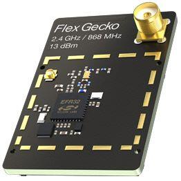

.. _slwrb4250b:

EFR32FG1 2400/868 MHz 13 dBm Dual Band (SLWRB4250B)
###################################################

Overview
********

The EFR32FG1 Flex Gecko 2.4 GHz and 868 MHz Radio Board is delivered as part of
`SLWSTK6061B Proprietary Wireless Starter Kit`_. It contains a EFR32FG1 Wireless
SoC built on an ARM Cortex®-M4F processor with excellent low power capabilities.

   SLWRB4250B (image courtesy of Silicon Labs)

The BRD4250B a.k.a. SLWRB4250B radio board plugs into the Wireless Starter Kit
Mainboard BRD4001A and is supported as one of :ref:`silabs_radio_boards`.

Hardware
********

- EFR32FG1P133F256GM48 Flex Gecko SoC
- CPU core: ARM Cortex®-M4 with FPU
- Flash memory: 256 kB
- RAM: 32 kB
- Transmit power: up to +13 dBm
- Operation frequency: 2.4 GHz, 868 MHz
- 8Mbit SPI NOR Flash
- Crystals for LFXO (32.768 kHz) and HFXO (38.4 MHz).

For more information about the EFR32FG1 SoC and BRD4250B board, refer to these
documents:

- `EFR32FG1 Website`_
- `EFR32FG1 Datasheet`_
- `EFR32xG1 Reference Manual`_
- `SLWSTK6061B Proprietary Wireless Starter Kit`_
- `BRD4250B User Guide`_
- `BRD4250B Reference Manual`_
- `EFR32FG1-BRD4250B Schematics`_

Supported Features
==================

The board configuration supports the following hardware features:

+-----------+------------+-------------------------------------+
| Interface | Controller | Driver/Component                    |
+===========+============+=====================================+
| MPU       | on-chip    | memory protection unit              |
+-----------+------------+-------------------------------------+
| NVIC      | on-chip    | nested vector interrupt controller  |
+-----------+------------+-------------------------------------+
| SYSTICK   | on-chip    | systick                             |
+-----------+------------+-------------------------------------+
| COUNTER   | on-chip    | rtcc                                |
+-----------+------------+-------------------------------------+
| FLASH     | on-chip    | flash memory                        |
+-----------+------------+-------------------------------------+
| GPIO      | on-chip    | gpio                                |
+-----------+------------+-------------------------------------+
| UART      | on-chip    | serial port-polling;                |
|           |            | serial port-interrupt               |
+-----------+------------+-------------------------------------+
| SPI(M)    | on-chip    | spi port-polling                    |
+-----------+------------+-------------------------------------+
| WATCHDOG  | on-chip    | watchdog                            |
+-----------+------------+-------------------------------------+

The default configuration can be found in
:zephyr_file:`boards/silabs/radio_boards/slwrb4250b/slwrb4250b_defconfig`

Connections and IOs
===================

In the following table, the column **Pin** contains Pin names. For example, PA2
means Pin number 2 on PORTA, as used in the board's datasheets and manuals.

+-------+-------------+-------------------------------------+
| Pin   | Function    | Usage                               |
+=======+=============+=====================================+
| PF4   | GPIO        | LED0                                |
+-------+-------------+-------------------------------------+
| PF5   | GPIO        | LED1                                |
+-------+-------------+-------------------------------------+
| PF6   | GPIO        | Push Button PB0                     |
+-------+-------------+-------------------------------------+
| PF7   | GPIO        | Push Button PB1                     |
+-------+-------------+-------------------------------------+
| PA5   | GPIO        | Board Controller Enable VCOM_ENABLE |
+-------+-------------+-------------------------------------+
| PA0   | USART0_TX   | UART Console VCOM_TX US0_TX #0      |
+-------+-------------+-------------------------------------+
| PA1   | USART0_RX   | UART Console VCOM_RX US0_RX #0      |
+-------+-------------+-------------------------------------+
| PC6   | SPI_MOSI    | Flash MOSI US1_TX #11               |
+-------+-------------+-------------------------------------+
| PC7   | SPI_MISO    | Flash MISO US1_RX #11               |
+-------+-------------+-------------------------------------+
| PC8   | SPI_SCLK    | Flash SCLK US1_CLK #11              |
+-------+-------------+-------------------------------------+
| PA4   | SPI_CS      | Flash Chip Select (GPIO)            |
+-------+-------------+-------------------------------------+

System Clock
============

The EFR32FG1P SoC is configured to use the 38.4 MHz external oscillator on the
board.

Serial Port
===========

The EFR32FG1P SoC has two USARTs and one Low Energy UARTs (LEUART).
USART0 is connected to the board controller and is used for the console.

Programming and Debugging
*************************

Flashing
========

Connect the BRD4001A board with a mounted BRD4250B radio module to your host
computer using the USB port.

Here is an example for the :zephyr:code-sample:`hello_world` application.

.. zephyr-app-commands::
   :zephyr-app: samples/hello_world
   :board: slwrb4250b
   :goals: flash

Open a serial terminal (minicom, putty, etc.) with the following settings:

- Speed: 115200
- Data: 8 bits
- Parity: None
- Stop bits: 1

Reset the board and you should see the following message in the terminal:

.. code-block:: console

   Hello World! slwrb4250b

.. _EFR32FG1 Website:
   https://www.silabs.com/wireless/proprietary/efr32fg1-series-1-sub-ghz-2-4-ghz-socs

.. _EFR32FG1 Datasheet:
   https://www.silabs.com/documents/public/data-sheets/efr32fg1-datasheet.pdf

.. _EFR32xG1 Reference Manual:
   https://www.silabs.com/documents/public/reference-manuals/efr32xg1-rm.pdf

.. _SLWSTK6061B Proprietary Wireless Starter Kit:
   https://www.silabs.com/products/development-tools/wireless/proprietary/slwstk6061b-efr32-flex-gecko-868-mhz-2-4-ghz-and-sub-ghz-starter-kit

.. _BRD4250B User Guide:
   https://www.silabs.com/documents/public/user-guides/ug182-brd4250b-user-guide.pdf

.. _BRD4250B Reference Manual:
   https://www.silabs.com/documents/public/reference-manuals/brd4250b-rm.pdf

.. _EFR32FG1-BRD4250B Schematics:
   https://www.silabs.com/documents/public/schematic-files/BRD4250B-B02-schematic.pdf
