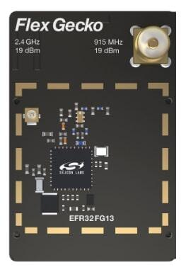

.. _slwrb4255a:

EFR32FG13 2400/915 MHz 19 dBm Dual Band (SLWRB4255A)
####################################################

Overview
********

The EFR32FG13P Flex Gecko 2.4 GHz and 915 MHz Radio Board is delivered as a
`standalone Proprietary Wireless radio board`_. It contains a EFR32FG13P Wireless
SoC built on an ARM Cortex®-M4F processor with excellent low power capabilities.

   SLWRB4255A (image courtesy of Silicon Labs)

The BRD4255A a.k.a. SLWRB4255A radio board plugs into the Wireless Starter Kit
Mainboard BRD4001A and is supported as one of :ref:`silabs_radio_boards`.

Hardware
********

- EFR32FG13P233F512GM48 Flex Gecko SoC
- CPU core: ARM Cortex®-M4 with FPU
- Flash memory: 512 kB
- RAM: 64 kB
- Transmit power: up to 19 dBm
- Operation frequency: 2.4 GHz, 915 MHz
- Crystals for LFXO (32.768 kHz) and HFXO (38.4 MHz).

For more information about the EFR32FG13 SoC and BRD4255A board, refer to these
documents:

- `EFR32FG13 Website`_
- `EFR32FG13 Datasheet`_
- `EFR32xG13 Reference Manual`_
- `BRD4255A Reference Manual`_

Supported Features
==================

The board configuration supports the following hardware features:

+-----------+------------+-------------------------------------+
| Interface | Controller | Driver/Component                    |
+===========+============+=====================================+
| MPU       | on-chip    | memory protection unit              |
+-----------+------------+-------------------------------------+
| NVIC      | on-chip    | nested vector interrupt controller  |
+-----------+------------+-------------------------------------+
| SYSTICK   | on-chip    | systick                             |
+-----------+------------+-------------------------------------+
| COUNTER   | on-chip    | rtcc                                |
+-----------+------------+-------------------------------------+
| FLASH     | on-chip    | flash memory                        |
+-----------+------------+-------------------------------------+
| GPIO      | on-chip    | gpio                                |
+-----------+------------+-------------------------------------+
| UART      | on-chip    | serial port-polling;                |
|           |            | serial port-interrupt               |
+-----------+------------+-------------------------------------+
| SPI(M)    | on-chip    | spi port-polling                    |
+-----------+------------+-------------------------------------+
| WATCHDOG  | on-chip    | watchdog                            |
+-----------+------------+-------------------------------------+

The default configuration can be found in
:zephyr_file:`boards/silabs/radio_boards/slwrb4255/slwrb4255_defconfig`

Connections and IOs
===================

In the following table, the column **Pin** contains Pin names. For example, PA2
means Pin number 2 on PORTA, as used in the board's datasheets and manuals.

+-------+-------------+-------------------------------------+
| Pin   | Function    | Usage                               |
+=======+=============+=====================================+
| PF4   | GPIO        | LED0                                |
+-------+-------------+-------------------------------------+
| PF5   | GPIO        | LED1                                |
+-------+-------------+-------------------------------------+
| PF6   | GPIO        | Push Button PB0                     |
+-------+-------------+-------------------------------------+
| PF7   | GPIO        | Push Button PB1                     |
+-------+-------------+-------------------------------------+
| PA5   | GPIO        | Board Controller Enable VCOM_ENABLE |
+-------+-------------+-------------------------------------+
| PA0   | USART0_TX   | UART Console VCOM_TX US0_TX #0      |
+-------+-------------+-------------------------------------+
| PA1   | USART0_RX   | UART Console VCOM_RX US0_RX #0      |
+-------+-------------+-------------------------------------+
| PC6   | SPI_MOSI    | Flash MOSI US1_TX #11               |
+-------+-------------+-------------------------------------+
| PC7   | SPI_MISO    | Flash MISO US1_RX #11               |
+-------+-------------+-------------------------------------+
| PC8   | SPI_SCLK    | Flash SCLK US1_CLK #11              |
+-------+-------------+-------------------------------------+
| PA4   | SPI_CS      | Flash Chip Select (GPIO)            |
+-------+-------------+-------------------------------------+

System Clock
============

The EFR32FG13P SoC is configured to use the 38.4 MHz external oscillator on the
board.

Serial Port
===========

The EFR32FG13P SoC has three USARTs and one Low Energy UARTs (LEUART).
USART0 is connected to the board controller and is used for the console.

Programming and Debugging
*************************

Flashing
========

Connect the BRD4001A board with a mounted BRD4255A radio module to your host
computer using the USB port.

Here is an example for the :zephyr:code-sample:`hello_world` application.

.. zephyr-app-commands::
   :zephyr-app: samples/hello_world
   :board: slwrb4255a
   :goals: flash

Open a serial terminal (minicom, putty, etc.) with the following settings:

- Speed: 115200
- Data: 8 bits
- Parity: None
- Stop bits: 1

Reset the board and you should see the following message in the terminal:

.. code-block:: console

   Hello World! slwrb4255a

.. _EFR32FG13 Website:
   https://www.silabs.com/wireless/proprietary/efr32fg13-series-1-sub-ghz-2-4-ghz-socs

.. _EFR32FG13 Datasheet:
   https://www.silabs.com/documents/public/data-sheets/efr32fg13-datasheet.pdf

.. _EFR32xG13 Reference Manual:
   https://www.silabs.com/documents/public/reference-manuals/efr32xg13-rm.pdf

.. _standalone Proprietary Wireless radio board:
   https://www.silabs.com/development-tools/wireless/proprietary/slwrb4255a-efr32fg13-915-mhz-radio-board

.. _BRD4255A Reference Manual:
   https://www.silabs.com/documents/public/reference-manuals/brd4255a-rm.pdf
