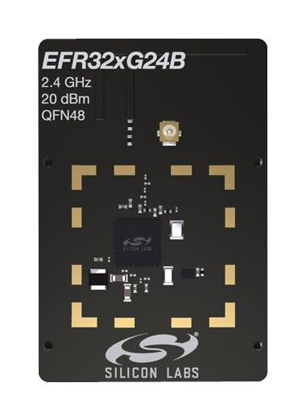

.. _xg24_rb4187c:

EFR32xG24 2.4 GHz 20 dBm (xG24-RB4187C)
#######################################

Overview
********

The EFR32MG24 Mighty Gecko Radio Board is one of the two
radio boards delivered with `xG24-PK6010A Website`_. It contains
a Wireless System-On-Chip from the EFR32MG24 family built on an
ARM Cortex®-M33F processor with excellent low power capabilities.

   xG24-RB4187C (image courtesy of Silicon Labs)

The BRD4187C a.k.a. xG24-RB4187C radio board plugs into the Wireless Pro Kit
Mainboard BRD4002A and is supported as one of :ref:`silabs_radio_boards`.

Hardware
********

- EFR32MG24B220F1536IM48 Mighty Gecko SoC
- CPU core: ARM Cortex®-M33 with FPU
- Flash memory: 1536 kB
- RAM: 256 kB
- Transmit power: up to +20 dBm
- Operation frequency: 2.4 GHz
- Crystals for LFXO (32.768 kHz) and HFXO (39 MHz).

For more information about the EFR32MG24 SoC and BRD4187C board, refer to these
documents:

- `EFR32MG24 Website`_
- `EFR32MG24 Datasheet`_
- `EFR32xG24 Reference Manual`_
- `xG24-PK6010A Website`_
- `BRD4187C User Guide`_

Supported Features
==================

The board configuration supports the following hardware features:

+-----------+------------+-------------------------------------+
| Interface | Controller | Driver/Component                    |
+===========+============+=====================================+
| MPU       | on-chip    | memory protection unit              |
+-----------+------------+-------------------------------------+
| NVIC      | on-chip    | nested vector interrupt controller  |
+-----------+------------+-------------------------------------+
| SYSTICK   | on-chip    | systick                             |
+-----------+------------+-------------------------------------+
| COUNTER   | on-chip    | stimer                              |
+-----------+------------+-------------------------------------+
| FLASH     | on-chip    | flash memory                        |
+-----------+------------+-------------------------------------+
| GPIO      | on-chip    | gpio                                |
+-----------+------------+-------------------------------------+
| UART      | on-chip    | serial                              |
+-----------+------------+-------------------------------------+
| I2C       | on-chip    | i2c                                 |
+-----------+------------+-------------------------------------+
| TRNG      | on-chip    | semailbox                           |
+-----------+------------+-------------------------------------+
| WATCHDOG  | on-chip    | watchdog                            |
+-----------+------------+-------------------------------------+

Other hardware features are currently not supported by the port.

Connections and IOs
===================

In the following table, the column **Name** contains Pin names. For example, PA2
means Pin number 2 on PORTA, as used in the board's datasheets and manuals.

+-------+-------------+-------------------------------------+
| Name  | Function    | Usage                               |
+=======+=============+=====================================+
| PB2   | GPIO        | LED0                                |
+-------+-------------+-------------------------------------+
| PB4   | GPIO        | LED1                                |
+-------+-------------+-------------------------------------+
| PB1   | GPIO        | Push Button 0                       |
+-------+-------------+-------------------------------------+
| PB3   | GPIO        | Push Button 1                       |
+-------+-------------+-------------------------------------+
| PB0   | GPIO        | Board Controller Enable             |
|       |             | VCOM_ENABLE                         |
+-------+-------------+-------------------------------------+
| PA8   | USART0_TX   | UART Console VCOM_TX US0_TX         |
+-------+-------------+-------------------------------------+
| PA9   | USART0_RX   | UART Console VCOM_RX US0_RX         |
+-------+-------------+-------------------------------------+

The default configuration can be found in
:zephyr_file:`boards/silabs/radio_boards/xg24_rb4187c/xg24_rb4187c_defconfig`

System Clock
============

The EFR32MG24 SoC is configured to use the 39 MHz external oscillator on the
board.

Serial Port
===========

The EFR32MG24 SoC has one USART and two EUSARTs.
USART0 is connected to the board controller and is used for the console.

Programming and Debugging
*************************

Flashing
========

Connect the BRD4002A board with a mounted BRD4187C radio module to your host
computer using the USB port.

Here is an example for the :ref:`hello_world` application.

.. zephyr-app-commands::
   :zephyr-app: samples/hello_world
   :board: xg24_rb4187c
   :goals: flash

Open a serial terminal (minicom, putty, etc.) with the following settings:

- Speed: 115200
- Data: 8 bits
- Parity: None
- Stop bits: 1

Reset the board and you should see the following message in the terminal:

.. code-block:: console

   Hello World! xg24_rb4187c

.. _xG24-PK6010A Website:
   https://www.silabs.com/development-tools/wireless/efr32xg24-pro-kit-20-dbm

.. _BRD4187C User Guide:
   https://www.silabs.com/documents/public/user-guides/ug526-brd4187c-user-guide.pdf

.. _EFR32MG24 Website:
   https://www.silabs.com/wireless/zigbee/efr32mg24-series-2-socs

.. _EFR32MG24 Datasheet:
   https://www.silabs.com/documents/public/data-sheets/efr32mg24-datasheet.pdf

.. _EFR32xG24 Reference Manual:
   https://www.silabs.com/documents/public/reference-manuals/brd4187c-rm.pdf
