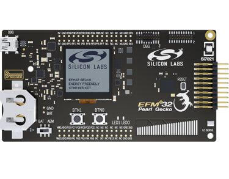

.. _slstk3402a:

EFM32 Pearl Gecko 12 (SLSTK3402A)
#################################

Overview
********

The EFM32 Pearl Gecko 12 Starter Kit SLSTK3402A contains an MCU from the
EFM32PG family built on an ARM® Cortex®-M4F processor with excellent low
power capabilities.

   EFM32PG12 SLSTK3402A (image courtesy of Silicon Labs)

Hardware
********

- Advanced Energy Monitoring provides real-time information about the energy
  consumption of an application or prototype design.
- Ultra low power 128x128 pixel Memory-LCD
- 2 user buttons, 2 LEDs and a touch slider
- Humidity, temperature, and inductive-capacitive metal sensor
- On-board Segger J-Link USB debugger

For more information about the EFM32PG SoC and SLSTK3402A board:

- `EFM32PG Website`_
- `EFM32PG12 Datasheet`_
- `EFM32PG12 Reference Manual`_
- `SLSTK3402A Website`_
- `SLSTK3402A User Guide`_
- `SLSTK3402A Schematics`_

Supported Features
==================

The slstk3402a board configuration supports the following hardware features:

+-----------+------------+-------------------------------------+
| Interface | Controller | Driver/Component                    |
+===========+============+=====================================+
| MPU       | on-chip    | memory protection unit              |
+-----------+------------+-------------------------------------+
| NVIC      | on-chip    | nested vector interrupt controller  |
+-----------+------------+-------------------------------------+
| SYSTICK   | on-chip    | systick                             |
+-----------+------------+-------------------------------------+
| COUNTER   | on-chip    | rtcc                                |
+-----------+------------+-------------------------------------+
| FLASH     | on-chip    | flash memory                        |
+-----------+------------+-------------------------------------+
| GPIO      | on-chip    | gpio                                |
+-----------+------------+-------------------------------------+
| UART      | on-chip    | serial port-polling;                |
|           |            | serial port-interrupt               |
+-----------+------------+-------------------------------------+
| I2C       | on-chip    | i2c port-polling                    |
+-----------+------------+-------------------------------------+
| WATCHDOG  | on-chip    | watchdog                            |
+-----------+------------+-------------------------------------+
| TRNG      | on-chip    | true random number generator        |
+-----------+------------+-------------------------------------+

The default configuration can be found in
:zephyr_file:`boards/silabs/starter_kits/slstk3402a/slstk3402a_efm32pg12b500f1024gl125_defconfig`

The default configuration when building using this board to develop for the
EFM32JG12 SoC can be found in
:zephyr_file:`boards/silabs/starter_kits/slstk3402a/slstk3402a_efm32jg12b500f1024gl125_defconfig`

Other hardware features are currently not supported by the port.

EFM32 Jade Gecko SoC
--------------------

The EFM32 Pearl Gecko Starter Kit SLSTK3402A can also be used to evaluate
the EFM32 Jade Gecko SoC (EFM32JG12). The only difference between the Pearl
Gecko and the Jade Gecko is their core. The Pearl Gecko contains an ARM®
Cortex®-M4F core, and the Jade Gecko an ARM® Cortex®-M3 core. Other features
such as memory and peripherals are the same.

Code that is built for the Jade Gecko also runs on an equivalent Pearl Gecko.

To build firmware for the Jade Gecko and run it on the EFM32 Pearl Gecko Starter
Kit, use the board ``slstk3402a/efm32jg12b500f1024gl125`` instead of
``slstk3402a/efm32pg12b500f1024gl125``.

Connections and IOs
===================

The EFM32PG12 SoC has twelve GPIO controllers (PORTA to PORTL), but only four
are currently enabled (PORTA, PORTB, PORTD and PORTF) for the SLSTK3402A
board.

In the following table, the column **Name** contains pin names. For example, PE2
means pin number 2 on PORTE, as used in the board's datasheets and manuals.

+-------+-------------+-------------------------------------+
| Name  | Function    | Usage                               |
+=======+=============+=====================================+
| PF4   | GPIO        | LED0                                |
+-------+-------------+-------------------------------------+
| PF5   | GPIO        | LED1                                |
+-------+-------------+-------------------------------------+
| PF6   | GPIO        | Push Button PB0                     |
+-------+-------------+-------------------------------------+
| PF7   | GPIO        | Push Button PB1                     |
+-------+-------------+-------------------------------------+
| PA5   | GPIO        | Board Controller Enable             |
|       |             | EFM_BC_EN                           |
+-------+-------------+-------------------------------------+
| PA0   | UART_TX     | UART TX Console VCOM_TX US0_TX #0   |
+-------+-------------+-------------------------------------+
| PA1   | UART_RX     | UART RX Console VCOM_RX US0_RX #0   |
+-------+-------------+-------------------------------------+
| PD10  | UART_TX     | EXP12_UART_TX LEU0_TX #18           |
+-------+-------------+-------------------------------------+
| PD11  | UART_RX     | EXP14_UART_RX LEU0_RX #18           |
+-------+-------------+-------------------------------------+
| PC10  | I2C_SDA     | ENV_I2C_SDA I2C0_SDA #15            |
+-------+-------------+-------------------------------------+
| PC11  | I2C_SCL     | ENV_I2C_SCL I2C0_SCL #15            |
+-------+-------------+-------------------------------------+

System Clock
============

The EFM32PG12 SoC is configured to use the 40 MHz external oscillator on the
board.

Serial Port
===========

The EFM32PG12 SoC has four USARTs and one Low Energy UART (LEUART).

Programming and Debugging
*************************

.. note::
   Before using the kit the first time, you should update the J-Link firmware
   from `J-Link-Downloads`_

Flashing
========

The SLSTK3402A includes an `J-Link`_ serial and debug adaptor built into the
board. The adaptor provides:

- A USB connection to the host computer, which exposes a mass storage device and a
  USB serial port.
- A serial flash device, which implements the USB flash disk file storage.
- A physical UART connection which is relayed over interface USB serial port.

Flashing an application to SLSTK3402A
-------------------------------------

The sample application :ref:`hello_world` is used for this example.
Build the Zephyr kernel and application:

.. zephyr-app-commands::
   :zephyr-app: samples/hello_world
   :board: slstk3402a/efm32pg12b500f1024gl125
   :goals: build

Connect the SLSTK3402A to your host computer using the USB port and you
should see a USB connection which exposes a mass storage device(STK3402A).
Copy the generated zephyr.bin to the STK3402A drive.

Use a USB-to-UART converter such as an FT232/CP2102 to connect to the UART on the
expansion header.

Open a serial terminal (minicom, putty, etc.) with the following settings:

- Speed: 115200
- Data: 8 bits
- Parity: None
- Stop bits: 1

Reset the board and you'll see the following message on the corresponding serial port
terminal session:

.. code-block:: console

   Hello World! slstk3402a

.. _SLSTK3402A Website:
   https://www.silabs.com/products/development-tools/mcu/32-bit/efm32-pearl-gecko-pg12-starter-kit

.. _SLSTK3402A User Guide:
   https://www.silabs.com/documents/public/user-guides/ug257-stk3402-usersguide.pdf

.. _SLSTK3402A Schematics:
   https://www.silabs.com/documents/public/schematic-files/BRD2501A-A01-schematic.pdf

.. _EFM32PG Website:
   https://www.silabs.com/products/mcu/32-bit/efm32-pearl-gecko

.. _EFM32PG12 Datasheet:
   https://www.silabs.com/documents/public/data-sheets/efm32pg12-datasheet.pdf

.. _EFM32PG12 Reference Manual:
   https://www.silabs.com/documents/public/reference-manuals/efm32pg12-rm.pdf

.. _J-Link:
   https://www.segger.com/jlink-debug-probes.html

.. _J-Link-Downloads:
   https://www.segger.com/downloads/jlink
