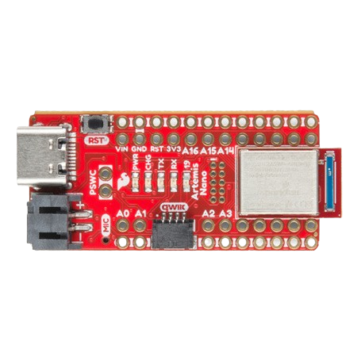

.. _artemis_nano:

Sparkfun Artemis Nano
######################

The SparkFun Artemis Nano is a versatile and user-friendly development board that utilizes
 Ambiq's ultra-low power Apollo3 Blue SoC.

Hardware
********

- Apollo3 Blue SoC with up to 96 MHz operating frequency
- ARM® Cortex® M4F core
- 16 kB 2-way Associative/Direct-Mapped Cache per core
- Up to 1 MB of flash memory for code/data
- Up to 384 KB of low leakage / low power RAM for code/data
- Integrated Bluetooth 5 Low-energy controller

For more information about the SparkFun RedBoard Artemis Nano:

- `SparkFun RedBoard Artemis Nano`_

Supported Features
==================

The Sparkfun Redboard Artemis Nano board configuration supports the following hardware features:

+-----------+------------+-------------------------------------+
| Interface | Controller | Driver/Component                    |
+===========+============+=====================================+
| MPU       | on-chip    | memory protection unit              |
+-----------+------------+-------------------------------------+
| NVIC      | on-chip    | nested vector interrupt controller  |
+-----------+------------+-------------------------------------+
| SYSTICK   | on-chip    | systick                             |
+-----------+------------+-------------------------------------+
| STIMER    | on-chip    | stimer                              |
+-----------+------------+-------------------------------------+
| GPIO      | on-chip    | gpio                                |
+-----------+------------+-------------------------------------+
| UART      | on-chip    | serial                              |
+-----------+------------+-------------------------------------+
| WDT       | on-chip    | watchdog                            |
+-----------+------------+-------------------------------------+
| RADIO     | on-chip    | bluetooth                           |
+-----------+------------+-------------------------------------+

The default configuration can be found in the defconfig file:
``boards/sparkfun/artemis_nano/artemis_nano_defconfig``.

Programming and Debugging
=========================

Flashing an application
-----------------------

Connect your device to your host computer using the USB-C port.
The sample application `blinky` is used for this example.
Build the Zephyr kernel and application, then flash it to the device:

.. zephyr-app-commands::
   :zephyr-app: samples/basic/blinky
   :board: artemis_nano
   :goals: flash

.. note::
   The `west flash` command requires the `SparkFun SVL bootloader`_ and a custom flash program that has been implemented for this board. To use west flash you have to add Artemis-Firmware-Upload-GUI-3.0.0/artemis_uploader to your PATH.

After flashing the board you should see the blue LED (USER LED D19) is blinking.

.. _SparkFun RedBoard Artemis Nano:
   https://www.sparkfun.com/products/15443

.. _Apollo3 Blue Datasheet:
   https://contentportal.ambiq.com/documents/20123/388390/Apollo3-Blue-SoC-Datasheet.pdf

.. _SEGGER J-Link software:
   https://www.segger.com/downloads/jlink

.. _pylink:
   https://github.com/Square/pylink

.. _SparkFun SVL bootloader:
   https://github.com/sparkfun/SparkFun_Artemis/tree/master
