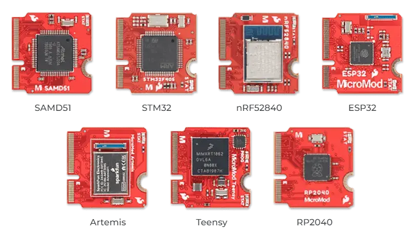

.. _boardname_linkname:

SparkFun MicroMod board Processor
#################################

Overview
********

MicroMod is a solderless, modular interface ecosystem that uses the M.2 standard
to mix and match your choice of processor with specific Function Boards or
stand-alone Carrier Boards. A MicroMod processor board is approximately 22x22 mm,
and can insert into any MicroMod carrier board. More information can be found in
the `Micromod specification website`_.

All Micromod board targets support the following hardware features:

- USB host mode compliant to 2.0 specification
- GPIO
- 2 UART
- 2 I2C
- 2 SPI
- 2 ADC
- 2 PWM
- Watchdog Timer (WDT)

   Sparkfun Micromod board (Credit: https://www.sparkfun.com)

Zephyr currently supports the following SoCs:

- ``micromod/nrf52840``

SparkFun MicroMod nRF52840 board Processor
##########################################

Overview
********

The ``micromod/nrf52840`` board target features the nRF52840 SoC
from Nordic Semiconductor, the SparkFun MicroMod nRF52840 Processor offers
a powerful combination of ARM Cortex-M4 CPU and 2.4 GHz Bluetooth transceiver
in the MicroMod form-factor. More information can be found in
the `Micromod nRF52840 guide`_.

Hardware
********

The ``micromod/nrf52840`` board target supports the following
hardware features:

- ARM Cortex-M4 CPU with floating point unit (FPU)

   - 1MB internal Flash
   - 256kB internal RAM

- Integrated 2.4GHz radio with support for Bluetooth Low Energy (BLE) and ieee802154
- USB 2.0 full speed (12 Mbps) controller
- QSPI with 128Mb flash memory
- ARM TrustZone Cryptocell 310 security subsystem
- USB host mode compliant to 2.0 specification
- GPIO
- 2 UART
- 2 I2C
- 2 SPI
- 2 ADC
- 2 PWM
- Watchdog Timer (WDT)

Supported Features
==================

The Zephyr ``micromod/nrf52840`` board target supports the following hardware
features:

+-----------+------------+-------------------------------------+
| Interface | Controller | Driver/Component                    |
+===========+============+=====================================+
| NVIC      | on-chip    | nested vector interrupt controller  |
+-----------+------------+-------------------------------------+
| SYSTICK   | on-chip    | system clock                        |
+-----------+------------+-------------------------------------+
| RADIO     | on-chip    | Bluetooth,                          |
|           |            | ieee802154                          |
+-----------+------------+-------------------------------------+
| UART      | on-chip    | serial port                         |
+-----------+------------+-------------------------------------+
| GPIO      | on-chip    | gpio                                |
+-----------+------------+-------------------------------------+
| PINMUX    | on-chip    | pinmux                              |
+-----------+------------+-------------------------------------+
| FLASH     | on-chip    | flash                               |
+-----------+------------+-------------------------------------+
| SPI       | on-chip    | spi                                 |
+-----------+------------+-------------------------------------+
| I2C       | on-chip    | i2c                                 |
+-----------+------------+-------------------------------------+
| USB       | on-chip    | usb                                 |
+-----------+------------+-------------------------------------+
| QSPI      | on-chip    | nordic,nrf-qspi                     |
+-----------+------------+-------------------------------------+

Connections and IOs
===================

LED
---

* Led0 (blue) = P0.13

Micromod header
---------------

* micromod_1_uart = uart0
* micromod_2_uart = uart1
* micromod_0_i2c = i2c0
* micromod_1_i2c = i2c1
* micromod_0_spi = spi2
* micromod_header compatible with ``sparkfun,micromod-gpio``

Programming and Debugging
*************************

Applications for the ``micromod/nrf52840`` board target can be
built, flashed, and debugged in the usual way. See
:ref:`build_an_application` and :ref:`application_run` for more details on
building and running.

Flashing
========

Follow the instructions in the :ref:`nordic_segger` page to install
and configure all the necessary software. Further information can be
found in :ref:`nordic_segger_flashing`. Then build and flash
applications as usual (see :ref:`build_an_application` and
:ref:`application_run` for more details).

The flashing tool will depend on the carrier used along with the board.
In the case of `Sparkfun asset tracking carrier`_, it is possible to use
the SWD interface along with a J-Link.

Here is an example for the :zephyr:code-sample:`hello_world` application.

First, run your favorite terminal program to listen for output.

.. code-block:: console

   $ minicom -D <tty_device> -b 115200

Replace :code:`<tty_device>` with the port where the board nRF52840 DK
can be found. For example, under Linux, :code:`/dev/ttyACM0`.

Then build and flash the application in the usual way.

.. zephyr-app-commands::
   :zephyr-app: samples/hello_world
   :board: micromod/nrf52840
   :goals: build flash

Debugging
=========

Refer to the :ref:`nordic_segger` page to learn about debugging Nordic boards with a
Segger IC.

In case of using a Nordic Segger Jlink, it is possible to configure the app to use Segger Real
Time Transfer (RTT) for debugging. In this case, build your app with the
:ref:`RTT snippet <snippet-rtt-console>`.

Testing the on-board LED
************************

There is a sample that allow you to test the LED on the board is working properly
with Zephyr:

* :zephyr:code-sample:`blinky`

You can build and flash the example to make sure Zephyr is running correctly on
your board. The button and LED definitions can be found in
:zephyr_file:`boards/sparkfun/micromod/micromod_nrf52840.dts`.

Testing the 128Mb qspi memory flash
***********************************

The ``micromod/nrf52840`` board target has a built-in NOR flash memory connected
to the qspi interface. It can be tested with the samples/drivers/jesd216 app.

.. zephyr-app-commands::
   :zephyr-app: samples/drivers/jesd216
   :board: micromod/nrf52840
   :goals: build flash

References
**********

.. target-notes::

.. _Micromod specification website: https://www.sparkfun.com/micromod
.. _Sparkfun asset tracking carrier: https://www.sparkfun.com/products/17272
.. _Micromod nRF52840 guide: https://learn.sparkfun.com/tutorials/micromod-nrf52840-processor-hookup-guide
.. _J-Link Software and documentation pack: https://www.segger.com/jlink-software.html
.. _nRF52840 Product Specification: http://infocenter.nordicsemi.com/pdf/nRF52840_PS_v1.0.pdf
