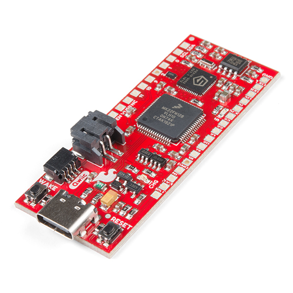

.. _sparkfun_red_v_things_plus:

SparkFun RED-V Things Plus
##########################

Overview
********

The SparkFun RED-V Things Plus is a development board with
a SiFive FE310-G002 RISC-V SoC.

For more information about the SparkFun RED-V Things Plus and SiFive FE310-G002:

- `SparkFun RED-V Things Plus Website`_
- `SiFive FE310-G002 Datasheet`_
- `SiFive FE310-G002 User Manual`_

Programming and debugging
*************************

Building
========

Applications for the ``sparkfun_red_v_things_plus`` board configuration can be built as usual
(see :ref:`build_an_application`) using the corresponding board name:

.. zephyr-app-commands::
   :board: sparkfun_red_v_things_plus
   :goals: build

Flashing
========

The SparkFun RED-V Things Plus uses Segger J-Link OB for flashing and debugging.
To flash and debug the board, you'll need to install the
`Segger J-Link Software and Documentation Pack
<https://www.segger.com/downloads/jlink#J-LinkSoftwareAndDocumentationPack>`_
and choose version V6.46a or later (Downloads for Windows, Linux, and macOS are
available).

With the Segger J-Link Software installed, you can flash the application as usual
(see :ref:`build_an_application` and :ref:`application_run` for more details):

.. zephyr-app-commands::
   :board: sparkfun_red_v_things_plus
   :goals: flash

Debugging
=========

Refer to the detailed overview about :ref:`application_debugging`.

.. _SparkFun RED-V Things Plus Website:
   https://www.sparkfun.com/products/15799

.. _SiFive FE310-G002 Datasheet:
   https://sifive.cdn.prismic.io/sifive/4999db8a-432f-45e4-bab2-57007eed0a43_fe310-g002-datasheet-v1p2.pdf

.. _SiFive FE310-G002 User Manual:
   https://sifive.cdn.prismic.io/sifive/034760b5-ac6a-4b1c-911c-f4148bb2c4a5_fe310-g002-v1p5.pdf
