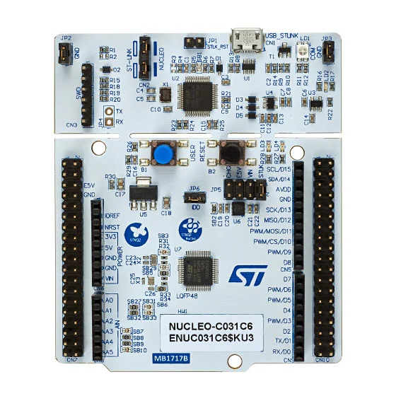

.. _nucleo_c031c6_board:

ST Nucleo C031C6
################

Overview
********
The STM32 Nucleo-64 development board with STM32C031C6 MCU, supports Arduino and ST morpho connectivity.

The STM32 Nucleo board provides an affordable, and flexible way for users to try out new concepts,
and build prototypes with the STM32 microcontroller, choosing from the various
combinations of performance, power consumption and features.

The STM32 Nucleo board integrates the ST-LINK/V2-1 debugger and programmer.

The STM32 Nucleo board comes with the STM32 comprehensive software HAL library together
with various packaged software examples.

More information about the board can be found at the `Nucleo C031C6 website`_.

Hardware
********
Nucleo C031C6 provides the following hardware components:

- STM32 microcontroller in 48-pin package featuring 32 Kbytes of Flash memory
  and 12 Kbytes of SRAM.
- Extension resource:

  - Arduino* Uno V3 connectivity

- On-board ST-LINK/V2-1 debugger/programmer with SWD connector:

- Flexible board power supply:

  - USB VBUS or external source (3.3V, 5V, 7 - 12V)
  - Current consumption measurement (IDD)

- Four LEDs:

  - USB communication (LD1), USB power fault LED (LD2), power LED (LD3),
    user LED (LD4)

- Two push-button: USER and RESET

- USB re-enumeration capability. Three different interfaces supported on USB:

  - Virtual COM port
  - Mass storage
  - Debug port

More information about STM32C031C6 can be found here:
`STM32C0x1 reference manual`_

Supported Features
==================

The Zephyr nucleo_c031c6 board configuration supports the following hardware features:

+-----------+------------+-------------------------------------+
| Interface | Controller | Driver/Component                    |
+===========+============+=====================================+
| NVIC      | on-chip    | nested vector interrupt controller  |
+-----------+------------+-------------------------------------+
| UART      | on-chip    | serial port-polling;                |
|           |            | serial port-interrupt               |
+-----------+------------+-------------------------------------+
| PINMUX    | on-chip    | pinmux                              |
+-----------+------------+-------------------------------------+
| GPIO      | on-chip    | gpio                                |
+-----------+------------+-------------------------------------+
| CLOCK     | on-chip    | reset and clock control             |
+-----------+------------+-------------------------------------+
| RTC       | on-chip    | counter                             |
+-----------+------------+-------------------------------------+
| IWDG      | on-chip    | independent watchdog                |
+-----------+------------+-------------------------------------+
| WWDG      | on-chip    | window watchdog                     |
+-----------+------------+-------------------------------------+
| PWM       | on-chip    | pwm                                 |
+-----------+------------+-------------------------------------+
| ADC       | on-chip    | ADC Controller                      |
+-----------+------------+-------------------------------------+
| die-temp  | on-chip    | die temperature sensor              |
+-----------+------------+-------------------------------------+
| I2C       | on-chip    | i2c                                 |
+-----------+------------+-------------------------------------+
| DMA       | on-chip    | Direct Memory Access                |
+-----------+------------+-------------------------------------+
| RTC       | on-chip    | rtc                                 |
+-----------+------------+-------------------------------------+

Other hardware features are not yet supported in this Zephyr port.

The default configuration can be found in
:zephyr_file:`boards/st/nucleo_c031c6/nucleo_c031c6_defconfig`

Connections and IOs
===================

Each of the GPIO pins can be configured by software as output (push-pull or open-drain), as
input (with or without pull-up or pull-down), or as peripheral alternate function. Most of the
GPIO pins are shared with digital or analog alternate functions. All GPIOs are high current
capable except for analog inputs.

Default Zephyr Peripheral Mapping:
----------------------------------

- UART_2 TX/RX : PA2/PA3 (ST-Link Virtual Port Com)
- LD4       : PA5

For more details please refer to `STM32 Nucleo-64 board User Manual`_.

Programming and Debugging
*************************

Nucleo C031C6 board includes an ST-LINK/V2-1 embedded debug tool interface.

Applications for the ``nucleo_c031c6`` board configuration can be built and
flashed in the usual way (see :ref:`build_an_application` and
:ref:`application_run` for more details).

Flashing
========

The board is configured to be flashed using west `STM32CubeProgrammer`_ runner,
so its :ref:`installation <stm32cubeprog-flash-host-tools>` is required.

Flashing an application to Nucleo C031C6
----------------------------------------

Here is an example for the :zephyr:code-sample:`blinky` application.

.. zephyr-app-commands::
   :zephyr-app: samples/basic/blinky
   :board: nucleo_c031c6
   :goals: build flash

You will see the LED blinking every second.

References
**********

.. target-notes::

.. _Nucleo C031C6 website:
   https://www.st.com/en/evaluation-tools/nucleo-c031c6.html

.. _STM32C0x1 reference manual:
   https://www.st.com/resource/en/reference_manual/rm0490-stm32c0x1-advanced-armbased-64bit-mcus-stmicroelectronics.pdf

.. _STM32 Nucleo-64 board User Manual:
   https://www.st.com/resource/en/user_manual/um2953-stm32c0-nucleo64-board-mb1717-stmicroelectronics.pdf

.. _STM32CubeProgrammer:
   https://www.st.com/en/development-tools/stm32cubeprog.html
