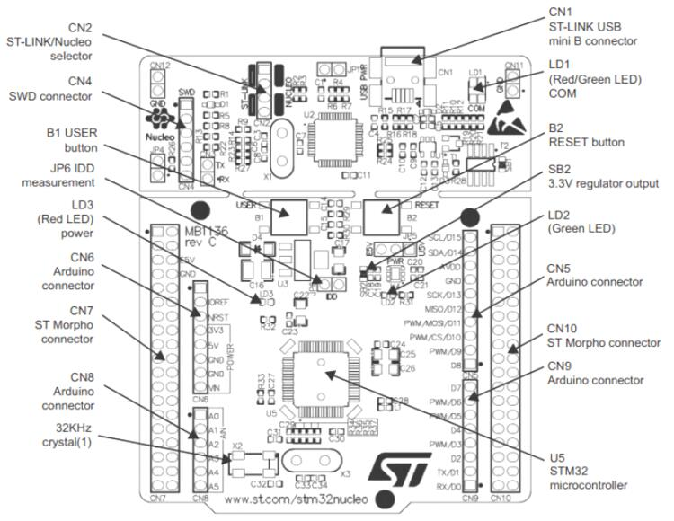

.. zephyr:board:: nucleo_f030r8

Overview
********
The STM32 Nucleo-64 development board with STM32F030R8 MCU, supports Arduino and ST morpho connectivity.

The STM32 Nucleo board provides an affordable, and flexible way for users to try out new concepts,
and build prototypes with the STM32 microcontroller, choosing from the various
combinations of performance, power consumption and features.

The Arduino* Uno V3 connectivity support and the ST morpho headers allow easy functionality
expansion of the STM32 Nucleo open development platform with a wide choice of
specialized shields.

The STM32 Nucleo board integrates the ST-LINK/V2-1 debugger and programmer.

The STM32 Nucleo board comes with the STM32 comprehensive software HAL library together
with various packaged software examples.

More information about the board can be found at the `Nucleo F030R8 website`_.

Hardware
********
Nucleo F030R8 provides the following hardware components:

- STM32 microcontroller in QFP64 package
- Two types of extension resources:

  - Arduino* Uno V3 connectivity
  - ST morpho extension pin headers for full access to all STM32 I/Os

- ARM* mbed*
- On-board ST-LINK/V2-1 debugger/programmer with SWD connector:

  - Selection-mode switch to use the kit as a standalone ST-LINK/V2-1

- Flexible board power supply:

  - USB VBUS or external source (3.3V, 5V, 7 - 12V)
  - Power management access point

- Three LEDs:

  - USB communication (LD1), user LED (LD2), power LED (LD3)

- Two push-buttons: USER and RESET
- USB re-enumeration capability. Three different interfaces supported on USB:

  - Virtual COM port
  - Mass storage
  - Debug port

- Support of wide choice of Integrated Development Environments (IDEs) including:

  - IAR
  - ARM Keil
  - GCC-based IDEs

More information about STM32F030R8 can be found here:

- `STM32F030 reference manual`_
- `STM32F030 data sheet`_

Supported Features
==================

The Zephyr nucleo_f030r8 board configuration supports the following hardware features:

+-----------+------------+-------------------------------------+
| Interface | Controller | Driver/Component                    |
+===========+============+=====================================+
| NVIC      | on-chip    | nested vector interrupt controller  |
+-----------+------------+-------------------------------------+
| UART      | on-chip    | serial port-polling;                |
|           |            | serial port-interrupt               |
+-----------+------------+-------------------------------------+
| PINMUX    | on-chip    | pinmux                              |
+-----------+------------+-------------------------------------+
| GPIO      | on-chip    | gpio                                |
+-----------+------------+-------------------------------------+
| CLOCK     | on-chip    | reset and clock control             |
+-----------+------------+-------------------------------------+
| FLASH     | on-chip    | flash memory                        |
+-----------+------------+-------------------------------------+
| WATCHDOG  | on-chip    | independent watchdog                |
+-----------+------------+-------------------------------------+
| I2C       | on-chip    | i2c controller                      |
+-----------+------------+-------------------------------------+
| ADC       | on-chip    | ADC controller                      |
+-----------+------------+-------------------------------------+

Other hardware features are not yet supported in this Zephyr port.

The default configuration can be found in
:zephyr_file:`boards/st/nucleo_f030r8/nucleo_f030r8_defconfig`

Connections and IOs
===================

Each of the GPIO pins can be configured by software as output (push-pull or open-drain), as
input (with or without pull-up or pull-down), or as peripheral alternate function. Most of the
GPIO pins are shared with digital or analog alternate functions. All GPIOs are high current
capable except for analog inputs.

Board connectors:
-----------------

Default Zephyr Peripheral Mapping:
----------------------------------

- UART_1 TX/RX : PA9/PA10
- UART_2 TX/RX : PA2/PA3 (ST-Link Virtual COM Port)
- I2C1 SCL/SDA : PB8/PB9 (Arduino I2C)
- I2C2 SCL/SDA : PB10/PB11
- SPI1 NSS/SCK/MISO/MOSI : PB6/PA5/PA6/PA7 (Arduino SPI)
- SPI2 NSS/SCK/MISO/MOSI : PB12/PB13/PB14/PB15
- USER_PB : PC13
- LD1 : PA5
- ADC : PA0

For more details please refer to `STM32 Nucleo-64 board User Manual`_.

Programming and Debugging
*************************

Nucleo F030R8 board includes an ST-LINK/V2-1 embedded debug tool interface.

Applications for the ``nucleo_f030r8`` board configuration can be built and
flashed in the usual way (see :ref:`build_an_application` and
:ref:`application_run` for more details).

.. _nucleo-f030r8-flashing:

Flashing
========

The board is configured to be flashed using west `STM32CubeProgrammer`_ runner,
so its :ref:`installation <stm32cubeprog-flash-host-tools>` is required.

Alternatively, OpenOCD, JLink, prob-rs can also be used to flash the board using
the ``--runner`` (or ``-r``) option:

.. code-block:: console

   $ west flash --runner openocd
   $ west flash --runner jlink
   $ west flash --runner prob-rs

Flashing an application to Nucleo F030R8
----------------------------------------

Here is an example for the :zephyr:code-sample:`blinky` application.

.. zephyr-app-commands::
   :zephyr-app: samples/basic/blinky
   :board: nucleo_f030r8
   :goals: build flash

You will see the LED blinking every second.

If using the C-01 board, select revision '1' that supports the board.

.. zephyr-app-commands::
   :zephyr-app: samples/basic/blinky
   :board: nucleo_f030r8@1
   :goals: build flash

Debugging
=========

You can debug an application in the usual way.  Here is an example for the
:zephyr:code-sample:`blinky` application.

.. zephyr-app-commands::
   :zephyr-app: samples/basic/blinky
   :board: nucleo_f030r8
   :maybe-skip-config:
   :goals: debug

Again you have to use the adapted command for C-01.

.. zephyr-app-commands::
   :zephyr-app: samples/basic/blinky
   :board: nucleo_f030r8@1
   :maybe-skip-config:
   :goals: debug

Board Revisions
***************

Nucleo F030R8 has some version of board variants.
`STM32 Nucleo-64 board User Manual`_ mentions to Nucleo board variants.

   | *The board version MB1136 C-01 or MB1136 C-02 is mentioned on the sticker, placed on the bottom side of the PCB.*
   | *The board marking MB1136 C-01 corresponds to a board, configured as HSE not used.*
   | *The board marking MB1136 C-02 (or higher) corresponds to a board, configured to use ST-LINK MCO as the clock input.*

Using revision **2** adapted for C-02(or higher) as default when not explicitly selecting revisions.
If using the C-01 board, select revision **1**.
Please see :ref:`Flashing <nucleo-f030r8-flashing>` section.

References
**********

.. target-notes::

.. _Nucleo F030R8 website:
   https://www.st.com/en/evaluation-tools/nucleo-f030r8.html

.. _STM32F030 reference manual:
   https://www.st.com/resource/en/reference_manual/dm00091010.pdf

.. _STM32F030 data sheet:
   https://www.st.com/resource/en/datasheet/stm32f030r8.pdf

.. _STM32 Nucleo-64 board User Manual:
   https://www.st.com/resource/en/user_manual/dm00105823.pdf

.. _STM32CubeProgrammer:
   https://www.st.com/en/development-tools/stm32cubeprog.html
