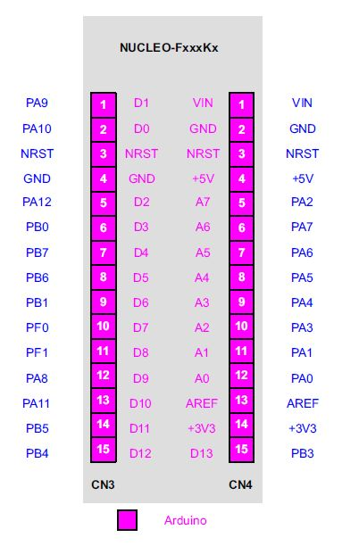

.. zephyr:board:: nucleo_f042k6

Overview
********
The STM32 Nucleo-32 development board with STM32F042K6 MCU, supports Arduino nano connectivity.

The STM32 Nucleo board provides an affordable, and flexible way for users to try out new concepts,
and build prototypes with the STM32 microcontroller, choosing from the various
combinations of performance, power consumption and features.

The STM32 Nucleo board integrates the ST-LINK/V2-1 debugger and programmer.

The STM32 Nucleo board comes with the STM32 comprehensive software HAL library together
with various packaged software examples.

More information about the board can be found at the `Nucleo F042K6 website`_.

Hardware
********
Nucleo F042K6 provides the following hardware components:

- STM32 microcontroller in LQFP32 package

- On-board ST-LINK/V2-1 debugger/programmer with SWD connector:

- Flexible board power supply:

  - USB VBUS or external source (3.3V, 5V, 7 - 12V)

- Three LEDs:

  - USB communication (LD1), user LED (LD2), power LED (LD3)

- reset push button

More information about STM32F042K6 can be found here:

- `STM32F042 reference manual`_
- `STM32F042 data sheet`_

Supported Features
==================

.. zephyr:board-supported-hw::

Connections and IOs
===================

Each of the GPIO pins can be configured by software as output (push-pull or open-drain), as
input (with or without pull-up or pull-down), or as peripheral alternate function. Most of the
GPIO pins are shared with digital or analog alternate functions.

Board connectors:
-----------------

Default Zephyr Peripheral Mapping:
----------------------------------

- UART_1 TX/RX : PA2/PA15 (ST-Link Virtual COM Port)
- I2C1 SCL/SDA : PB6/PB7 (Arduino I2C)
- SPI1 NSS/SCK/MISO/MOSI : PA4/PA5/PA6/PA7 (Arduino SPI)
- LD2 : PB3

For more details please refer to `STM32 Nucleo-32 board User Manual`_.

Programming and Debugging
*************************

.. zephyr:board-supported-runners::

Nucleo F042K6 board includes an ST-LINK/V2-1 embedded debug tool interface.

Applications for the ``nucleo_f042k6`` board configuration can be built and
flashed in the usual way (see :ref:`build_an_application` and
:ref:`application_run` for more details).

Flashing
========

The board is configured to be flashed using west `STM32CubeProgrammer`_ runner,
so its :ref:`installation <stm32cubeprog-flash-host-tools>` is required.

Alternatively, OpenOCD or JLink can also be used to flash the board using
the ``--runner`` (or ``-r``) option:

.. code-block:: console

   $ west flash --runner openocd
   $ west flash --runner jlink

Flashing an application to Nucleo F042K6
----------------------------------------

Here is an example for the :zephyr:code-sample:`blinky` application.

.. zephyr-app-commands::
   :zephyr-app: samples/basic/blinky
   :board: nucleo_f042k6
   :goals: build flash

You will see the LED blinking every second.

Debugging
=========

You can debug an application in the usual way.  Here is an example for the
:zephyr:code-sample:`blinky` application.

.. zephyr-app-commands::
   :zephyr-app: samples/basic/blinky
   :board: nucleo_f042k6
   :maybe-skip-config:
   :goals: debug

References
**********

.. target-notes::

.. _Nucleo F042K6 website:
   https://www.st.com/en/evaluation-tools/nucleo-f042k6.html

.. _STM32F042 reference manual:
   https://www.st.com/resource/en/reference_manual/dm00031936-stm32f0x1stm32f0x2stm32f0x8-advanced-armbased-32bit-mcus-stmicroelectronics.pdf

.. _STM32F042 data sheet:
   https://www.st.com/resource/en/datasheet/stm32f042k6.pdf

.. _STM32 Nucleo-32 board User Manual:
   https://www.st.com/resource/en/user_manual/dm00231744-stm32-nucleo32-boards-mb1180-stmicroelectronics.pdf

.. _STM32CubeProgrammer:
   https://www.st.com/en/development-tools/stm32cubeprog.html
