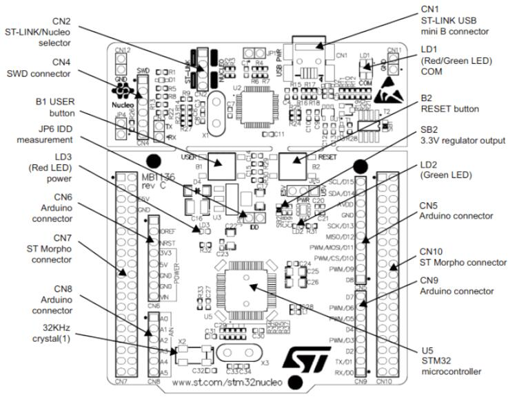

.. zephyr:board:: nucleo_f302r8

Overview
********

The Nucleo F302R8 board features an ARM Cortex-M4 based STM32F302R8
mixed-signal MCU with FPU and DSP instructions capable of running at 72 MHz.
Here are some highlights of the Nucleo F302R8 board:

- STM32 microcontroller in LQFP64 package
- LSE crystal: 32.768 kHz crystal oscillator
- Two types of extension resources:

  - Arduino* Uno V3 connectors
  - ST morpho extension pin headers for full access to all STM32 I/Os

- On-board ST-LINK/V2-1 debugger/programmer with SWD connector
- Flexible board power supply:

  - 5 V from ST-LINK/V2-1 USB VBUS
  - External power sources: 3.3 V and 7 - 12 V on ST Zio or ST morpho
    connectors, 5 V on ST morpho connector

- One user LED
- Two push-buttons: USER and RESET

More information about the board can be found at the `Nucleo F302R8 website`_,
and in the `STM32 Nucleo-64 board User Manual`_.

Hardware
********

The Nucleo F302R8 provides the following hardware components:

- STM32F302R8T6 in QFP64 package
- ARM |reg| 32-bit Cortex |reg| -M4 CPU with FPU
- 72 MHz max CPU frequency
- VDD from 2.0 V to 3.6 V
- 64 KB Flash
- 16 KB SRAM
- RTC
- Advanced-control Timer
- General Purpose Timers (4)
- Basic Timer
- Watchdog Timers (2)
- PWM channels (18)
- SPI/I2S (2)
- I2C (3)
- USART/UART (3/3)
- USB 2.0 FS with on-chip PHY
- CAN (2)
- GPIO with external interrupt capability
- DMA channels (7)
- Capacitive sensing channels (18)
- 12-bit ADC with 15 channels
- 12-bit D/A converter
- Analog comparator (3)
- Op amp

More information about the STM32F302R8 can be found here:

- `STM32F302R8 on www.st.com`_
- `STM32F302R8 reference manual`_
- `STM32F302R8 datasheet`_

Supported Features
==================

.. zephyr:board-supported-hw::

Connections and IOs
===================

The Nucleo F302R8 Board has 5 GPIO controllers. These controllers are
responsible for pin muxing, input/output, pull-up, etc.

Board connectors:
-----------------

Default Zephyr Peripheral Mapping:
----------------------------------

The Nucleo F302R8 board features an Arduino Uno V3 connector and a ST
morpho connector. Board is configured as follows:

- UART_2 TX/RX : PA2/PA3 (ST-Link Virtual Port Com)
- UART_3 TX/RX : PC10/PC11
- I2C1 SCL/SDA : PB8/PB9 (Arduino I2C)
- SPI2 CS/SCK/MISO/MOSI : PB6/PB13/PB14/P15 (Arduino SPI)
- PWM_2_CH2 : PA0
- USER_PB   : PC13
- LD2       : PB13

System Clock
------------

The Nucleo F302R8 System Clock can be driven by an internal or
external oscillator, as well as by the main PLL clock. By default the
System Clock is driven by the PLL clock at 72 MHz. The input to the
PLL is an 8 MHz external clock supplied by the processor of the
on-board ST-LINK/V2-1 debugger/programmer.

Serial Port
-----------

The Nucleo F302R8 board has 3 UARTs. The Zephyr console output is assigned
to UART2.  Default settings are 115200 8N1.

Programming and Debugging
*************************

The Nucleo F302R8 board includes an ST-LINK/V2-1 embedded debug tool interface.

Flashing
========

The board is configured to be flashed using west `STM32CubeProgrammer`_ runner,
so its :ref:`installation <stm32cubeprog-flash-host-tools>` is required.

Alternatively, OpenOCD or JLink can also be used to flash the board using
the ``--runner`` (or ``-r``) option:

.. code-block:: console

   $ west flash --runner openocd
   $ west flash --runner jlink

.. _Nucleo F302R8 website:
   https://www.st.com/en/evaluation-tools/nucleo-f302r8.html

.. _STM32 Nucleo-64 board User Manual:
   https://www.st.com/resource/en/user_manual/dm00105823.pdf

.. _STM32F302R8 on www.st.com:
   https://www.st.com/en/microcontrollers/stm32f302r8.html

.. _STM32F302R8 reference manual:
   https://www.st.com/resource/en/reference_manual/dm00094349.pdf

.. _STM32F302R8 datasheet:
   https://www.st.com/resource/en/datasheet/stm32f302r8.pdf

.. _STM32CubeProgrammer:
   https://www.st.com/en/development-tools/stm32cubeprog.html
