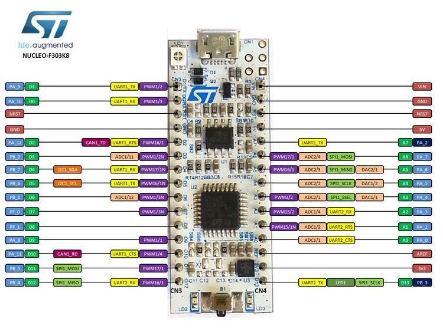

.. zephyr:board:: nucleo_f303k8

Overview
********

The Nucleo F303K8 board features an ARM Cortex-M4 based STM32F303K8
mixed-signal MCU with FPU and DSP instructions capable of running at 72 MHz.
Here are some highlights of the Nucleo F303K8 board:

- STM32 microcontroller in LQFP32 package
- one type of extension resources:

- Arduino™ Nano V3 connectivity support

- On-board ST-LINK/V2-1 debugger/programmer with SWD connector
- Flexible board power supply:

- 5 V from ST-LINK/V2-1 USB VBUS
- External power sources: 3.3 V, 5V and 7 - 12 V

- One user LED
- One push-buttons: RESET

More information about the board can be found at the `Nucleo F303K8 website`_,
and in the `STM32 Nucleo-32 board User Manual`_.

Hardware
********

The Nucleo F303K8 provides the following hardware components:

- STM32F303K8T6 in LQFP32 package
- ARM |reg| 32-bit Cortex |reg| -M4 CPU with FPU
- 72 MHz max CPU frequency
- VDD from 2.0 V to 3.6 V
- 64 KB Flash
- 12 KB SRAM
- RTC
- Advanced-control Timer
- General Purpose Timers (5)
- Basic Timer (2)
- Watchdog Timers (2)
- PWM channels (12)
- SPI/I2S (1)
- I2C (1)
- USART/UART (2)
- CAN (1)
- GPIO with external interrupt capability
- DMA channels (7)
- Capacitive sensing channels (18)
- 12-bit ADC with 21 channels
- 12-bit D/A converter
- Analog comparator (3)
- Op amp

More information about the STM32F303K8 can be found here:

- `STM32F303K8 on www.st.com`_
- `STM32F303K8 reference manual`_
- `STM32F303K8 datasheet`_

Supported Features
==================

The Zephyr nucleo_f303k8 board configuration supports the following hardware
features:

+-----------+------------+-------------------------------------+
| Interface | Controller | Driver/Component                    |
+===========+============+=====================================+
| NVIC      | on-chip    | nested vector interrupt controller  |
+-----------+------------+-------------------------------------+
| UART      | on-chip    | serial port-polling;                |
|           |            | serial port-interrupt               |
+-----------+------------+-------------------------------------+
| PINMUX    | on-chip    | pinmux                              |
+-----------+------------+-------------------------------------+
| GPIO      | on-chip    | gpio                                |
+-----------+------------+-------------------------------------+
| PWM       | on-chip    | pwm                                 |
+-----------+------------+-------------------------------------+
| I2C       | on-chip    | i2c                                 |
+-----------+------------+-------------------------------------+
| SPI       | on-chip    | spi                                 |
+-----------+------------+-------------------------------------+
| ADC       | on-chip    | ADC Controller                      |
+-----------+------------+-------------------------------------+

Other hardware features are not yet supported on this Zephyr port.

The default configuration can be found in
:zephyr_file:`boards/st/nucleo_f303k8/nucleo_f303k8_defconfig`

Connections and IOs
===================

The Nucleo F303K8 Board has 1 GPIO controller. This controllers is responsible
for input/output, pull-up, etc.

Board connectors:
-----------------

Default Zephyr Peripheral Mapping:
----------------------------------

The Nucleo F303K8 board features an Arduino Zero V3 connector. Board is configured as follows:

- UART_2 TX/RX : PA2/PA15 (ST-Link Virtual Port Com)
- I2C1 SCL/SDA : PB7/PB6
- SPI1 CS/SCK/MISO/MOSI : PA_4/PA_5/PA_6/PA_7
- LD2       : PB3

System Clock
------------

The Nucleo F303K8 System Clock can be driven by an internal or
external oscillator, as well as by the main PLL clock. By default the
System Clock is driven by the PLL clock at 72 MHz. The input to the
PLL is an 8 MHz internal clock supply.

Serial Port
-----------

The Nucleo F303K8 board has 2 UARTs. The Zephyr console output is assigned
to UART2.  Default settings are 115200 8N1.

Programming and Debugging
*************************

The Nucleo F303K8 board includes an ST-LINK/V2-1 embedded debug tool interface.

Flashing
========

The board is configured to be flashed using west `STM32CubeProgrammer`_ runner,
so its :ref:`installation <stm32cubeprog-flash-host-tools>` is required.

Alternatively, OpenOCD, JLink, or pyOCD can also be used to flash the board using
the ``--runner`` (or ``-r``) option:

.. code-block:: console

   $ west flash --runner openocd
   $ west flash --runner jlink
   $ west flash --runner pyocd

.. _Nucleo F303K8 website:
   https://www.st.com/en/evaluation-tools/nucleo-F303K8.html

.. _STM32 Nucleo-32 board User Manual:
   https://www.st.com/resource/en/user_manual/dm00231744-stm32-nucleo32-boards-mb1180-stmicroelectronics.pdf

.. _STM32F303K8 on www.st.com:
   https://www.st.com/en/microcontrollers/stm32F303K8.html

.. _STM32F303K8 reference manual:
   https://www.st.com/resource/en/reference_manual/dm00043574-stm32f303xbcde-stm32f303x68-stm32f328x8-stm32f358xc-stm32f398xe-advanced-armbased-mcus-stmicroelectronics.pdf

.. _STM32F303K8 datasheet:
   https://www.st.com/resource/en/datasheet/stm32f303k8.pdf

.. _STM32CubeProgrammer:
   https://www.st.com/en/development-tools/stm32cubeprog.html
