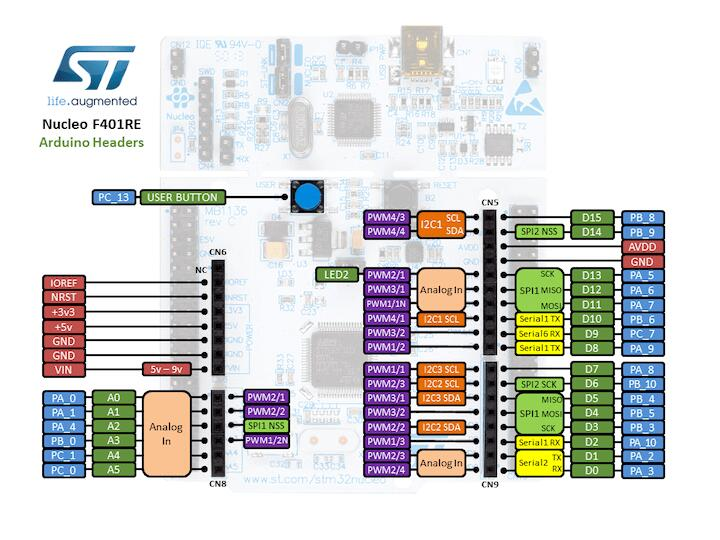
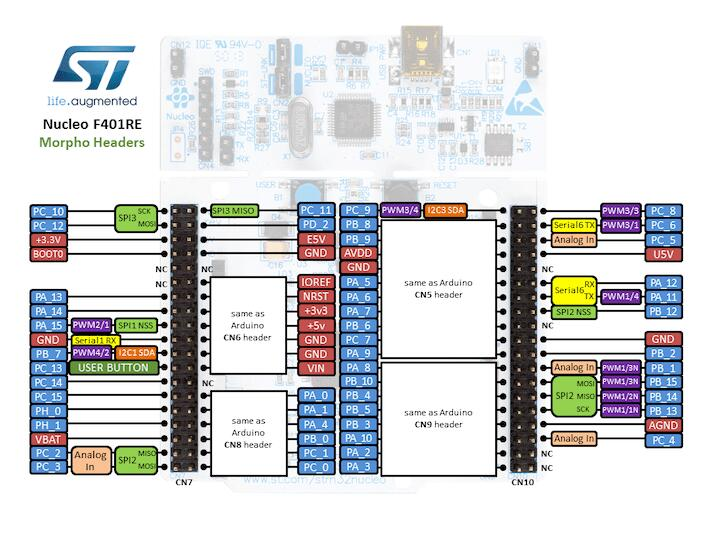

.. zephyr:board:: nucleo_f401re

Overview
********

The Nucleo F401RE board features an ARM Cortex-M4 based STM32F401RE MCU
with a wide range of connectivity support and configurations Here are
some highlights of the Nucleo F401RE board:

- STM32 microcontroller in QFP64 package
- Two types of extension resources:

  - Arduino Uno V3 connectivity
  - ST morpho extension pin headers for full access to all STM32 I/Os

- On-board ST-LINK/V2-1 debugger/programmer with SWD connector
- Flexible board power supply:

  - USB VBUS or external source(3.3V, 5V, 7 - 12V)
  - Power management access point

- Three LEDs: USB communication (LD1), user LED (LD2), power LED (LD3)
- Two push-buttons: USER and RESET

More information about the board can be found at the `Nucleo F401RE website`_.

Hardware
********

Nucleo F401RE provides the following hardware components:

- STM32F401RET6 in LQFP64 package
- ARM |reg| 32-bit Cortex |reg|-M4 CPU with FPU
- 84 MHz max CPU frequency
- VDD from 1.7 V to 3.6 V
- 512 KB Flash
- 96 KB SRAM
- GPIO with external interrupt capability
- 12-bit ADC with 16 channels
- RTC
- Advanced-control Timer
- General Purpose Timers (7)
- Watchdog Timers (2)
- USART/UART (3)
- I2C (3)
- SPI (4)
- SDIO
- USB 2.0 OTG FS
- DMA Controller

More information about STM32F401RE can be found here:

- `STM32F401RE on www.st.com`_
- `STM32F401 reference manual`_

Supported Features
==================

.. zephyr:board-supported-hw::

Pin Mapping
===========

Nucleo F401RE Board has 6 GPIO controllers. These controllers are responsible for pin muxing,
input/output, pull-up, etc.

Available pins:
---------------

For more details please refer to `STM32 Nucleo-64 board User Manual`_.

Default Zephyr Peripheral Mapping:
----------------------------------

- UART_1 TX/RX : PB6/PB7
- UART_2 TX/RX : PA2/PA3 (ST-Link Virtual Port Com)
- I2C1 SCL/SDA : PB8/PB9 (Arduino I2C)
- SPI1 CS/SCK/MISO/MOSI : PB6/PA5/PA6/PA7 (Arduino SPI)
- PWM_2_CH1 : PA0
- USER_PB   : PC13
- LD2       : PA5

System Clock
============

Nucleo F401RE System Clock could be driven by internal or external oscillator,
as well as main PLL clock. By default System clock is driven by PLL clock at 84MHz,
driven by 8MHz high speed external clock.

Serial Port
===========

Nucleo F401RE board has 3 UARTs. The Zephyr console output is assigned to UART2.
Default settings are 115200 8N1.

I2C
===

Nucleo F401RE board has up to 3 I2Cs. The default I2C mapping for Zephyr is:

- I2C1_SCL : PB8
- I2C1_SDA : PB9

Programming and Debugging
*************************

.. zephyr:board-supported-runners::

Nucleo F401RE board includes an ST-LINK/V2-1 embedded debug tool interface.

Applications for the ``nucleo_f401re`` board configuration can be built and
flashed in the usual way (see :ref:`build_an_application` and
:ref:`application_run` for more details).

Flashing
========

The board is configured to be flashed using west `STM32CubeProgrammer`_ runner,
so its :ref:`installation <stm32cubeprog-flash-host-tools>` is required.

Alternatively, OpenOCD or JLink can also be used to flash the board using
the ``--runner`` (or ``-r``) option:

.. code-block:: console

   $ west flash --runner openocd
   $ west flash --runner jlink

Flashing an application to Nucleo F401RE
----------------------------------------

Connect the Nucleo F401RE to your host computer using the USB port,
then run a serial host program to connect with your Nucleo board:

.. code-block:: console

   $ minicom -D /dev/ttyACM0

Now build and flash an application. Here is an example for
:zephyr:code-sample:`hello_world`.

.. zephyr-app-commands::
   :zephyr-app: samples/hello_world
   :board: nucleo_f401re
   :goals: build flash

You should see the following message on the console:

.. code-block:: console

   Hello World! arm

Debugging
=========

You can debug an application in the usual way.  Here is an example for the
:zephyr:code-sample:`hello_world` application.

.. zephyr-app-commands::
   :zephyr-app: samples/hello_world
   :board: nucleo_f401re
   :maybe-skip-config:
   :goals: debug

.. _Nucleo F401RE website:
   https://www.st.com/en/evaluation-tools/nucleo-f401re.html

.. _STM32 Nucleo-64 board User Manual:
   https://www.st.com/resource/en/user_manual/dm00105823.pdf

.. _STM32F401RE on www.st.com:
   https://www.st.com/en/microcontrollers/stm32f401re.html

.. _STM32F401 reference manual:
   https://www.st.com/resource/en/reference_manual/dm00096844.pdf

.. _STM32CubeProgrammer:
   https://www.st.com/en/development-tools/stm32cubeprog.html
