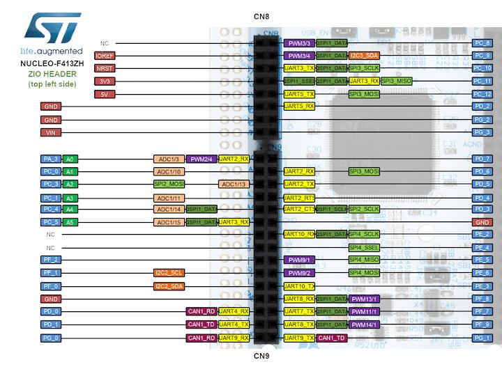
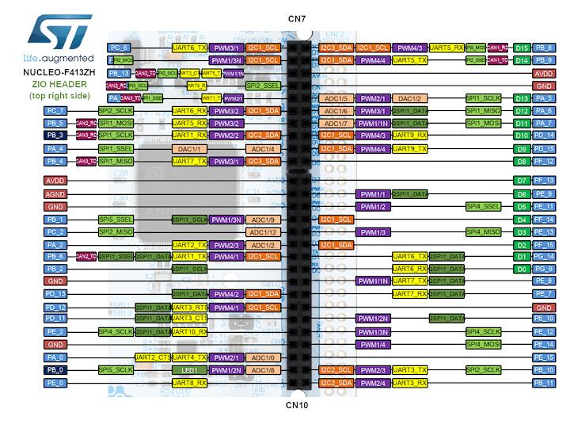
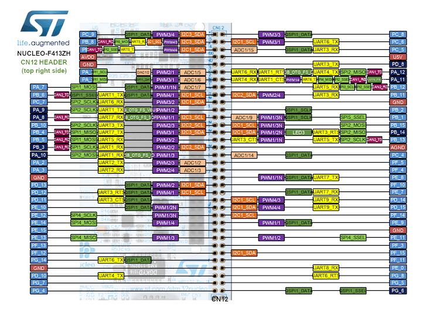

.. zephyr:board:: nucleo_f413zh

Overview
********

The Nucleo F413ZH board features an ARM Cortex-M4 based STM32F413ZH MCU
with a wide range of connectivity support and configurations. Here are
some highlights of the Nucleo F413ZH board:

- STM32 microcontroller in LQFP144 package
- Two types of extension resources:

  - ST Zio connector including: support for Arduino* Uno V3 connectivity
    (A0 to A5, D0 to D15) and additional signals exposing a wide range of
    peripherals
  - ST morpho extension pin headers for full access to all STM32 I/Os

- On-board ST-LINK/V2-1 debugger/programmer with SWD connector
- Flexible board power supply:

  - 5 V from ST-LINK/V2-1 USB VBUS
  - External power sources: 3.3 V and 7 - 12 V on ST Zio or ST morpho
    connectors, 5 V on ST morpho connector

- Three user LEDs
- Two push-buttons: USER and RESET

More information about the board can be found at the `Nucleo F413ZH website`_.

Hardware
********

Nucleo F413ZH provides the following hardware components:

- STM32F413ZHT6 in LQFP144 package
- ARM |reg| 32-bit Cortex |reg| -M4 CPU with FPU
- 100 MHz max CPU frequency
- VDD from 1.7 V to 3.6 V
- 1.5 MB Flash
- 320 KB SRAM
- GPIO with external interrupt capability
- 2 12-bit ADC with 16 channels, with FIFO and burst support
- RTC
- 14 General purpose timers
- 2 watchdog timers (independent and window)
- SysTick timer
- USART/UART (10)
- I2C (4)
- SPI (5)
- SDIO
- USB 2.0 OTG FS
- DMA Controller
- CRC calculation unit

More information about STM32F413ZH can be found here:

- `STM32F413ZH on www.st.com`_
- `STM32F413/423 reference manual`_

Supported Features
==================

The Zephyr nucleo_413zh board configuration supports the following hardware features:

+-----------+------------+-------------------------------------+
| Interface | Controller | Driver/Component                    |
+===========+============+=====================================+
| NVIC      | on-chip    | nested vector interrupt controller  |
+-----------+------------+-------------------------------------+
| UART      | on-chip    | serial port-polling;                |
|           |            | serial port-interrupt               |
+-----------+------------+-------------------------------------+
| PINMUX    | on-chip    | pinmux                              |
+-----------+------------+-------------------------------------+
| GPIO      | on-chip    | gpio                                |
+-----------+------------+-------------------------------------+
| I2C       | on-chip    | i2c                                 |
+-----------+------------+-------------------------------------+
| SPI       | on-chip    | spi                                 |
+-----------+------------+-------------------------------------+
| USB       | on-chip    | usb                                 |
+-----------+------------+-------------------------------------+
| PWM       | on-chip    | pwm                                 |
+-----------+------------+-------------------------------------+

Other hardware features are not yet supported on this Zephyr port.

The default configuration can be found in
:zephyr_file:`boards/st/nucleo_f413zh/nucleo_f413zh_defconfig`

Connections and IOs
===================

Nucleo F413ZH Board has 8 GPIO controllers. These controllers are responsible for pin muxing,
input/output, pull-up, etc.

Available pins:
---------------

.. image:: img/nucleo_f413zh_morpho_left.jpg
   :align: center
   :alt: Nucleo F413ZH Morpho connectors (left)

For more details please refer to `STM32 Nucleo-144 board User Manual`_.

Default Zephyr Peripheral Mapping:
----------------------------------

- UART_3 TX/RX : PD8/PD9 (ST-Link Virtual Port Com)
- UART_6 TX/RX : PG14/PG9 (Arduino Serial)
- I2C1 SCL/SDA : PB8/PB9 (Arduino I2C)
- SPI1 NSS/SCK/MISO/MOSI : PD14/PA5/PA6/PA7 (Arduino SPI)
- PWM_2_CH1 : PA0
- USB_DM : PA11
- USB_DP : PA12
- USER_PB : PC13
- LD1 : PB0
- LD2 : PB7
- LD3 : PB14

System Clock
------------

Nucleo F413ZH System Clock could be driven by internal or external oscillator,
as well as main PLL clock. By default System clock is driven by PLL clock at 96MHz,
driven by 8MHz high speed external clock.

Serial Port
-----------

Nucleo F413ZH board has 10 UARTs. The Zephyr console output is assigned to UART3.
Default settings are 115200 8N1.

USB
===
Nucleo F413ZH board has a USB OTG dual-role device (DRD) controller that
supports both device and host functions through its micro USB connector
(USB USER). Only USB device function is supported in Zephyr at the moment.

Programming and Debugging
*************************

Nucleo F413ZH board includes an ST-LINK/V2-1 embedded debug tool interface.

Flashing
========

The board is configured to be flashed using west `STM32CubeProgrammer`_ runner,
so its :ref:`installation <stm32cubeprog-flash-host-tools>` is required.

Alternatively, OpenOCD or JLink can also be used to flash the board using
the ``--runner`` (or ``-r``) option:

.. code-block:: console

   $ west flash --runner openocd
   $ west flash --runner jlink

.. _Nucleo F413ZH website:
   https://www.st.com/en/evaluation-tools/nucleo-f413zh.html

.. _STM32 Nucleo-144 board User Manual:
   https://www.st.com/resource/en/user_manual/dm00244518.pdf

.. _STM32F413ZH on www.st.com:
   https://www.st.com/en/microcontrollers/stm32f413zh.html

.. _STM32F413/423 reference manual:
   https://www.st.com/resource/en/reference_manual/dm00305666.pdf

.. _STM32CubeProgrammer:
   https://www.st.com/en/development-tools/stm32cubeprog.html
