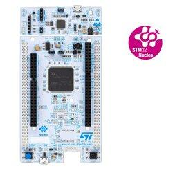
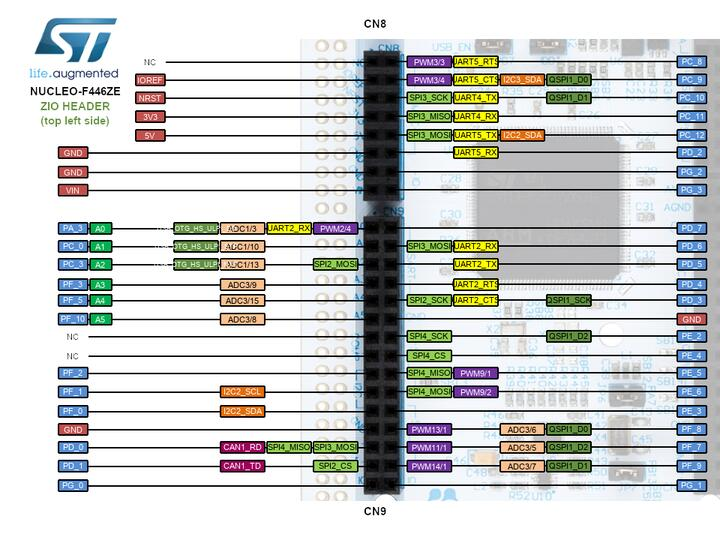
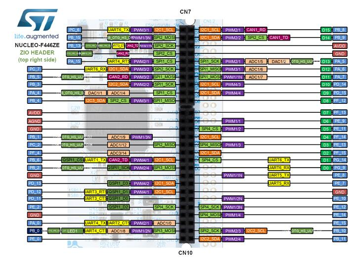
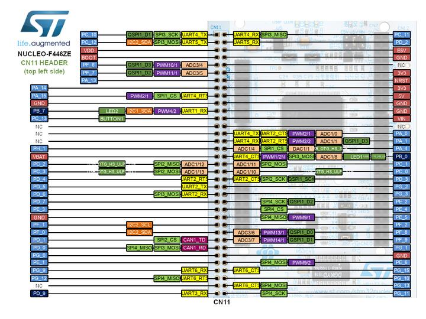
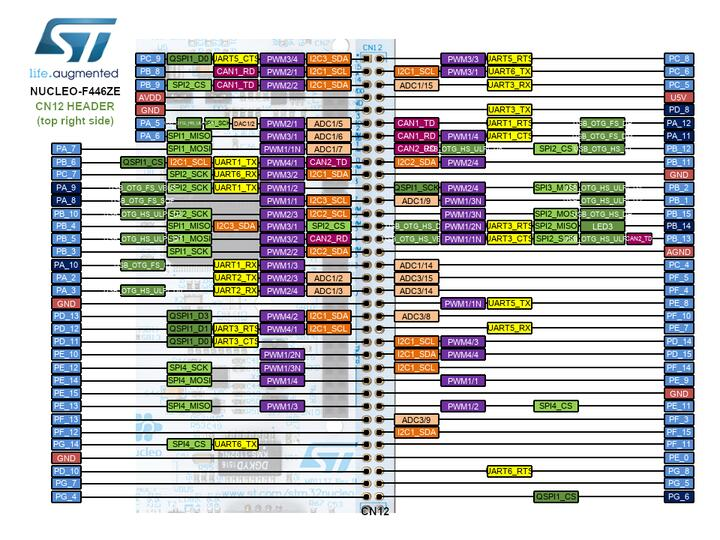

.. _nucleo_f446ze_board:

ST Nucleo F446ZE
################

Overview
********

The Nucleo F446ZE board features an ARM Cortex-M4 based STM32F446ZE MCU
with a wide range of connectivity support and configurations. Here are
some highlights of the Nucleo F446ZE board:

- STM32F446 microcontroller in QFP144 package
- Two types of extension resources:

  - ST zio support for Arduino™ Uno V3 connectivity (A0 to A5, D0 to D15) and additional signals exposing a wide range of peripherals
  - ST morpho extension pin headers for full access to all STM32 I/Os

- On-board ST-LINK/V2-1 debugger/programmer with SWD connector
- USB re-enumeration capability. Three different interfaces supported on USB:
  - Virtual Com port
  - Mass storage (USB Disk drive) for drag'n'drop programming
  - Debug port
- Flexible board power supply:
  - USB VBUS or external source(3.3V, 5V, 7 - 12V)
  - Power management access point
  - USB OTG

- Three LEDs: USB communication (LD1), user LED (LD2), power LED (LD3)
- Two push-buttons: USER and RESET

More information about the board can be found at the `Nucleo F446ZE website`_.

Hardware
********

Nucleo F446ZE provides the following hardware components:

- STM32F446ZET6 in LQFP144 package
- ARM |reg| 32-bit Cortex |reg|-M4 CPU with FPU
- Adaptive real-time accelerator (ART Accelerator)
- 180 MHz max CPU frequency
- VDD from 1.7 V to 3.6 V
- 512 KB Flash
- 128 KB SRAM
- 10 General purpose timers
- 2 Advanced control timers
- 2 basic timers
- SPI(4)
- I2C(4)
- USART(4)
- UART(2)
- USB OTG Full Speed and High Speed
- CAN(2)
- SAI(2)
- SPDIF_Rx(1)
- HDMI_CEC(1)
- Quad SPI(1)
- Camera Interface
- GPIO(50) with external interrupt capability
- 12-bit ADC(3) with 16 channels
- 12-bit DAC with 2 channels

More information about STM32F446ZE can be found here:

- `STM32F446ZE on www.st.com`_
- `STM32F446 reference manual`_

Supported Features
==================

The Zephyr nucleo_f446ze board configuration supports the following hardware features:

+-------------+------------+-------------------------------------+
| Interface   | Controller | Driver/Component                    |
+=============+============+=====================================+
| NVIC        | on-chip    | nested vector interrupt controller  |
+-------------+------------+-------------------------------------+
| UART        | on-chip    | serial port                         |
+-------------+------------+-------------------------------------+
| PINMUX      | on-chip    | pinmux                              |
+-------------+------------+-------------------------------------+
| GPIO        | on-chip    | gpio                                |
+-------------+------------+-------------------------------------+
| PWM         | on-chip    | pwm                                 |
+-------------+------------+-------------------------------------+
| I2C         | on-chip    | i2c                                 |
+-------------+------------+-------------------------------------+
| USB         | on-chip    | usb                                 |
+-------------+------------+-------------------------------------+
| Backup SRAM | on-chip    | Backup SRAM                         |
+-------------+------------+-------------------------------------+
| CAN 1/2     | on-chip    | Controller Area Network             |
+-------------+------------+-------------------------------------+
| ADC         | on-chip    | Analog Input                        |
+-------------+------------+-------------------------------------+
| DAC         | on-chip    | Analog Output                       |
+-------------+------------+-------------------------------------+

Other hardware features are not yet supported on this Zephyr port.

The default configuration can be found in
:zephyr_file:`boards/st/nucleo_f446ze/nucleo_f446ze_defconfig`

Connections and IOs
===================

Nucleo F446ZE Board has 8 GPIO controllers. These controllers are responsible for pin muxing,
input/output, pull-up, etc.

Available pins:
---------------

For more details please refer to `STM32 Nucleo-144 board User Manual`_.

Default Zephyr Peripheral Mapping:
----------------------------------

- UART_2_TX : PD5
- UART_2_RX : PD6
- UART_3_TX : PD8
- UART_3_RX : PD9
- USER_PB   : PC13
- LD0       : PB0
- LD1       : PB7
- LD2       : PB14
- I2C1_SDA  : PB9
- I2C1_SCL  : PB8
- I2C2_SDA  : PF0
- I2C2_SCL  : PF1
- SPI1_CS   : PD14
- SPI1_SCK  : PA5
- SPI1_MISO : PA6
- SPI1_MOSI : PA7
- SPI2_NSS  : PB12
- SPI2_SCK  : PB13
- SPI2_MISO : PB14
- SPI2_MOSI : PB15
- CAN1_RX   : PD0
- CAN1_TX   : PD1
- USB_DP    : PA11
- USB_DM    : PA12
- ADC1_IN0  : PA0
- DAC_OUT1  : PA4

System Clock
------------

Nucleo F446ZE System Clock could be driven by an internal or external oscillator,
as well as the main PLL clock. By default, the System clock is driven by the PLL clock at 84MHz,
driven by an 8MHz high-speed external clock.

Serial Port
-----------

Nucleo F446ZE board has 2 UARTs and 4 USARTs. The Zephyr console output is assigned to USART3.
Default settings are 115200 8N1.

Backup SRAM
-----------

In order to test backup SRAM you may want to disconnect VBAT from VDD. You can
do it by removing ``SB156`` jumper on the back side of the board.

Controller Area Network
-----------------------

The TX/RX wires are connected with pins 25/27 of CN9 connector.

Programming and Debugging
*************************

Applications for the ``nucleo_f446ze`` board configuration can be built and
flashed in the usual way (see :ref:`build_an_application` and
:ref:`application_run` for more details).

Flashing
========

Nucleo F446ZE board includes an ST-LINK/V2-1 embedded debug tool interface.
This interface is supported by the openocd version included in the Zephyr SDK.

Flashing an application to Nucleo F446ZE
----------------------------------------

Here is an example for the :ref:`hello_world` application.

Run a serial host program to connect with your Nucleo board.

.. code-block:: console

   $ minicom -b 115200 -D /dev/ttyACM0

Build and flash the application:

.. zephyr-app-commands::
   :zephyr-app: samples/hello_world
   :board: nucleo_f446ze
   :goals: build flash

You should see the following message on the console:

.. code-block:: console

   $ Hello World! arm

Debugging
=========

You can debug an application in the usual way.  Here is an example for the
:ref:`hello_world` application.

.. zephyr-app-commands::
   :zephyr-app: samples/hello_world
   :board: nucleo_f446ze
   :maybe-skip-config:
   :goals: debug

.. _Nucleo F446ZE website:
   https://www.st.com/en/evaluation-tools/nucleo-f446ze.html

.. _STM32 Nucleo-144 board User Manual:
   https://www.st.com/resource/en/user_manual/um1974-stm32-nucleo144-boards-mb1137-stmicroelectronics.pdf

.. _STM32F446ZE on www.st.com:
   https://www.st.com/en/microcontrollers/stm32f446ze.html

.. _STM32F446 reference manual:
   https://www.st.com/resource/en/reference_manual/dm00135183.pdf
