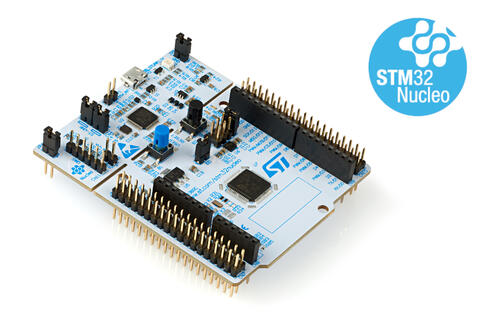

.. _nucleo_g0b1re_board:

ST Nucleo G0B1RE
################

Overview
********
The Nucleo G0B1RE board features an ARM Cortex-M0+ based STM32G0B1RE MCU
with a wide range of connectivity support and configurations. Here are
some highlights of the Nucleo G0B1RE board:

- STM32 microcontroller in QFP64 package
- Board connectors:

  - Arduino Uno V3 connectivity
  - ST morpho extension pin headers for full access to all STM32 I/Os

- On-board ST-LINK/V2-1 debugger/programmer with SWD connector
- Flexible board power supply:

   - 5V_USB_STLK from ST-Link USB connector
   - VIN (7 - 12V) from ARDUINO connector or ST morpho connector
   - E5V from ST morpho connector
   - 5V_USB_CHG from ST-LINK USB connector
   - 3.3V on ARDUINO connector or ST morpho connector

- Three LEDs: USB communication (LD1), user LED (LD4), power LED (LD3)
- Two push-buttons: USER and RESET
- 32.768 kHz crystal oscillator

More information about the board can be found at the `Nucleo G0B1RE website`_.

Hardware
********
Nucleo G0B1RE provides the following hardware components:

- STM32G0B1RE in LQFP64 package
- ARM 32-bit Cortex-M0+ CPU
- 64 MHz max CPU frequency
- Voltage range from 1.7 V to 3.6 V
- 512 KB Flash
- 144 kB SRAM
- 32-bit timers(1)
- 16-bit timers(11)
- watchdogs(2)
- systick(1)
- Calendar RTC with alarm and periodic wakeup
- I2C(3)
- USART(6)
- LPUART(2)
- 32 Mbit/s SPI(3) multiplexed with I2S(2)
- HDMI_CEC(1)
- USB 2.0 FS device (crystal-less) and host controller(1)
- USB Type-C Power Delivery controller
- CAN FD(2)
- GPIO (up to 94) with external interrupt capability
- Tamper Pins(3)
- 12-bit ADC with 16 channels
- 12-bit DAC with 2 channels(2)
- Analog Comparator(3)
- 12-channel DMA

More information about STM32G0B1RE can be found here:

- `G0B1RE on www.st.com`_
- `STM32G0B1 reference manual`_

Supported Features
==================

The Zephyr nucleo_g0b1re board configuration supports the following hardware features:

+-----------+------------+-------------------------------------+
| Interface | Controller | Driver/Component                    |
+===========+============+=====================================+
| MPU       | on-chip    | arm memory protection unit          |
+-----------+------------+-------------------------------------+
| NVIC      | on-chip    | nested vector interrupt controller  |
+-----------+------------+-------------------------------------+
| UART      | on-chip    | serial port-polling;                |
|           |            | serial port-interrupt               |
+-----------+------------+-------------------------------------+
| PINMUX    | on-chip    | pinmux                              |
+-----------+------------+-------------------------------------+
| GPIO      | on-chip    | gpio                                |
+-----------+------------+-------------------------------------+
| I2C       | on-chip    | i2c                                 |
+-----------+------------+-------------------------------------+
| SPI       | on-chip    | spi                                 |
+-----------+------------+-------------------------------------+
| CLOCK     | on-chip    | reset and clock control             |
+-----------+------------+-------------------------------------+
| COUNTER   | on-chip    | rtc                                 |
+-----------+------------+-------------------------------------+
| WATCHDOG  | on-chip    | independent watchdog                |
+-----------+------------+-------------------------------------+
| PWM       | on-chip    | pwm                                 |
+-----------+------------+-------------------------------------+
| ADC       | on-chip    | adc                                 |
+-----------+------------+-------------------------------------+
| DAC       | on-chip    | dac                                 |
+-----------+------------+-------------------------------------+
| die-temp  | on-chip    | die temperature sensor              |
+-----------+------------+-------------------------------------+
| FDCAN     | on-chip    | CAN controller                      |
+-----------+------------+-------------------------------------+

Other hardware features are not yet supported in this Zephyr port.

The default configuration can be found in the defconfig file:
:zephyr_file:`boards/st/nucleo_g0b1re/nucleo_g0b1re_defconfig`

Connections and IOs
===================

Each of the GPIO pins can be configured by software as output (push-pull or open-drain), as
input (with or without pull-up or pull-down), or as peripheral alternate function. Most of the
GPIO pins are shared with digital or analog alternate functions. All GPIOs are high current
capable except for analog inputs.

Default Zephyr Peripheral Mapping:
----------------------------------

- UART_1 TX/RX : PC4/PC5
- UART_2 TX/RX : PA2/PA3 (ST-Link Virtual Port Com)
- I2C1 SCL/SDA : PB8/PB9 (Arduino I2C)
- I2C2 SCL/SDA : PA11/PA12
- SPI1 NSS/SCK/MISO/MOSI : PB0/PA5/PA6/PA7 (Arduino SPI)
- SPI2 NSS/SCK/MISO/MOSI : PB12/PB13/PB14/PB15
- USER_PB   : PC13
- LD4       : PA5
- PWM       : PA6
- ADC1 IN0  : PA0
- ADC1 IN1  : PA1
- DAC1_OUT1 : PA4
- FDCAN1 RX/TX: PA11/PA12
- FDCAN2 RX/TX: PB0/PB1

For more details please refer to `STM32 Nucleo-64 board User Manual`_.

Programming and Debugging
*************************

Nucleo G0B1RE board includes an ST-LINK/V2-1 embedded debug tool interface.

Applications for the ``nucleo_g0b1re`` board configuration can be built and
flashed in the usual way (see :ref:`build_an_application` and
:ref:`application_run` for more details).

Flashing
========

The board is configured to be flashed using west `STM32CubeProgrammer`_ runner,
so its :ref:`installation <stm32cubeprog-flash-host-tools>` is required.

Alternatively, OpenOCD, JLink, or pyOCD can also be used to flash the board using
the ``--runner`` (or ``-r``) option:

.. code-block:: console

   $ west flash --runner openocd
   $ west flash --runner jlink
   $ west flash --runner pyocd

Pyocd support is currently limited: As the stm32g0b1 target causes issues,
the stm32g071 target is used. For STM32G0 support pyOCD needs additional target
information, which can be installed by adding "pack" support with the
following pyOCD commands:

.. code-block:: console

   $ pyocd pack --update
   $ pyocd pack --install stm32g0

Flashing an application to Nucleo G0B1RE
----------------------------------------

Here is an example for the :zephyr:code-sample:`blinky` application.

.. zephyr-app-commands::
   :zephyr-app: samples/basic/blinky
   :board: nucleo_g0b1re
   :goals: build flash

You will see the LED blinking every second.

Debugging
=========

You can debug an application in the usual way.  Here is an example for the
:ref:`hello_world` application.

.. zephyr-app-commands::
   :zephyr-app: samples/hello_world
   :board: nucleo_g0b1re
   :maybe-skip-config:
   :goals: debug

References
**********

.. target-notes::

.. _Nucleo G0B1RE website:
   https://www.st.com/en/evaluation-tools/nucleo-g0b1re.html

.. _STM32G0B1 reference manual:
   https://www.st.com/resource/en/reference_manual/dm00371828.pdf

.. _STM32 Nucleo-64 board User Manual:
   https://www.st.com/resource/en/user_manual/dm00452640.pdf

.. _G0B1RE on www.st.com:
   https://www.st.com/en/microcontrollers/stm32g0b1re.html

.. _STM32CubeProgrammer:
   https://www.st.com/en/development-tools/stm32cubeprog.html
