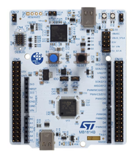

.. zephyr:board:: nucleo_h503rb

Overview
********

The Nucleo-H503RB board features an ARM |reg| Cortex |reg|-M33 core-based
STM32H503RBT6 microcontroller with a wide range of connectivity support and
configurations.
Here are some highlights of the Nucleo-H503RB board:

- STM32H503RB microcontroller featuring 128 Kbytes of Flash memory and 32 Kbytes of
  SRAM in LQFP64 package

- Board connectors:

  - User USB Type-C |reg|
  - MIPI10 for debugging (SWD/JTAG)
  - Arduino |reg| Uno V3 connectivity (CN5, CN6, CN8, CN9)
  - ST morpho extension connector (CN7, CN10)

- Flexible board power supply:

  - ST-LINK USB VBUS
  - user USB connector
  - external sources

- On-board ST-LINK/V3EC debugger/programmer:

  - mass storage
  - Virtual COM port
  - debug port

- One user LED shared with ARDUINO |reg| Uno V3
- Two push-buttons: USER and RESET
- 32.768 kHz crystal oscillator
- 24 MHz HSE crystal oscillator

More information about the board can be found at the `NUCLEO_H503RB website`_.

Hardware
********

The STM32H503xx devices are a high-performance microcontrollers family
(STM32H5 series) based on the high-performance Arm |reg| Cortex |reg|-M33 32-bit
RISC core. They operate at a frequency of up to 250 MHz.

- Core: Arm |reg| Cortex |reg|-M33 CPU with FPU, MPU, 375 DMIPS (Dhrystone 2.1),
  and DSP instructions
- ART Accelerator

- Memories

  - 128 Kbytes of embedded flash memory with ECC, two banks of read-while-write
  - 2-Kbyte OTP (one-time programmable)
  - 32-Kbyte SRAM with ECC
  - 2 Kbytes of backup SRAM (available in the lowest power modes)

- Clock management

  - Internal oscillators: 64 MHz HSI, 48 MHz HSI48, 4 MHz CSI, 32 kHz LSI
  - Two PLLs for system clock, USB, audio, and ADC
  - External oscillators: 4 to 50 MHz HSE, 32.768 kHz LSE

- Embedded regulator (LDO)
- Up to 49 fast I/Os (most 5 V tolerant), up to 9 I/Os with independent supply down to 1.08 V

- Analog peripherals

  - 1x 12-bit ADC with up to 2.5 MSPS
  - 1x 12-bit dual-channel DAC
  - 1x ultra-low-power comparator
  - 1x operational amplifier (7 MHz bandwidth)

- 1x Digital temperature sensor

- Up to 11 timers
  - 4x 16-bit
  - 1x 32-bit
  - 2x 16-bit low-power 16-bit timers (available in Stop mode)
  - 2x watchdogs
  - 1x SysTick timer
  - RTC with HW calendar, alarms and calibration

- Up to 16x communication interfaces

  - Up to 2x I2Cs FM + interfaces (SMBus/PMBus |reg|)
  - Up to 2x I3Cs shared with I2C
  - Up to 3x USARTs (ISO7816 interface, LIN, IrDA, modem control)
  - 1x LPUART
  - Up to 3x SPIs including three muxed with full-duplex I2S
  - Up to 3x additional SPI from 3x USART when configured in synchronous mode
  - 1x FDCAN
  - 1x USB 2.0 full-speed host and device

- Two DMA controllers to offload the CPU

- Security

  - HASH (SHA-1, SHA-2), HMAC
  - True random generator
  - 96-bit unique ID
  - Active tamper

- Development support: serial wire debug (SWD) and JTAG interfaces

More information about STM32H533RE can be found here:

- `STM32H503rb on www.st.com`_
- `STM32H503 reference manual`_

Supported Features
==================

The Zephyr nucleo_h503rb board configuration supports the following hardware features:

+-----------+------------+-------------------------------------+
| Interface | Controller | Driver/Component                    |
+===========+============+=====================================+
| CLOCK     | on-chip    | reset and clock control             |
+-----------+------------+-------------------------------------+
| GPIO      | on-chip    | gpio                                |
+-----------+------------+-------------------------------------+
| I2C       | on-chip    | i2c bus                             |
+-----------+------------+-------------------------------------+
| NVIC      | on-chip    | nested vector interrupt controller  |
+-----------+------------+-------------------------------------+
| PINMUX    | on-chip    | pinmux                              |
+-----------+------------+-------------------------------------+
| RNG       | on-chip    | True Random number generator        |
+-----------+------------+-------------------------------------+
| BKP SRAM  | on-chip    | Backup SRAM                         |
+-----------+------------+-------------------------------------+
| UART      | on-chip    | serial port-polling;                |
|           |            | serial port-interrupt               |
+-----------+------------+-------------------------------------+
| WATCHDOG  | on-chip    | independent watchdog                |
+-----------+------------+-------------------------------------+

Other hardware features are not yet supported on this Zephyr port.

The default configuration can be found in the defconfig and dts files:

  - :zephyr_file:`boards/st/nucleo_h503rb/nucleo_h503rb_defconfig`
  - :zephyr_file:`boards/st/nucleo_h503rb/nucleo_h503rb.dts`

Connections and IOs
===================

Nucleo-H503RB board has 8 GPIO controllers. These controllers are responsible for pin muxing,
input/output, pull-up, etc.

For more details please refer to `STM32H5 Nucleo-64 board User Manual`_.

Default Zephyr Peripheral Mapping:
----------------------------------

- USART1 TX/RX : PB14/PB15 (Arduino USART1)
- SPI1 SCK/MISO/MOSI/NSS: PA5/PA6/PA7/PC9
- USART3 TX/RX : PA3/PA4 (VCP)
- USER_PB : PC13
- User LED (green): PA5

System Clock
------------

Nucleo H533RE System Clock could be driven by internal or external oscillator,
as well as main PLL clock. By default System clock is driven by PLL clock at
240 MHz, driven by an 24 MHz high-speed external clock.

Serial Port
-----------

Nucleo H533RE board has up to 3 U(S)ARTs. The Zephyr console output is assigned
to USART3. Default settings are 115200 8N1.

Backup SRAM
-----------

In order to test backup SRAM, you may want to disconnect VBAT from VDD_MCU.
You can do it by removing ``SB38`` jumper on the back side of the board.
VBAT can be provided via the left ST Morpho connector's pin 33.

Programming and Debugging
*************************

Nucleo-H503RB board includes an ST-LINK/V3EC embedded debug tool interface.
This probe allows to flash the board using various tools.

Applications for the ``nucleo_h503rb`` board can be built and
flashed in the usual way (see :ref:`build_an_application` and
:ref:`application_run` for more details).

OpenOCD Support
===============

For now, openocd support  for stm32h5 is not available on upstream OpenOCD.
You can check `OpenOCD official Github mirror`_.
In order to use it though, you should clone from the cutomized
`STMicroelectronics OpenOCD Github`_ and compile it following usual README guidelines.
Once it is done, you can set the OPENOCD and OPENOCD_DEFAULT_PATH variables in
:zephyr_file:`boards/st/nucleo_h563zi/board.cmake` to point the build
to the paths of the OpenOCD binary and its scripts,  before
including the common openocd.board.cmake file:

   .. code-block:: none

      set(OPENOCD "<path_to_openocd_repo>/src/openocd" CACHE FILEPATH "" FORCE)
      set(OPENOCD_DEFAULT_PATH <path_to_opneocd_repo>/tcl)
      include(${ZEPHYR_BASE}/boards/common/openocd.board.cmake)

Flashing
========

The board is configured to be flashed using west `STM32CubeProgrammer`_ runner,
so its :ref:`installation <stm32cubeprog-flash-host-tools>` is required.

Alternatively, OpencOCD or pyOCD can also be used to flash the board using
the ``--runner`` (or ``-r``) option:

.. code-block:: console

   $ west flash --runner openocd
   $ west flash --runner pyocd

For pyOCD, additional target information needs to be installed
which can be done by executing the following commands:

.. code-block:: console

   $ pyocd pack --update
   $ pyocd pack --install stm32h5

Flashing an application to Nucleo-H503RB
----------------------------------------

Connect the Nucleo-H503RB to your host computer using the USB port.
Then build and flash an application. Here is an example for the
:zephyr:code-sample:`hello_world` application.

Run a serial host program to connect with your Nucleo board:

.. code-block:: console

   $ minicom -D /dev/ttyACM0

Then build and flash the application.

.. zephyr-app-commands::
   :zephyr-app: samples/hello_world
   :board: nucleo_h503rb
   :goals: build flash

You should see the following message on the console:

.. code-block:: console

   Hello World! nucleo_h503rb/stm32h503xx

Debugging
=========

You can debug an application in the usual way. Here is an example for the
:zephyr:code-sample:`blinky` application.

.. zephyr-app-commands::
   :zephyr-app: samples/basic/blinky
   :board: nucleo_h503rb
   :goals: debug

.. _NUCLEO_H503RB website:
   https://www.st.com/en/evaluation-tools/nucleo-h503rb

.. _STM32H5 Nucleo-64 board User Manual:
   https://www.st.com/resource/en/user_manual/um3121-stm32h5-nucleo64-board-mb1814-stmicroelectronics.pdf

.. _STM32H503RB on www.st.com:
   https://www.st.com/en/microcontrollers-microprocessors/stm32h503rb

.. _STM32H503 reference manual:
   https://www.st.com/resource/en/reference_manual/rm0492-stm32h503-line-armbased-32bit-mcus-stmicroelectronics.pdf

.. _STM32CubeProgrammer:
   https://www.st.com/en/development-tools/stm32cubeprog.html

.. _OpenOCD official Github mirror:
   https://github.com/openocd-org/openocd/

.. _STMicroelectronics OpenOCD Github:
   https://github.com/STMicroelectronics/OpenOCD/tree/openocd-cubeide-r6
