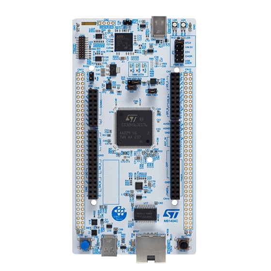

.. _nucleo_h563zi_board:

ST Nucleo H563ZI
################

Overview
********

The Nucleo H563ZI board is designed as an affordable development platform for
STMicroelectronics ARM |reg| Cortex |reg|-M33 core-based STM32H563ZIT6
microcontroller with TrustZone |reg|.
Here are some highlights of the Nucleo H563ZI board:

- STM32H563ZI microcontroller featuring 2 Mbytes of Flash memory and 640Kbyte of
  SRAM in LQFP144 package
- Board connectors:

  - USB Type-C |trade| Sink device FS
  - Ethernet RJ45 connector compliant with IEEE-802.3-2002 (depending on STM32 support)
  - ST Zio expansion connector including Arduino Uno V3 connectivity (CN7, CN8, CN9, CN10)
  - ST morpho extension connector (CN11, CN12)

- Flexible board power supply:

   - 5V_USB_STLK from ST-Link USB connector
   - VIN (7 - 12V, 0.8A) supplied via pin header CN8 pin 15 or CN11 pin 24
   - 5V_EXT on the ST morpho connector CN11 Pin 6 (5V, 1.3)
   - CHGR from a USB charger via the ST-LINK USB connector
   - USB_USER from the USB user connector (5V, 3A)
   - 3V3_EXT supplied via a pin header CN8 pin 7 or CN11 pin 16 (3.3V, 1.3A)

- On-board ST-LINK/V3EC debugger/programmer

  - mass storage
  - Virtual COM port
  - debug port

- Three users LEDs
- Two push-buttons: USER and RESET
- 32.789 kHz crystal oscillator

More information about the board can be found at the `NUCLEO_H563ZI website`_.

Hardware
********

The STM32H563xx devices are high-performance microcontrollers from the STM32H5
Series based on the high-performance Arm |reg| Cortex |reg|-M33 32-bit RISC core.
They operate at a frequency of up to 250 MHz.

- Core: ARM |reg| 32-bit Cortex |reg| -M33 CPU with TrustZone |reg| and FPU.
- Performance benchmark:

  - 375 DMPIS/MHz (Dhrystone 2.1)

- Security

  - Arm |reg| TrustZone |reg| with ARMv8-M mainline security extension
  - Up to 8 configurable SAU regions
  - TrustZone |reg| aware and securable peripherals
  - Flexible lifecycle scheme with secure debug authentication
  - SFI (secure firmware installation)
  - Secure firmware upgrade support with TF-M
  - HASH hardware accelerator
  - True random number generator, NIST SP800-90B compliant
  - 96-bit unique ID
  - Active tampers

- Clock management:

  - 25 MHz crystal oscillator (HSE)
  - 32 kHz crystal oscillator for RTC (LSE)
  - Internal 64 MHz (HSI) trimmable by software
  - Internal low-power 32 kHz RC (LSI)( |plusminus| 5%)
  - Internal 4 MHz oscillator (CSI), trimmable by software
  - Internal 48 MHz (HSI48) with recovery system
  - 3 PLLs for system clock, USB, audio, ADC

- Power management

  - Embedded regulator (LDO) with three configurable range output to supply the digital circuitry
  - Embedded SMPS step-down converter

- RTC with HW calendar, alarms and calibration
- Up to 139 fast I/Os, most 5 V-tolerant, up to 10 I/Os with independent supply down to 1.08 V
- Up to 16 timers and 2 watchdogs

  - 12x 16-bit
  - 2x 32-bit timers with up to 4 IC/OC/PWM or pulse counter and quadrature (incremental) encoder input
  - 6x 16-bit low-power 16-bit timers (available in Stop mode)
  - 2x watchdogs
  - 2x SysTick timer

- Memories

  - Up to 2 MB Flash, 2 banks read-while-write
  - 1 Kbyte OTP (one-time programmable)
  - 640 KB of SRAM including 64 KB with hardware parity check and 320 Kbytes with flexible ECC
  - 4 Kbytes of backup SRAM available in the lowest power modes
  - Flexible external memory controller with up to 16-bit data bus: SRAM, PSRAM, FRAM, SDRAM/LPSDR SDRAM, NOR/NAND memories
  - 1x OCTOSPI memory interface with on-the-fly decryption and support for serial PSRAM/NAND/NOR, Hyper RAM/Flash frame formats
  - 2x SD/SDIO/MMC interfaces

- Rich analog peripherals (independent supply)

  - 2x 12-bit ADC with up to 5 MSPS in 12-bit
  - 1x 12-bit D/A with 2 channels
  - 1x Digital temperature sensor

- 34x communication interfaces

  - 1x USB Type-C / USB power-delivery controller
  - 1x USB 2.0 full-speed host and device
  - 4x I2C FM+ interfaces (SMBus/PMBus)
  - 1x I3C interface
  - 12x U(S)ARTS (ISO7816 interface, LIN, IrDA, modem control)
  - 1x LP UART
  - 6x SPIs including 3 muxed with full-duplex I2S
  - 5x additional SPI from 5x USART when configured in Synchronous mode
  - 2x SAI
  - 2x FDCAN
  - 1x SDMMC interface
  - 2x 16 channel DMA controllers
  - 1x 8- to 14- bit camera interface
  - 1x HDMI-CEC
  - 1x Ethernel MAC interface with DMA controller
  - 1x 16-bit parallel slave synchronous-interface

- CORDIC for trigonometric functions acceleration
- FMAC (filter mathematical accelerator)
- CRC calculation unit
- Development support: serial wire debug (SWD), JTAG, Embedded Trace Macrocell |trade|

More information about STM32H563ZI can be found here:

- `STM32H563ZI on www.st.com`_
- `STM32H563 reference manual`_

Supported Features
==================

The Zephyr nucleo_h563zi board configuration supports the following hardware features:

+-----------+------------+-------------------------------------+
| Interface | Controller | Driver/Component                    |
+===========+============+=====================================+
| ADC       | on-chip    | ADC Controller                      |
+-----------+------------+-------------------------------------+
| CAN/CANFD | on-chip    | CAN                                 |
+-----------+------------+-------------------------------------+
| CLOCK     | on-chip    | reset and clock control             |
+-----------+------------+-------------------------------------+
| DAC       | on-chip    | DAC Controller                      |
+-----------+------------+-------------------------------------+
| GPIO      | on-chip    | gpio                                |
+-----------+------------+-------------------------------------+
| NVIC      | on-chip    | nested vector interrupt controller  |
+-----------+------------+-------------------------------------+
| PINMUX    | on-chip    | pinmux                              |
+-----------+------------+-------------------------------------+
| PWM       | on-chip    | PWM                                 |
+-----------+------------+-------------------------------------+
| RNG       | on-chip    | True Random number generator        |
+-----------+------------+-------------------------------------+
| RTC       | on-chip    | Real Time Clock                     |
+-----------+------------+-------------------------------------+
| SPI       | on-chip    | spi bus                             |
+-----------+------------+-------------------------------------+
| I2C       | on-chip    | i2c bus                             |
+-----------+------------+-------------------------------------+
| UART      | on-chip    | serial port-polling;                |
|           |            | serial port-interrupt               |
+-----------+------------+-------------------------------------+
| WATCHDOG  | on-chip    | independent watchdog                |
+-----------+------------+-------------------------------------+
| USB       | on-chip    | USB full-speed host/device bus      |
+-----------+------------+-------------------------------------+

Other hardware features are not yet supported on this Zephyr port.

The default configuration can be found in the defconfig and dts files:

- Secure target:

  - :zephyr_file:`boards/st/nucleo_h563zi/nucleo_h563zi_defconfig`
  - :zephyr_file:`boards/st/nucleo_h563zi/nucleo_h563zi.dts`

Zephyr board options
====================

The STM32H563 is an SoC with Cortex-M33 architecture. Zephyr provides support
for building for Secure firmware.

The BOARD options are summarized below:

+----------------------+-----------------------------------------------+
|   BOARD              | Description                                   |
+======================+===============================================+
| nucleo_h563zi        | For building Secure firmware                  |
+----------------------+-----------------------------------------------+

Connections and IOs
===================

Nucleo H563ZI Board has 9 GPIO controllers. These controllers are responsible for pin muxing,
input/output, pull-up, etc.

For more details please refer to `STM32H5 Nucleo-144 board User Manual`_.

Default Zephyr Peripheral Mapping:
----------------------------------

- ADC1 channel 3 input: PA6
- ADC1 channel 15 input: PA3
- DAC1 channel 2 output: PA5
- CAN/CANFD TX/RX: PD1/PD0
- LD1 (green): PB0
- LD2 (yellow): PF4
- LD3 (red): PG4
- LPUART1 TX/RX : PB6/PB7 (Arduino LPUART1)
- SPI1 SCK/MISO/MOSI/CS: PA5/PG9/PB5/PD14
- UART3 TX/RX : PD8/PD9 (VCP)
- USER_PB : PC13

System Clock
------------

Nucleo H563ZI System Clock could be driven by internal or external oscillator,
as well as main PLL clock. By default System clock is driven by PLL clock at
240MHz, driven by 8MHz external clock provided from the STLINK-V3EC.

Serial Port
-----------

Nucleo H563ZI board has up to 12 U(S)ARTs. The Zephyr console output is assigned
to USART3. Default settings are 115200 8N1.

Programming and Debugging
*************************

Applications for the ``nucleo_h563zi`` board can be built and
flashed in the usual way (see :ref:`build_an_application` and
:ref:`application_run` for more details).

Flashing
========

Nucleo H563ZI board includes an ST-LINK/V3EC embedded debug tool interface.
This probe allows to flash the board using various tools.

Board is configured to be flashed using west STM32CubeProgrammer runner.
Installation of `STM32CubeProgrammer`_ is then required to flash the board.

Alternatively, pyocd or jlink via an external probe can also be used to flash
and debug the board if west is told to use it as runner, which can be done by
passing either or ``-r pyocd``, or ``-r jlink``.

For pyocd additional target information needs to be installed.
This can be done by executing the following commands.

.. code-block:: console

   $ pyocd pack --update
   $ pyocd pack --install stm32h5

Flashing an application to Nucleo H563ZI
------------------------------------------

Connect the Nucleo H563ZI to your host computer using the USB port.
Then build and flash an application. Here is an example for the
:ref:`hello_world` application.

Run a serial host program to connect with your Nucleo board:

.. code-block:: console

   $ minicom -D /dev/ttyACM0

Then build and flash the application.

.. zephyr-app-commands::
   :zephyr-app: samples/hello_world
   :board: nucleo_h563zi
   :goals: build flash

You should see the following message on the console:

.. code-block:: console

   Hello World! nucleo_h563zi

Debugging
=========

You can debug an application in the usual way.  Here is an example for the
:zephyr:code-sample:`blinky` application.

.. zephyr-app-commands::
   :zephyr-app: samples/basic/blinky
   :board: nucleo_h563zi
   :goals: debug

.. _NUCLEO_H563ZI website:
   https://www.st.com/en/evaluation-tools/nucleo-h563zi

.. _STM32H5 Nucleo-144 board User Manual:
   https://www.st.com/resource/en/user_manual/um3115-stm32h5-nucleo144-board-mb1404-stmicroelectronics.pdf

.. _STM32H563ZI on www.st.com:
   https://www.st.com/en/microcontrollers/stm32h563zi.html

.. _STM32H563 reference manual:
   https://www.st.com/resource/en/reference_manual/rm0481-stm32h563h573-and-stm32h562-armbased-32bit-mcus-stmicroelectronics.pdf

.. _STM32CubeProgrammer:
   https://www.st.com/en/development-tools/stm32cubeprog.html
