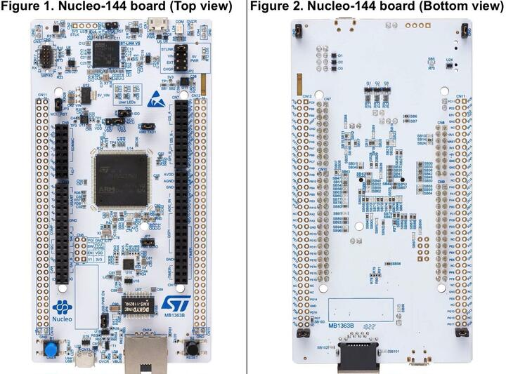

.. _nucleo_h745zi_q_board:

ST Nucleo H745ZI-Q
###################

Overview
********

The STM32 Nucleo-144 board provides an affordable and flexible way for users
to try out new concepts and build prototypes by choosing from the various combinations
of performance and power consumption features, provided by the STM32 microcontroller.
For the compatible boards, the internal or external SMPS significantly reduces power
consumption in Run mode.

The ST Zio connector, which extends the ARDUINO® Uno V3 connectivity, and
the ST morpho headers provide an easy means of expanding the functionality of the Nucleo
open development platform with a wide choice of specialized shields.
The STM32 Nucleo-144 board does not require any separate probe as it integrates
the ST-LINK V3 debugger/programmer.

The STM32 Nucleo-144 board comes with the STM32 comprehensive free software
libraries and examples available with the STM32Cube MCU Package.

Key Features

- STM32 microcontroller in LQFP144 package
- Ethernet compliant with IEEE-802.3-2002 (depending on STM32 support)
- USB OTG or full-speed device (depending on STM32 support)
- 3 user LEDs
- 2 user and reset push-buttons
- 32.768 kHz crystal oscillator
- Board connectors:

 - USB with Micro-AB
 - Ethernet RJ45 (depending on STM32 support)
 - SWDST Zio connector including Arduino* Uno V3ST
 - ST morpho expansion

- Flexible power-supply options: ST-LINK USB VBUS or external sources
- External or internal SMPS to generate Vcore logic supply
- On-board ST-LINK/V3 debugger/programmer with USB re-enumeration
- capability: mass storage, virtual COM port and debug port
- USB OTG full speed or device only
- Comprehensive free software libraries and examples available with the
  STM32Cube MCU package.
- Arm* Mbed Enabled* compliant (only for some Nucleo part numbers)



More information about the board can be found at the `Nucleo H745ZI-Q website`_.

Hardware
********

Nucleo H745ZI-Q provides the following hardware components:

- STM32H745ZI in LQFP144 package
- ARM 32-bit Cortex-M7 CPU with FPU
- ARM 32-bit Cortex-M4 CPU with FPU
- Chrom-ART Accelerator
- Hardware JPEG Codec
- 480 MHz max CPU frequency
- VDD from 1.62 V to 3.6 V
- 2 MB Flash
- 1 MB SRAM
- High-resolution timer (2.1 ns)
- 32-bit timers(2)
- 16-bit timers(12)
- SPI(6)
- I2C(4)
- I2S (3)
- USART(4)
- UART(4)
- USB OTG Full Speed and High Speed(1)
- USB OTG Full Speed(1)
- CAN FD(2)
- SAI(2)
- SPDIF_Rx(4)
- HDMI_CEC(1)
- Dual Mode Quad SPI(1)
- Camera Interface
- GPIO (up to 114) with external interrupt capability
- 16-bit ADC(3) with 36 channels / 3.6 MSPS
- 12-bit DAC with 2 channels(2)
- True Random Number Generator (RNG)
- 16-channel DMA
- LCD-TFT Controller with XGA resolution

Supported Features
==================

The Zephyr nucleo_h745zi_q board configuration supports the following hardware
features:

+-------------+------------+-------------------------------------+
| Interface   | Controller | Driver/Component                    |
+=============+============+=====================================+
| NVIC        | on-chip    | nested vector interrupt controller  |
+-------------+------------+-------------------------------------+
| UART        | on-chip    | serial port                         |
+-------------+------------+-------------------------------------+
| PINMUX      | on-chip    | pinmux                              |
+-------------+------------+-------------------------------------+
| GPIO        | on-chip    | gpio                                |
+-------------+------------+-------------------------------------+
| RTC         | on-chip    | counter                             |
+-------------+------------+-------------------------------------+
| I2C         | on-chip    | i2c                                 |
+-------------+------------+-------------------------------------+
| PWM         | on-chip    | pwm                                 |
+-------------+------------+-------------------------------------+
| ETHERNET    | on-chip    | ethernet                            |
+-------------+------------+-------------------------------------+
| RNG         | on-chip    | True Random number generator        |
+-------------+------------+-------------------------------------+
| USB OTG FS  | on-chip    | USB device                          |
+-------------+------------+-------------------------------------+

Other hardware features are not yet supported on this Zephyr port.

The default configuration per core can be found in the defconfig files:
:zephyr_file:`boards/st/nucleo_h745zi_q/nucleo_h745zi_q_stm32h745xx_m7_defconfig` and
:zephyr_file:`boards/st/nucleo_h745zi_q/nucleo_h745zi_q_stm32h745xx_m4_defconfig`

For more details please refer to `STM32 Nucleo-144 board User Manual`_.

Default Zephyr Peripheral Mapping:
----------------------------------

The Nucleo H745ZI board features a ST Zio connector (extended Arduino Uno V3)
and a ST morpho connector. Board is configured as follows:

- UART_3 TX/RX : PD8/PD9 (ST-Link Virtual Port Com)
- USER_PB : PC13
- LD1 : PB0
- LD2 : PB7
- LD3 : PB14
- I2C : PB8, PB9

System Clock
------------

Nucleo H745ZI-Q System Clock could be driven by an internal or external
oscillator, as well as the main PLL clock. By default, the System clock is
driven by the PLL clock at 480MHz, driven by an 8MHz high-speed external clock.

Serial Port
-----------

Nucleo H745ZI-Q board has 4 UARTs and 4 USARTs. The Zephyr console output is
assigned to UART3. Default settings are 115200 8N1.

Resources sharing
-----------------

The dual core nature of STM32H745 SoC requires sharing HW resources between the
two cores. This is done in 3 ways:

- **Compilation**: Clock configuration is only accessible to M7 core. M4 core only
  has access to bus clock activation and deactivation.
- **Static pre-compilation assignment**: Peripherals such as a UART are assigned in
  devicetree before compilation. The user must ensure peripherals are not assigned
  to both cores at the same time.
- **Run time protection**: Interrupt-controller and GPIO configurations could be
  accessed by both cores at run time. Accesses are protected by a hardware semaphore
  to avoid potential concurrent access issues.

Programming and Debugging
*************************

Applications for the ``nucleo_h745zi_q`` board should be built per core target,
using either ``nucleo_h745zi_q_m7`` or ```nucleo_h745zi_q_m4`` as the target
(see :ref:`build_an_application` and :ref:`application_run` for more details).

.. note::

   If using OpenOCD you will need a recent development version as the last
   official release does not support H7 series and ST-LINK V3 yet.
   Following links may be helpful: `OpenOCD installing Debug Version`_
   and `OpenOCD installing with ST-LINK V3 support`_

.. note::

   Check if your ST-LINK V3 has newest FW version. It can be done with `STM32CubeIDE`_

Flashing
========

Nucleo H745ZI-Q board includes an ST-LINK/V3 embedded debug tool interface.

Flashing operation will depend on the target to be flashed and the SoC
option bytes configuration.

By default:

  - CPU0 (Cortex-M7) boot address is set to 0x80000000 (OB: BOOT_CM7_ADD0)
  - CPU1 (Cortex-M4) boot address is set to 0x81000000 (OB: BOOT_CM4_ADD0)

Also, default out of the box board configuration enables CM7 and CM4 boot when
board is powered (Option bytes BCM7 and BCM4 are checked).
In that configuration, Kconfig boot option ``STM32H7_BOOT_CM4_CM7`` should be selected.
Zephyr flash configuration has been set to meet these default settings.

Flashing an application to STM32H745ZI M7 Core
----------------------------------------------
First, connect the NUCLEO-H745ZI-Q to your host computer using
the USB port to prepare it for flashing. Then build and flash your application.

Here is an example for the :ref:`hello_world` application.

Run a serial host program to connect with your NUCLEO-H745ZI-Q board.

.. code-block:: console

   $ minicom -b 115200 -D /dev/ttyACM0

or use screen:

.. code-block:: console

   $ screen /dev/ttyACM0 115200

Build and flash the application:

.. zephyr-app-commands::
   :zephyr-app: samples/hello_world
   :board: nucleo_h745zi_q_m7
   :goals: build flash

You should see the following message on the console:

.. code-block:: console

   $ Hello World! nucleo_h745zi_q_m7

.. note::
  Sometimes, flashing is not working. It is necessary to erase the flash
  (with STM32CubeProgrammer for example) to make it work again.

Similarly, you can build and flash samples on the M4 target. For this, please
take care of the resource sharing (UART port used for console for instance).

Here is an example for the :zephyr:code-sample:`blinky` application on M4 core.

.. zephyr-app-commands::
   :zephyr-app: samples/basic/blinky
   :board: nucleo_h745zi_q_m4
   :goals: build flash

.. note::

   Flashing both M4 and M7 and pushing RESTART button on the board leads
   to LD1 and LD2 flashing simultaneously.

Debugging
=========

You can debug an application in the usual way.  Here is an example for the
:ref:`hello_world` application.

.. zephyr-app-commands::
   :zephyr-app: samples/hello_world
   :board: nucleo_h745zi_q_m7
   :maybe-skip-config:
   :goals: debug

Debugging with west is currently not available on Cortex M4 side.
In order to debug a Zephyr application on Cortex M4 side, you can use
`STM32CubeIDE`_.

.. _Nucleo H745ZI-Q website:
   https://www.st.com/en/evaluation-tools/nucleo-h745zi-q.html

.. _STM32 Nucleo-144 board User Manual:
   https://www.st.com/resource/en/user_manual/dm00499171-stm32h7-nucleo144-boards-mb1363-stmicroelectronics.pdf

.. _STM32H745ZI on www.st.com:
   https://www.st.com/en/microcontrollers-microprocessors/stm32h745zi.html

.. _STM32H745 reference manual:
   https://www.st.com/resource/en/reference_manual/dm00176879-stm32h745755-and-stm32h747757-advanced-armbased-32bit-mcus-stmicroelectronics.pdf

.. _OpenOCD installing Debug Version:
   https://github.com/zephyrproject-rtos/openocd

.. _OpenOCD installing with ST-LINK V3 support:
   https://mbd.kleier.net/integrating-st-link-v3.html

.. _STM32CubeIDE:
   https://www.st.com/en/development-tools/stm32cubeide.html
