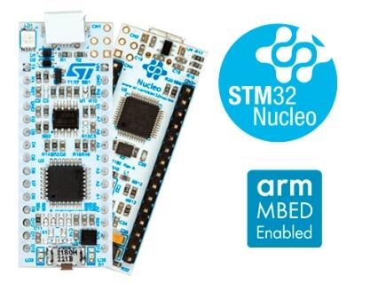

.. _nucleo_l031k6_board:

ST Nucleo L031K6
################

Overview
********
The STM32 Nucleo-32 development board with STM32L031K6 MCU, supports Arduino Nano V3 connectivity.

The STM32 Nucleo board provides an affordable, and flexible way for users to try out new concepts,
and build prototypes with the STM32 microcontroller, choosing from the various
combinations of performance, power consumption, and features.

The Arduino* Nano V3 connectivity support allow easy functionality
expansion of the STM32 Nucleo open development platform with a wide choice of
specialized shields.

The STM32 Nucleo board integrates the ST-LINK/V2-1 debugger and programmer.

The STM32 Nucleo board comes with the STM32 comprehensive software HAL library together
with various packaged software examples.

More information about the board can be found at the `Nucleo L031K6 website`_.

Hardware
********
Nucleo L031K6 provides the following hardware components:

- STM32 microcontroller in LQFP32 package
- Extension resource:

  - Arduino* Nano V3 connectivity

- On-board ST-LINK/V2-1 debugger/programmer with SWD connector:

  - Selection-mode switch to use the kit as a standalone ST-LINK/V2-1

- Flexible board power supply:

  - USB VBUS or external source (3.3V, 5V, 7 - 12V)
  - Power management access point

- Three LEDs:

  - USB communication (LD1), user LED (LD2), power LED (LD3)

- One push-button: RESET

- USB re-enumeration capability. Three different interfaces supported on USB:

  - Virtual COM port
  - Mass storage
  - Debug port

More information about STM32L031K6 can be found in the
`STM32L0x1 reference manual`_

Supported Features
==================

The Zephyr nucleo_l031k6 board configuration supports the following hardware features:

+-----------+------------+-------------------------------------+
| Interface | Controller | Driver/Component                    |
+===========+============+=====================================+
| NVIC      | on-chip    | nested vector interrupt controller  |
+-----------+------------+-------------------------------------+
| UART      | on-chip    | serial port-polling;                |
|           |            | serial port-interrupt               |
+-----------+------------+-------------------------------------+
| PINMUX    | on-chip    | pinmux                              |
+-----------+------------+-------------------------------------+
| GPIO      | on-chip    | gpio                                |
+-----------+------------+-------------------------------------+
| CLOCK     | on-chip    | reset and clock control             |
+-----------+------------+-------------------------------------+
| I2C       | on-chip    | i2c controller                      |
+-----------+------------+-------------------------------------+
| SPI       | on-chip    | spi controller                      |
+-----------+------------+-------------------------------------+
| EEPROM    | on-chip    | eeprom                              |
+-----------+------------+-------------------------------------+

Other hardware features are not yet supported in this Zephyr port.

The default configuration can be found in the defconfig file:
:zephyr_file:`boards/st/nucleo_l031k6/nucleo_l031k6_defconfig`

Connections and IOs
===================

Each of the GPIO pins can be configured by software as output (push-pull or open-drain), as
input (with or without pull-up or pull-down), or as peripheral alternate function. Most of the
GPIO pins are shared with digital or analog alternate functions. All GPIOs are high current
capable except for analog inputs.

Default Zephyr Peripheral Mapping:
----------------------------------

- UART_2 TX/RX : PA2/PA15 (ST-Link Virtual Port Com)
- I2C1 SCL/SDA : PA9/PA10 (Arduino I2C)
- SPI1 SCK/MISO/MOSI : PA5/PA6/PA7 (Arduino SPI)
- LD2       : PB3

For more details please refer to `STM32 Nucleo-32 board User Manual`_.

Programming and Debugging
*************************

Nucleo L031K6 board includes an ST-LINK/V2-1 embedded debug tool interface.

Applications for the ``nucleo_l031k6`` board configuration can be built and
flashed in the usual way (see :ref:`build_an_application` and
:ref:`application_run` for more details).

Flashing
========

The board is configured to be flashed using west `STM32CubeProgrammer`_ runner,
so its :ref:`installation <stm32cubeprog-flash-host-tools>` is required.

Alternatively, OpenOCD or JLink can also be used to flash the board using
the ``--runner`` (or ``-r``) option:

.. code-block:: console

   $ west flash --runner openocd
   $ west flash --runner jlink

Flashing an application to Nucleo L031K6
----------------------------------------

Here is an example for the :zephyr:code-sample:`blinky` application.

.. zephyr-app-commands::
   :zephyr-app: samples/basic/blinky
   :board: nucleo_l031k6
   :goals: build flash

You will see the LED blinking every second.

Debugging
=========

You can debug an application in the usual way.  Here is an example for the
:zephyr:code-sample:`hello_world` application.

.. zephyr-app-commands::
   :zephyr-app: samples/hello_world
   :board: nucleo_l031k6
   :maybe-skip-config:
   :goals: debug

References
**********

.. target-notes::

.. _Nucleo L031K6 website:
   https://www.st.com/en/evaluation-tools/nucleo-l031k6.html

.. _STM32L0x1 reference manual:
   https://www.st.com/resource/en/reference_manual/dm00108282-ultralowpower-stm32l0x1-advanced-armbased-32bit-mcus-stmicroelectronics.pdf

.. _STM32 Nucleo-32 board User Manual:
   https://www.st.com/resource/en/user_manual/dm00231744-stm32-nucleo32-boards-mb1180-stmicroelectronics.pdf

.. _STM32CubeProgrammer:
   https://www.st.com/en/development-tools/stm32cubeprog.html
