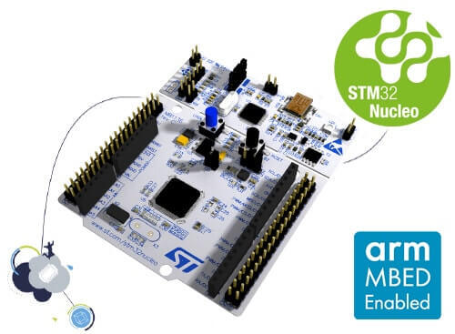
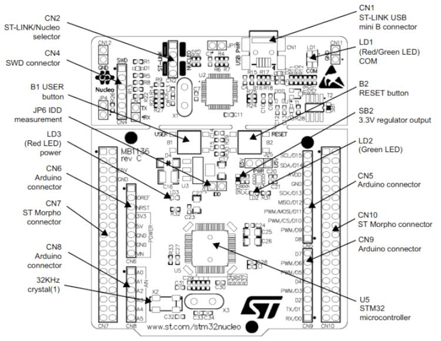

.. _nucleo_l152re_board:

ST Nucleo L152RE
################

Overview
********
The STM32 Nucleo-64 development board with STM32L152RE MCU, supports Arduino™ and ST morpho connectivity.

The STM32 Nucleo board provides an affordable, and flexible way for users to try out new concepts,
and build prototypes with the STM32 microcontroller, choosing from the various
combinations of performance, power consumption and features.

The Arduino Uno V3 connectivity support and the ST morpho headers allow easy functionality
expansion of the STM32 Nucleo open development platform with a wide choice of
specialized shields.

The STM32 Nucleo board integrates the ST-LINK/V2-1 debugger and programmer.

The STM32 Nucleo board comes with the STM32 comprehensive software HAL library together
with various packaged software examples.

More information about the board can be found at the `Nucleo L152RE website`_.

Hardware
********
Nucleo L152RE provides the following hardware components:

- STM32 microcontroller in QFP64 package
- Two types of extension resources:

  - Arduino Uno V3 connectivity
  - ST morpho extension pin headers for full access to all STM32 I/Os

- On-board ST-LINK/V2-1 debugger/programmer with SWD connector:

  - Selection-mode switch to use the kit as a standalone ST-LINK/V2-1

- Flexible board power supply:

  - USB VBUS or external source (3.3V, 5V, 7 - 12V)
  - Power management access point

- Three LEDs:

  - USB communication (LD1), user LED (LD2), power LED (LD3)

- Two push-buttons: B1 (USER/blue) and B2 (RESET/black)
- USB re-enumeration capability. Three different interfaces supported on USB:

  - Virtual COM port
  - Mass storage
  - Debug port

More information about STM32L152RE can be found here:

- `STM32L152 reference manual`_
- `STM32L152 data sheet`_

Supported Features
==================

The Zephyr nucleo_l152re board configuration supports the following hardware features:

+-----------+------------+-------------------------------------+
| Interface | Controller | Driver/Component                    |
+===========+============+=====================================+
| NVIC      | on-chip    | nested vector interrupt controller  |
+-----------+------------+-------------------------------------+
| CLOCK     | on-chip    | reset and clock control             |
+-----------+------------+-------------------------------------+
| PINMUX    | on-chip    | pinmux                              |
+-----------+------------+-------------------------------------+
| UART      | on-chip    | serial port-polling;                |
|           |            | serial port-interrupt               |
+-----------+------------+-------------------------------------+
| GPIO      | on-chip    | gpio                                |
+-----------+------------+-------------------------------------+
| I2C       | on-chip    | i2c controller                      |
+-----------+------------+-------------------------------------+
| EEPROM    | on-chip    | eeprom                              |
+-----------+------------+-------------------------------------+
| WATCHDOG  | on-chip    | independent watchdog                |
+-----------+------------+-------------------------------------+
| FLASH     | on-chip    | flash memory                        |
+-----------+------------+-------------------------------------+
| COUNTER   | on-chip    | rtc                                 |
+-----------+------------+-------------------------------------+
| ADC       | on-chip    | ADC Controller                      |
+-----------+------------+-------------------------------------+
| DAC       | on-chip    | DAC Controller                      |
+-----------+------------+-------------------------------------+
| PWM       | on-chip    | PWM                                 |
+-----------+------------+-------------------------------------+
| DMA       | on-chip    | Direct Memory Access                |
+-----------+------------+-------------------------------------+
| die-temp  | on-chip    | die temperature sensor              |
+-----------+------------+-------------------------------------+
| RTC       | on-chip    | rtc                                 |
+-----------+------------+-------------------------------------+

Other hardware features are not yet supported in this Zephyr port.

The default configuration can be found in
:zephyr_file:`boards/st/nucleo_l152re/nucleo_l152re_defconfig`

Connections and IOs
===================

Each of the GPIO pins can be configured by software as output (push-pull or open-drain), as
input (with or without pull-up or pull-down), or as peripheral alternate function. Most of the
GPIO pins are shared with digital or analog alternate functions. All GPIOs are high current
capable except for analog inputs.

Board connectors:
-----------------

Default Zephyr Peripheral Mapping:
----------------------------------

- UART_2 TX/RX : PA2/PA3 (ST-Link Virtual COM Port)
- I2C1 SCL/SDA : PB8/PB9 (Arduino I2C)
- B1 (USER/blue) : PC13
- LD1 : PA5
- DAC : PA4
- PWM_3_CH1 : PA6

For more details please refer to `STM32 Nucleo-64 board User Manual`_.

Programming and Debugging
*************************

Applications for the ``nucleo_l152re`` board configuration can be built and
flashed in the usual way (see :ref:`build_an_application` and
:ref:`application_run` for more details).

Flashing
========

Nucleo L152RE board includes an ST-LINK/V2-1 embedded debug tool interface.
This interface is supported by the openocd version included in the Zephyr SDK.

Flashing an application to Nucleo L152RE
----------------------------------------

Here is an example for the :zephyr:code-sample:`blinky` application.

.. zephyr-app-commands::
   :zephyr-app: samples/basic/blinky
   :board: nucleo_l152re
   :goals: build flash

You will see the LED blinking every second.

Debugging
=========

You can debug an application in the usual way. Here is an example for the
:ref:`hello_world` application.

.. zephyr-app-commands::
   :zephyr-app: samples/hello_world
   :board: nucleo_l152re
   :maybe-skip-config:
   :goals: debug

References
**********

.. target-notes::

.. _Nucleo L152RE website:
   https://www.st.com/en/evaluation-tools/nucleo-l152re.html

.. _STM32L152 reference manual:
   https://www.st.com/resource/en/reference_manual/cd00240193.pdf

.. _STM32L152 data sheet:
   https://www.st.com/resource/en/datasheet/stm32l152re.pdf

.. _STM32 Nucleo-64 board User Manual:
   https://www.st.com/resource/en/user_manual/dm00105823.pdf
