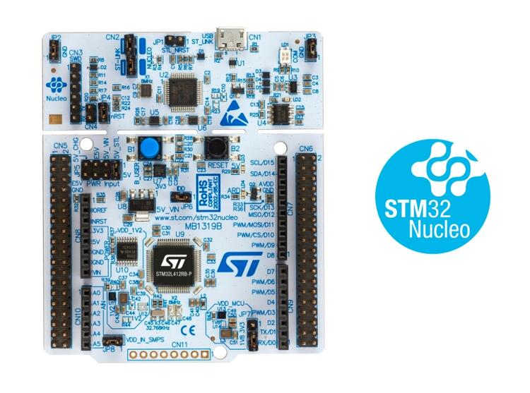
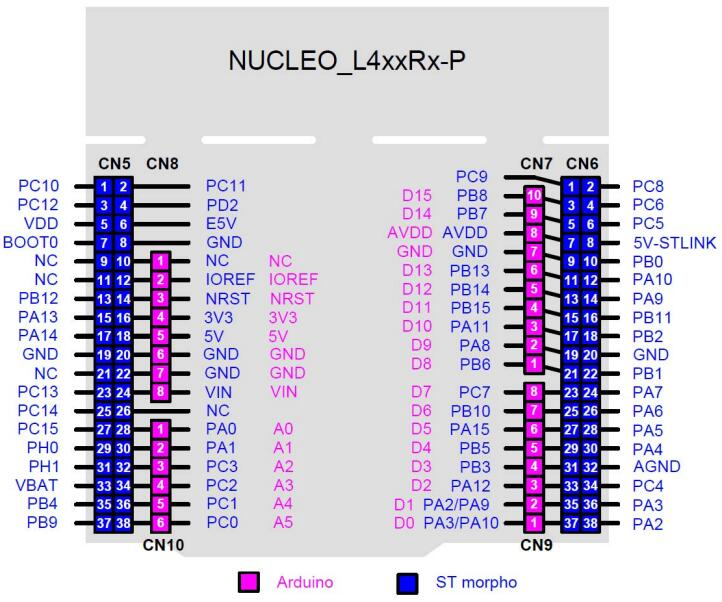

.. _nucleo_l412rb_p_board:

ST Nucleo L412RB-P
##################

Overview
********

The Nucleo L412RB board features an ARM Cortex-M4 based STM32L412RB MCU
with a wide range of connectivity support and configurations. Here are
some highlights of the Nucleo L412RB board:

- STM32 microcontroller in LQFP64 package
- 1 user LED shared with ARDUINO |reg|
- 1 user and 1 reset push-buttons
- 32.768 kHz crystal oscillator
- Two types of extension resources:

  - Arduino Uno V3 connectivity
  - ST morpho extension pin headers for full access to all STM32 I/Os

- On-board ST-LINK debugger/programmer with USB re-enumeration capability: mass storage, Virtual COM port and debug port
- Flexible power-supply options: ST-LINK, USB VBUS, or external sources

  - USB VBUS or external source(3.3V, 5V, 7 - 12V)
  - Power management access point

- Board specific features

  - External SMPS to generate Vcore logic supply
  - 24 MHz HSE
  - Board connectors:

    - External SMPS experimentation dedicated connector
    - Micro-AB or Mini-AB USB connector for the ST-LINK
    - MIPI® debug connector

  - Arm® Mbed Enabled |trade| compliant

More information about the board can be found at the `Nucleo L412RB-P website`_.

Hardware
********

Nucleo L412RB-P provides the following hardware components:

- STM32L412RBT6 in LQFP64 package
- Ultra-low-power with FlexPowerControl

  - 1.71 V to 3.6 V power supply
  - -40 °C to 85/125 °C temperature range
  - 300 nA in VBAT mode: supply for RTC and 32x32-bit backup registers
  - 16 nA Shutdown mode (4 wakeup pins)
  - 32 nA Standby mode (4 wakeup pins)
  - 245 nA Standby mode with RTC
  - 0.7 |micro| A Stop 2 mode, 0.95 |micro| A with RTC
  - 79 |micro| A/MHz run mode (LDO Mode)
  - 28 |micro| A/MHz run mode (@3.3 V SMPS Mode)
  - Batch acquisition mode (BAM)
  - 4 |micro| s wakeup from Stop mode
  - Brown out reset (BOR)
  - Interconnect matrix

- Core: Arm |reg| 32-bit Cortex |reg| -M4 CPU with FPU, Adaptive real-time accelerator (ART Accelerator |trade| ) allowing 0-wait-state execution from Flash memory, frequency up to 80 MHz, MPU, 100DMIPS and DSP instructions
- Performance benchmark

  - 1.25 DMIPS/MHz (Drystone 2.1)
  - 273.55 CoreMark |reg| (3.42 CoreMark/MHz @ 80 MHz)

- Energy benchmark

  - 442 ULPMark-CP®
  - 165 ULPMark-PP®

- Clock Sources:

  - 4 to 48 MHz crystal oscillator
  - 32 kHz crystal oscillator for RTC (LSE)
  - Internal 16 MHz factory-trimmed RC ( |plusminus| 1%)
  - Internal low-power 32 kHz RC ( |plusminus| 5%)
  - Internal multispeed 100 kHz to 48 MHz oscillator, auto-trimmed by LSE (better than |plusminus| 0.25 % accuracy)
  - Internal 48 MHz with clock recovery
  - PLL for system clock

- Up to 52 fast I/Os, most 5 V-tolerant
- RTC with HW calendar, alarms and calibration
- Up to 12 capacitive sensing channels: support touchkey, linear and rotary touch sensors
- 10x timers:

  - 1x 16-bit advanced motor-control
  - 1x 32-bit and 2x 16-bit general purpose
  - 1x 16-bit basic
  - 2x low-power 16-bit timers (available in Stop mode)
  - 2x watchdogs
  - SysTick timer

- Memories

  - 128 KB single bank Flash, proprietary code readout protection
  - 40 KB of SRAM including 8 KB with hardware parity check
  - Quad SPI memory interface with XIP capability

- Rich analog peripherals (independent supply)

  - 2x 12-bit ADC 5 Msps, up to 16-bit with hardware oversampling, 200 |micro| A/Msps
  - 2x operational amplifiers with built-in PGA
  - 1x ultra-low-power comparator
  - Accurate 2.5 V or 2.048 V reference voltage buffered output

- 12x communication interfaces
  - USB 2.0 full-speed crystal less solution with LPM and BCD
  - 3x I2C FM+(1 Mbit/s), SMBus/PMBus
  - 3x USARTs (ISO 7816, LIN, IrDA, modem)
  - 1x LPUART (Stop 2 wake-up)
  - 2x SPIs (and 1x Quad SPI)
  - IRTIM (Infrared interface)

- 14-channel DMA controller
- True random number generator
- CRC calculation unit, 96-bit unique ID
- Development support: serial wire debug (SWD), JTAG, Embedded Trace Macrocell |trade|
- All packages are ECOPACK2 compliant

Note: the current board revision is C. (MB1319C)

More information about STM32L412RB can be found here:

- `STM32L412RB on www.st.com`_
- `STM32L412 reference manual`_

Supported Features
==================

The Zephyr ``nucleo_l412rb_p`` board configuration supports the following hardware features:

+-----------+------------+-------------------------------------+
| Interface | Controller | Driver/Component                    |
+===========+============+=====================================+
| NVIC      | on-chip    | nested vector interrupt controller  |
+-----------+------------+-------------------------------------+
| UART      | on-chip    | serial port-polling;                |
|           |            | serial port-interrupt               |
+-----------+------------+-------------------------------------+
| PINMUX    | on-chip    | pinmux                              |
+-----------+------------+-------------------------------------+
| GPIO      | on-chip    | gpio                                |
+-----------+------------+-------------------------------------+
| I2C       | on-chip    | i2c                                 |
+-----------+------------+-------------------------------------+
| SPI       | on-chip    | spi                                 |
+-----------+------------+-------------------------------------+
| ADC       | on-chip    | ADC Controller                      |
+-----------+------------+-------------------------------------+
| PWM       | on-chip    | pwm                                 |
+-----------+------------+-------------------------------------+

Other hardware features are not yet supported on this Zephyr port.

The default configuration can be found in the defconfig file:
:zephyr_file:`boards/st/nucleo_l412rb_p/nucleo_l412rb_p_defconfig`

Connections and IOs
===================

Nucleo L412RB-P Board has 5 GPIO controllers (Ports A, B, C, D and H). These controllers are responsible for pin muxing,
input/output, pull-up, etc.

Available pins:
---------------

For more details please refer to `ST Nucleo L412RB-P User Manual`_.

Default Zephyr Peripheral Mapping:
----------------------------------

- LPUART1 TX/RX : PA2/PA3
- I2C1 SCL/SDA  : PB8/PB7 (Arduino I2C)
- SPI2 CS/SCK/MISO/MOSI : PA11/PB13/PB14/PB15 (Arduino SPI)
- UART1 TX/RX : PA9/PA10
- PWM_2_CH1 : PA0
- USER_PB   : PC13
- LD4 : PB13

Note: SPI2 CS pin (PB12) is not located on the Arduino connector.

System Clock
------------

Nucleo L412RB-P System Clock could be driven by internal or external oscillator,
as well as main PLL clock. By default System clock is driven by PLL clock at 80MHz,
driven by 16MHz high speed internal oscillator.

Serial Port
-----------

Nucleo L412RB-P board has 3 U(S)ARTs and 1 LPUART. The Zephyr console output is assigned to LPUART1.
Default settings are 115200 8N1.

Programming and Debugging
*************************

Nucleo L412RB-P board includes an ST-LINK/V2-1 embedded debug tool interface.

Applications for the ``nucleo_l412rb_p`` board configuration can be built and
flashed in the usual way (see :ref:`build_an_application` and
:ref:`application_run` for more details).

Flashing
========

The board is configured to be flashed using west `STM32CubeProgrammer`_ runner,
so its :ref:`installation <stm32cubeprog-flash-host-tools>` is required.

Alternatively, OpenOCD or JLink can also be used to flash the board using
the ``--runner`` (or ``-r``) option:

.. code-block:: console

   $ west flash --runner openocd
   $ west flash --runner jlink

Flashing an application to Nucleo L412RB-P
------------------------------------------

Connect the Nucleo L412RB-P to your host computer using the USB port,
then run a serial host program to connect with your Nucleo board.

.. code-block:: console

   $ minicom -D /dev/ttyACM0

Now build and flash an application. Here is an example for
:ref:`hello_world`.

.. zephyr-app-commands::
   :zephyr-app: samples/hello_world
   :board: nucleo_l412rb_p
   :goals: build flash

You should see the following message on the console:

.. code-block:: console

   $ Hello World! nucleo_l412rb_p

Debugging
=========

You can debug an application in the usual way.  Here is an example for the
:ref:`hello_world` application.

.. zephyr-app-commands::
   :zephyr-app: samples/hello_world
   :board: nucleo_l412rb_p
   :maybe-skip-config:
   :goals: debug

.. _Nucleo L412RB-P website:
   https://www.st.com/en/evaluation-tools/nucleo-l412rb-p.html

.. _ST Nucleo L412RB-P User Manual:
   https://www.st.com/resource/en/user_manual/dm00387966-stm32-nucleo-64-p-boards-stmicroelectronics.pdf

.. _STM32L412RB on www.st.com:
   https://www.st.com/en/microcontrollers-microprocessors/stm32l412rb.html

.. _STM32L412 reference manual:
   https://www.st.com/resource/en/reference_manual/dm00151940-stm32l41xxx42xxx43xxx44xxx45xxx46xxx-advanced-armbased-32bit-mcus-stmicroelectronics.pdf

.. _STM32CubeProgrammer:
   https://www.st.com/en/development-tools/stm32cubeprog.html
