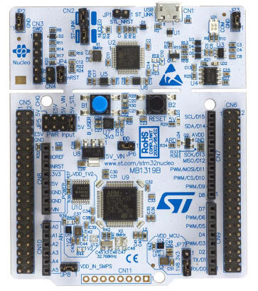
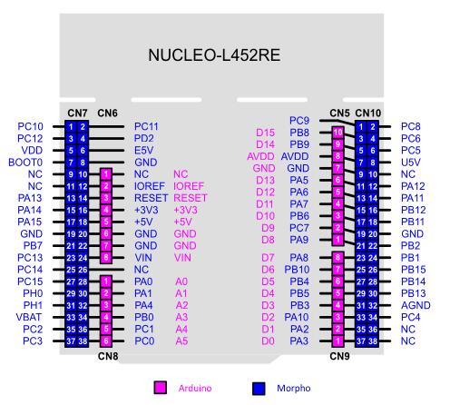
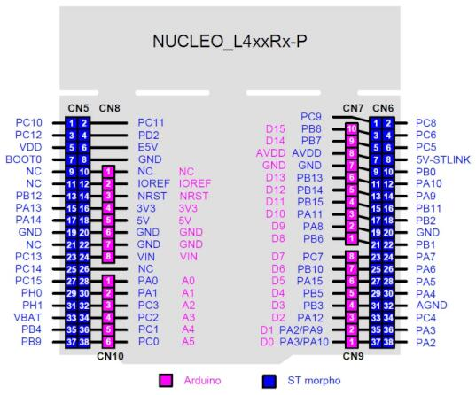

.. _nucleo_l452re_board:

ST Nucleo L452RE
################

Overview
********

The Nucleo L452RE(-P) boards feature an ARM Cortex-M4 based STM32L452RE MCU
with a wide range of connectivity support and configurations. There are two variants:

- ST Nucleo L452RE
- ST Nucleo L452RE-P

Here some highlights of these boards:

- STM32 microcontroller in LQFP64 package
- Arduino Uno V3 connectivity
- On-board ST-LINK/V2-1 debugger/programmer with SWD connector
- Flexible board power supply:

  - USB VBUS or external source(3.3V, 5V, 7 - 12V)
  - Power management access point

- Three LEDs: USB communication (LD1), user LED (LD2), power LED (LD3)
- One push-button: RESET

The main difference between the ST Nucleo L452RE and the L452RE-P (note the missing
"-P" at the end) lays in the External Switched Mode Power Supply (SMPS) included in
the P series.

More information about the boards can be found at the `Nucleo L452RE website`_ and
the `Nucleo L452RE-P website`_.

Hardware
********

The STM32L452RE SoC provides the following hardware IPs:

- Ultra-low-power with FlexPowerControl (down to 28 nA Standby mode and 84
  |micro| A/MHz run mode)
- Core: ARM |reg| 32-bit Cortex |reg| -M4 CPU with FPU, frequency up to 80 MHz,
  100DMIPS/1.25DMIPS/MHz (Dhrystone 2.1)
- Clock Sources:

  - 4 to 48 MHz crystal oscillator
  - 32 kHz crystal oscillator for RTC (LSE)
  - Internal 16 MHz factory-trimmed RC ( |plusminus| 1%)
  - Internal low-power 32 kHz RC ( |plusminus| 5%)
  - Internal multispeed 100 kHz to 48 MHz oscillator, auto-trimmed by
    LSE (better than |plusminus| 0.25 % accuracy)
  - 2 PLLs for system clock, USB, audio, ADC

- RTC with HW calendar, alarms and calibration
- Up to 3 capacitive sensing channels: support touchkey, linear and rotary touch sensors
- 12x timers:

  - 1x 16-bit advanced motor-control
  - 1x 32-bit and 3x 16-bit general purpose
  - 2x 16-bit basic
  - 2x low-power 16-bit timers (available in Stop mode)
  - 2x watchdogs
  - SysTick timer

- Up to 26 fast I/Os, most 5 V-tolerant
- Memories

  - Up to 512 KB single bank Flash, proprietary code readout protection
  - 160 KB of SRAM including 32 KB with hardware parity check
  - Quad SPI memory interface

- Rich analog peripherals (independent supply)

  - 1x 12-bit ADC 5 MSPS, up to 16-bit with hardware oversampling, 200
    |micro| A/MSPS
  - 2x 12-bit DAC, low-power sample and hold
  - 1x operational amplifiers with built-in PGA
  - 2x ultra-low-power comparators

- 17x communication interfaces
  - USB 2.0 full-speed crystal less solution with LPM and BCD
  - 1x SAI (serial audio interface)
  - 4x I2C FM+(1 Mbit/s), SMBus/PMBus
  - 3x USARTs (ISO 7816, LIN, IrDA, modem)
  - 1x UART (LIN, IrDA, modem)
  - 1x LPUART (Stop 2 wake-up)
  - 3x SPIs (and 1x Quad SPI)
  - CAN (2.0B Active) and SDMMC interface
  - IRTIM (Infrared interface)

- 14-channel DMA controller
- True random number generator
- CRC calculation unit, 96-bit unique ID
- Development support: serial wire debug (SWD), JTAG, Embedded Trace Macrocell*

More information about STM32L452RE can be found here:

- `STM32L452RE on www.st.com`_
- `STM32L452 reference manual`_

Supported Features
==================

The Zephyr nucleo_l452re board configuration supports the following hardware features:

+-----------+------------+-------------------------------------+
| Interface | Controller | Driver/Component                    |
+===========+============+=====================================+
| NVIC      | on-chip    | nested vector interrupt controller  |
+-----------+------------+-------------------------------------+
| UART      | on-chip    | serial port-polling;                |
|           |            | serial port-interrupt               |
+-----------+------------+-------------------------------------+
| PINMUX    | on-chip    | pinmux                              |
+-----------+------------+-------------------------------------+
| GPIO      | on-chip    | gpio                                |
+-----------+------------+-------------------------------------+
| I2C       | on-chip    | i2c                                 |
+-----------+------------+-------------------------------------+
| PWM       | on-chip    | pwm                                 |
+-----------+------------+-------------------------------------+
| CAN       | on-chip    | can                                 |
+-----------+------------+-------------------------------------+

.. note:: CAN feature requires CAN transceiver

Other hardware features are not yet supported on this Zephyr port.

The default configuration can be found in the defconfig file:
:zephyr_file:`boards/st/nucleo_l452re/nucleo_l452re_defconfig`

And for Nucleo L452RE-P in this defconfig file:
:zephyr_file:`boards/st/nucleo_l452re/nucleo_l452re_stm32l452xx_p_defconfig`

Connections and IOs
===================

Nucleo L452RE Board has 6 GPIO controllers. These controllers are responsible for pin muxing,
input/output, pull-up, etc.

Available pins:
---------------

For more details please refer to `ST Nucleo L452RE User Manual`_ or
`ST Nucleo L452RE-P User Manual`_.

Default Zephyr Peripheral Mapping:
----------------------------------

- UART_1_TX : PA9
- UART_1_RX : PA10
- UART_2_TX : PA2
- UART_2_RX : PA3
- I2C_1_SCL : PB8
- I2C_1_SDA : PB7
- PWM_2_CH1 : PA0
- SPI_NSS : PB6
- SPI_SCK : PA5
- SPI_MISO : PA6
- SPI_MOSI : PA7
- CAN_TX : PA11
- CAN_RX : PA12
- LD2 : PA5

System Clock
------------

Nucleo L452RE System Clock could be driven by internal or external oscillator,
as well as main PLL clock. By default System clock is driven by PLL clock at 80MHz,
driven by 16MHz high speed internal oscillator.

Serial Port
-----------

Nucleo L452RE board has 3 U(S)ARTs. The Zephyr console output is assigned to UART2.
Default settings are 115200 8N1.

Programming and Debugging
*************************

Nucleo L452RE board includes an ST-LINK/V2-1 embedded debug tool interface.

Applications for the ``nucleo_l452re`` board configuration can be built and
flashed in the usual way (see :ref:`build_an_application` and
:ref:`application_run` for more details).

Flashing
========

The board is configured to be flashed using west `STM32CubeProgrammer`_ runner,
so its :ref:`installation <stm32cubeprog-flash-host-tools>` is required.

Alternatively, OpenOCD or JLink can also be used to flash the board using
the ``--runner`` (or ``-r``) option:

.. code-block:: console

   $ west flash --runner openocd
   $ west flash --runner jlink

Flashing an application to Nucleo L452RE
----------------------------------------

Connect the Nucleo L452RE to your host computer using the USB port,
then run a serial host program to connect with your Nucleo board.

.. code-block:: console

   $ minicom -D /dev/ttyACM0

Now build and flash an application. Here is an example for
:ref:`hello_world`.

.. zephyr-app-commands::
   :zephyr-app: samples/hello_world
   :board: nucleo_l452re
   :goals: build flash

For Nucleo L452RE-P, use this command instead:

.. zephyr-app-commands::
   :zephyr-app: samples/hello_world
   :board: nucleo_l452re/stm32l452xx/p
   :goals: build flash

You should see the following message on the console:

.. code-block:: console

   $ Hello World! arm

Debugging
=========

You can debug an application in the usual way.  Here is an example for the
:ref:`hello_world` application.

.. zephyr-app-commands::
   :zephyr-app: samples/hello_world
   :board: nucleo_l452re
   :maybe-skip-config:
   :goals: debug

.. _Nucleo L452RE website:
   https://www.st.com/en/evaluation-tools/nucleo-l452re.html

.. _Nucleo L452RE-P website:
   https://www.st.com/en/evaluation-tools/nucleo-l452re-p.html

.. _ST Nucleo L452RE User Manual:
   https://www.st.com/resource/en/user_manual/dm00105823.pdf

.. _ST Nucleo L452RE-P User Manual:
   https://www.st.com/resource/en/user_manual/dm00387966.pdf

.. _STM32L452RE on www.st.com:
   https://www.st.com/en/microcontrollers-microprocessors/stm32l452re.html

.. _STM32L452 reference manual:
   https://www.st.com/resource/en/reference_manual/dm00151940.pdf

.. _STM32CubeProgrammer:
   https://www.st.com/en/development-tools/stm32cubeprog.html
