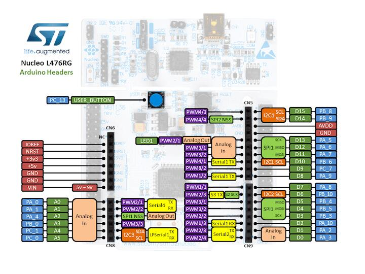
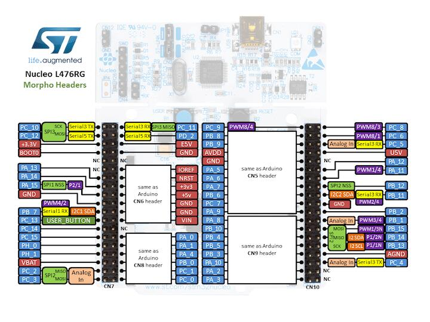

.. zephyr:board:: nucleo_l476rg

Overview
********

The Nucleo L476RG board features an ARM Cortex-M4 based STM32L476RG MCU
with a wide range of connectivity support and configurations. Here are
some highlights of the Nucleo L476RG board:

- STM32 microcontroller in QFP64 package
- Two types of extension resources:

  - Arduino Uno V3 connectivity
  - ST morpho extension pin headers for full access to all STM32 I/Os

- On-board ST-LINK/V2-1 debugger/programmer with SWD connector
- Flexible board power supply:

   - USB VBUS or external source(3.3V, 5V, 7 - 12V)
   - Power management access point

- Three LEDs: USB communication (LD1), user LED (LD2), power LED (LD3)
- Two push-buttons: USER and RESET

More information about the board can be found at the `Nucleo L476RG website`_.

Hardware
********

The STM32L476RG SoC provides the following hardware IPs:

- Ultra-low-power with FlexPowerControl (down to 130 nA Standby mode and 100 uA/MHz run mode)
- Core: ARM |reg| 32-bit Cortex |reg|-M4 CPU with FPU, frequency up to 80 MHz, 100DMIPS/1.25DMIPS/MHz (Dhrystone 2.1)
- Clock Sources:

  - 4 to 48 MHz crystal oscillator
  - 32 kHz crystal oscillator for RTC (LSE)
  - Internal 16 MHz factory-trimmed RC ( |plusminus| 1%)
  - Internal low-power 32 kHz RC ( |plusminus| 5%)
  - Internal multispeed 100 kHz to 48 MHz oscillator, auto-trimmed by
    LSE (better than  |plusminus| 0.25 % accuracy)
  - 3 PLLs for system clock, USB, audio, ADC

- RTC with HW calendar, alarms and calibration
- LCD 8 x 40 or 4 x 44 with step-up converter
- Up to 24 capacitive sensing channels: support touchkey, linear and rotary touch sensors
- 16x timers:

  - 2x 16-bit advanced motor-control
  - 2x 32-bit and 5x 16-bit general purpose
  - 2x 16-bit basic
  - 2x low-power 16-bit timers (available in Stop mode)
  - 2x watchdogs
  - SysTick timer

- Up to 114 fast I/Os, most 5 V-tolerant, up to 14 I/Os with independent supply down to 1.08 V
- Memories

  - Up to 1 MB Flash, 2 banks read-while-write, proprietary code readout protection
  - Up to 128 KB of SRAM including 32 KB with hardware parity check
  - External memory interface for static memories supporting SRAM, PSRAM, NOR and NAND memories
  - Quad SPI memory interface

- 4x digital filters for sigma delta modulator
- Rich analog peripherals (independent supply)

  - 3x 12-bit ADC 5 MSPS, up to 16-bit with hardware oversampling, 200 uA/MSPS
  - 2x 12-bit DAC, low-power sample and hold
  - 2x operational amplifiers with built-in PGA
  - 2x ultra-low-power comparators

- 18x communication interfaces

  - USB OTG 2.0 full-speed, LPM and BCD
  - 2x SAIs (serial audio interface)
  - 3x I2C FM+(1 Mbit/s), SMBus/PMBus
  - 6x USARTs (ISO 7816, LIN, IrDA, modem)
  - 3x SPIs (4x SPIs with the Quad SPI)
  - CAN (2.0B Active) and SDMMC interface
  - SWPMI single wire protocol master I/F

- 14-channel DMA controller
- True random number generator
- CRC calculation unit, 96-bit unique ID
- Development support: serial wire debug (SWD), JTAG, Embedded Trace Macrocell |trade|

More information about STM32L476RG can be found here:

- `STM32L476RG on www.st.com`_
- `STM32L476 reference manual`_

Supported Features
==================

.. zephyr:board-supported-hw::

Connections and IOs
===================

Nucleo L476RG Board has 8 GPIO controllers. These controllers are responsible for pin muxing,
input/output, pull-up, etc.

Available pins:
---------------

For more details please refer to `STM32 Nucleo-64 board User Manual`_.

Default Zephyr Peripheral Mapping:
----------------------------------

.. rst-class:: rst-columns

- UART_1 TX/RX  : PA9/PA10
- UART_2 TX/RX  : PA2/PA3 (ST-Link Virtual Port Com)
- UART_3 TX/RX  : PB10/PB11
- I2C_1 SCL/SDA : PB8/PB9 (Arduino I2C)
- I2C_3 SCL/SDA : PC0/PC1
- SPI_1 CS/SCK/MISO/MOSI : PB6/PA5/PA6/PA7 (Arduino SPI)
- SPI_2 CS/SCK/MISO/MOSI : PB12/PB13/PB14/PB15
- SPI_3 CS/SCK/MISO/MOSI : PA15/PC10/PC11/PC12
- PWM_2_CH1 : PA0
- USER_PB   : PC13
- LD2       : PA5

System Clock
------------

Nucleo L476RG System Clock could be driven by internal or external oscillator,
as well as main PLL clock. By default System clock is driven by PLL clock at 80MHz,
driven by 16MHz high speed internal oscillator.

Serial Port
-----------

Nucleo L476RG board has 6 U(S)ARTs. The Zephyr console output is assigned to UART2.
Default settings are 115200 8N1.

Programming and Debugging
*************************

.. zephyr:board-supported-runners::

Nucleo L476RG board includes an ST-LINK/V2-1 embedded debug tool interface.

Applications for the ``nucleo_l476rg`` board configuration can be built and
flashed in the usual way (see :ref:`build_an_application` and
:ref:`application_run` for more details).

Flashing
========

The board is configured to be flashed using west `STM32CubeProgrammer`_ runner,
so its :ref:`installation <stm32cubeprog-flash-host-tools>` is required.

Alternatively, OpenOCD or JLink can also be used to flash the board using
the ``--runner`` (or ``-r``) option:

.. code-block:: console

   $ west flash --runner openocd
   $ west flash --runner jlink

Flashing an application to Nucleo L476RG
----------------------------------------

Connect the Nucleo L476RG to your host computer using the USB port.
Then build and flash an application. Here is an example for the
:zephyr:code-sample:`hello_world` application.

Run a serial host program to connect with your Nucleo board:

.. code-block:: console

   $ minicom -D /dev/ttyACM0

Then build and flash the application.

.. zephyr-app-commands::
   :zephyr-app: samples/hello_world
   :board: nucleo_l476rg
   :goals: build flash

You should see the following message on the console:

.. code-block:: console

   Hello World! arm

Debugging
=========

You can debug an application in the usual way.  Here is an example for the
:zephyr:code-sample:`hello_world` application.

.. zephyr-app-commands::
   :zephyr-app: samples/hello_world
   :board: nucleo_l476rg
   :maybe-skip-config:
   :goals: debug

.. _Nucleo L476RG website:
   https://www.st.com/en/evaluation-tools/nucleo-l476rg.html

.. _STM32 Nucleo-64 board User Manual:
   https://www.st.com/resource/en/user_manual/dm00105823.pdf

.. _STM32L476RG on www.st.com:
   https://www.st.com/en/microcontrollers/stm32l476rg.html

.. _STM32L476 reference manual:
   https://www.st.com/resource/en/reference_manual/DM00083560.pdf

.. _STM32CubeProgrammer:
   https://www.st.com/en/development-tools/stm32cubeprog.html
