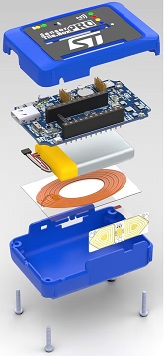

.. _sensortile_box_pro_board:

ST SensorTile.box PRO
#####################

Overview
********

The STEVAL-MKBOXPRO (SensorTile.box PRO) features an ARM Cortex-M33 based STM32U585AI MCU
and is a ready-to-use box kit for wireless IoT and wearable sensor platforms to help using
and developing apps based on remote motion and environmental sensor data.

The SensorTile.box PRO board fits into a small plastic box with a long-life rechargeable
battery, and communicates with a standard smartphone through its Bluetooth interface,
providing data coming from the sensors.

More information about the board can be found at the `SensorTile.box PRO website`_.

Supported Features
******************

The SensorTile.box PRO provides motion, environmental, and audio
sensor data through either the BLE or USB protocols to a host application running
on a smartphone/PC to implement applications such as:

- Pedometer optimized for belt positioning
- Baby crying detection with Cloud AI learning
- Barometer / environmental monitoring
- Vehicle / goods tracking
- Vibration monitoring
- Compass and inclinometer
- Sensor data logger

(see `Motion and environmental sensors`_ section for the complete lists of available
sensors on board)

Hardware
********

The STM32U585xx devices are an ultra-low-power microcontrollers family (STM32U5
Series) based on the high-performance Arm|reg| Cortex|reg|-M33 32-bit RISC core.
They operate at a frequency of up to 160 MHz.

- Ultra-low-power with FlexPowerControl (down to 300 nA Standby mode and 19.5 uA/MHz run mode)
- Core: ARM |reg| 32-bit Cortex |reg| -M33 CPU with TrustZone |reg| and FPU.
- Performance benchmark:

  - 1.5 DMPIS/MHz (Drystone 2.1)
  - 651 CoreMark |reg| (4.07 CoreMark |reg| /MHZ)

- Security and cryptography

  - Arm |reg|  TrustZone |reg| and securable I/Os memories and peripherals
  - Flexible life cycle scheme with RDP (readout protection) and password protected debug
  - Root of trust thanks to unique boot entry and secure hide protection area (HDP)
  - Secure Firmware Installation thanks to embedded Root Secure Services
  - Secure data storage with hardware unique key (HUK)
  - Secure Firmware Update support with TF-M
  - 2 AES coprocessors including one with DPA resistance
  - Public key accelerator, DPA resistant
  - On-the-fly decryption of Octo-SPI external memories
  - HASH hardware accelerator
  - Active tampers
  - True Random Number Generator NIST SP800-90B compliant
  - 96-bit unique ID
  - 512-byte One-Time Programmable for user data
  - Active tampers

- Clock management:

  - 4 to 50 MHz crystal oscillator
  - 32 kHz crystal oscillator for RTC (LSE)
  - Internal 16 MHz factory-trimmed RC ( |plusminus| 1%)
  - Internal low-power 32 kHz RC ( |plusminus| 5%)
  - 2 internal multispeed 100 kHz to 48 MHz oscillators, including one auto-trimmed by
    LSE (better than  |plusminus| 0.25 % accuracy)
  - 3 PLLs for system clock, USB, audio, ADC
  - Internal 48 MHz with clock recovery

- Power management

  - Embedded regulator (LDO)
  - Embedded SMPS step-down converter supporting switch on-the-fly and voltage scaling

- RTC with HW calendar and calibration
- Up to 136 fast I/Os, most 5 V-tolerant, up to 14 I/Os with independent supply down to 1.08 V
- Up to 24 capacitive sensing channels: support touchkey, linear and rotary touch sensors
- Up to 17 timers and 2 watchdogs

  - 2x 16-bit advanced motor-control
  - 2x 32-bit and 5 x 16-bit general purpose
  - 4x low-power 16-bit timers (available in Stop mode)
  - 2x watchdogs
  - 2x SysTick timer

- ART accelerator

  - 8-Kbyte instruction cache allowing 0-wait-state execution from Flash and
    external memories: up to 160 MHz, MPU, 240 DMIPS and DSP
  - 4-Kbyte data cache for external memories

- Memories

  - 2-Mbyte Flash memory with ECC, 2 banks read-while-write, including 512 Kbytes with 100 kcycles
  - 786-Kbyte SRAM with ECC OFF or 722-Kbyte SRAM including up to 322-Kbyte SRAM with ECC ON
  - External memory interface supporting SRAM, PSRAM, NOR, NAND and FRAM memories
  - 2 Octo-SPI memory interfaces

- Rich analog peripherals (independent supply)

  - 14-bit ADC 2.5-Msps, resolution up to 16 bits with hardware oversampling
  - 12-bit ADC 2.5-Msps, with hardware oversampling, autonomous in Stop 2 mode
  - 12-bit DAC, low-power sample and hold
  - 2 operational amplifiers with built-in PGA
  - 2 ultra-low-power comparators

- Up to 22 communication interfaces

  - USB Type-C / USB power delivery controller
  - USB OTG 2.0 full-speed controller
  - 2x SAIs (serial audio interface)
  - 4x I2C FM+(1 Mbit/s), SMBus/PMBus
  - 6x USARTs (ISO 7816, LIN, IrDA, modem)
  - 3x SPIs (5x SPIs with dual OCTOSPI in SPI mode)
  - 1x FDCAN
  - 2x SDMMC interface
  - 16- and 4-channel DMA controllers, functional in Stop mode
  - 1 multi-function digital filter (6 filters)+ 1 audio digital filter with
    sound-activity detection

- CRC calculation unit
- Development support: serial wire debug (SWD), JTAG, Embedded Trace Macrocell |trade|
- True Random Number Generator (RNG)

- Graphic features

  - Chrom-ART Accelerator (DMA2D) for enhanced graphic content creation
  - 1 digital camera interface

- Mathematical co-processor

 - CORDIC for trigonometric functions acceleration
 - FMAC (filter mathematical accelerator)

More information about STM32U585AI can be found here:

- `STM32U585 on www.st.com`_
- `STM32U585 reference manual`_

Motion and environmental sensors
================================

  - **LSM6DSV16X** 6-axis inertial measurement unit
    (`lsm6dsv16x datasheet`_)
  - **LIS2MDL** 3-axis magnetometer
    (`lis2mdl datasheet`_)
  - **LPS22DF** Altimeter / pressure sensor
    (`lps22df datasheet`_)
  - **LIS2DU12** 3-axis accelerometer
    (`lis2du12 datasheet`_)
  - **HTS221** Humidity sensor
    (`hts221 datasheet`_)
  - **STTS22H** Digital temperature sensor
    (`stts22hh datasheet`_)
  - **MP23db01HP** Microphone / audio sensor
    (`mp23db01hp datasheet`_)

Connections and IOs
===================

- 4x user LEDs

  - **led0** (Green)
  - **led1** (Red - shared with BLE)
  - **led2** (Yellow)
  - **led3** (Blue)

- 4x buttons/switch

  - **User BT1** button, available to user application
  - **User BT2** / **boot0** button, available to user application
    but useful to let the SensorTile.box PRO enter DFU mode
    if found pressed after h/w reset (see **rst** button and
    `Programming and Debugging`_ section)
  - **rst** button, used to reset the board (not available on case)
  - **power** switch, used to Power on/off the board

System Clock
============

SensorTile.box PRO System Clock could be driven by internal or external
oscillator, as well as main PLL clock. By default, the System clock is
driven by the PLL clock at 80MHz, driven by the 16MHz external oscillator.
The system clock can be boosted to 120MHz.
The internal AHB/APB1/APB2 AMBA buses are all clocked at 80MHz.

Serial Port
===========

The SensorTile.box PRO has 4 U(S)ARTs. The UART4 is connected to JTAG/SWD connector
and may be used as console.

USB interface
=============

SensorTile.box PRO can be connected as a USB device to a PC host through its USB-C connector.
The final application may use it to declare SensorTile.box PRO device as belonging to a
certain standard or vendor class, e.g. a CDC, a mass storage or a composite device with both
functions.

Console
=======

There are two possible options for Zephyr console output:

- through UART4 which is available on SWD connector (JP2). In this case a JTAG adapter
  can be used to connect SensorTile.box PRO and have both SWD and console lines available.

  To enable console and shell over UART

  - switch the console lines from cdc_acm to uart4
    (:file:`boards/st/sensortile_box_pro/sensortile_box_pro.dts`)

  - comment out the USB configuration macros
    (:file:`boards/st/sensortile_box_pro/sensortile_box_pro_defconfig`)

.. code-block:: dts
   :caption: boards/st/sensortile_box_pro/sensortile_box_pro.dts

   / {
       chosen {
          zephyr,console = &uart4;
          zephyr,shell-uart = &uart4;
          //zephyr,console = &cdc_acm_uart0;
          //zephyr,shell-uart = &cdc_acm_uart0;
        };
     };

.. code-block:: Kconfig
   :caption: boards/st/sensortile_box_pro/sensortile_box_pro_defconfig

   # Comment out following USB config lines when
   # switching console to UART
   #CONFIG_USB_DEVICE_STACK=y
   #CONFIG_USB_DEVICE_VID=0x0483
   #CONFIG_USB_DEVICE_PID=0x1235
   #CONFIG_USB_DEVICE_PRODUCT="Zephyr CDC SensorTile.box PRO"
   #CONFIG_USB_CDC_ACM_LOG_LEVEL_OFF=y
   #CONFIG_USB_DEVICE_INITIALIZE_AT_BOOT=n

- through USB as USB CDC/ACM class. This is the default case present in the board dts file.

.. code-block:: dts
   :caption: boards/st/sensortile_box_pro/sensortile_box_pro.dts

   / {
       chosen {
          zephyr,console = &cdc_acm_uart0;
        };
     };

     &zephyr_udc0 {
        cdc_acm_uart0: cdc_acm_uart0 {
                compatible = "zephyr,cdc-acm-uart";
        };
     };

Console default settings are 115200 8N1.

Programming and Debugging
*************************

There are two alternative methods of flashing ST Sensortile.box Pro board:

1. Using DFU software tools

   This method requires to enter STM32U585 ROM bootloader DFU mode
   by powering up (or reset) the board while keeping the BOOT0 button pressed.
   No additional hardware is required except a USB-C cable. This method is fully
   supported by :ref:`flash-debug-host-tools`.
   You can read more about how to enable and use the ROM bootloader by checking
   the application note `AN2606`_ (STM32U585xx section).

2. Using SWD hardware tools

   This method requires to connect additional hardware, like a ST-LINK/V3
   embedded debug tool, to the board SWD connector.

DFU flashing
============

Install dfu-util
----------------

It is recommended to use at least v0.9 of dfu-util. The package available in
Debian and Ubuntu can be quite old, so you might have to build dfu-util from source.
Information about how to get the source code and how to build it can be found
at the `DFU-UTIL website`_

Flash an Application to SensorTile.box PRO
------------------------------------------

While pressing the BOOT0 button, connect the USB-C cable to the USB OTG SensorTile.box PRO
port and to your computer. The board should be forced to enter DFU mode.

Check that the board is indeed in DFU mode:

.. code-block:: console

   $ sudo dfu-util -l
   dfu-util 0.9

   Copyright 2005-2009 Weston Schmidt, Harald Welte and OpenMoko Inc.
   Copyright 2010-2019 Tormod Volden and Stefan Schmidt
   This program is Free Software and has ABSOLUTELY NO WARRANTY
   Please report bugs to http://sourceforge.net/p/dfu-util/tickets/

   Found DFU: [0483:df11] ver=2200, devnum=74, cfg=1, intf=0, path="2-2", alt=2, name="@OTP Memory /0x1FFF7000/01*0001Ke", serial="204A325D574D"
   Found DFU: [0483:df11] ver=2200, devnum=74, cfg=1, intf=0, path="2-2", alt=1, name="@Option Bytes  /0x1FF00000/01*040 e/0x1FF01000/01*040 e", serial="204A325D574D"
   Found DFU: [0483:df11] ver=2200, devnum=74, cfg=1, intf=0, path="2-2", alt=0, name="@Internal Flash  /0x08000000/512*0004Kg", serial="204A325D574D"

You should see following confirmation on your Linux host:

.. code-block:: console

   $ dmesg
   usb 2-2: new full-speed USB device number 74 using xhci_hcd
   usb 2-2: New USB device found, idVendor=0483, idProduct=df11
   usb 2-2: New USB device strings: Mfr=1, Product=2, SerialNumber=3
   usb 2-2: Product: STM32  BOOTLOADER
   usb 2-2: Manufacturer: STMicroelectronics
   usb 2-2: SerialNumber: 204A325D574D

You can build and flash the provided sample application
(:ref:`sensortile_box_pro_sample_sensors`) that reads sensors data and outputs
values on the console.

References
**********

.. target-notes::

.. _SensorTile.box PRO website:
   https://www.st.com/en/evaluation-tools/steval-mkboxpro.html

.. _STM32U585 on www.st.com:
   https://www.st.com/en/microcontrollers-microprocessors/stm32u575-585.html

.. _STM32U585 reference manual:
   https://www.st.com/resource/en/reference_manual/rm0456-stm32u575585-armbased-32bit-mcus-stmicroelectronics.pdf

.. _lsm6dsv16x datasheet:
   https://www.st.com/en/mems-and-sensors/lsm6dsv16x.html

.. _lis2mdl datasheet:
   https://www.st.com/en/mems-and-sensors/lis2mdl.html

.. _lps22df datasheet:
   https://www.st.com/en/mems-and-sensors/lps22df.html

.. _lis2du12 datasheet:
   https://www.st.com/en/mems-and-sensors/lis2du12.html

.. _hts221 datasheet:
   https://www.st.com/en/mems-and-sensors/hts221.html

.. _stts22hh datasheet:
   https://www.st.com/en/mems-and-sensors/stts22h.html

.. _mp23db01hp datasheet:
   https://www.st.com/en/mems-and-sensors/mp23db01hp.html

.. _AN2606:
   http://www.st.com/content/ccc/resource/technical/document/application_note/b9/9b/16/3a/12/1e/40/0c/CD00167594.pdf/files/CD00167594.pdf/jcr:content/translations/en.CD00167594.pdf

.. _DFU-UTIL website:
   http://dfu-util.sourceforge.net/
