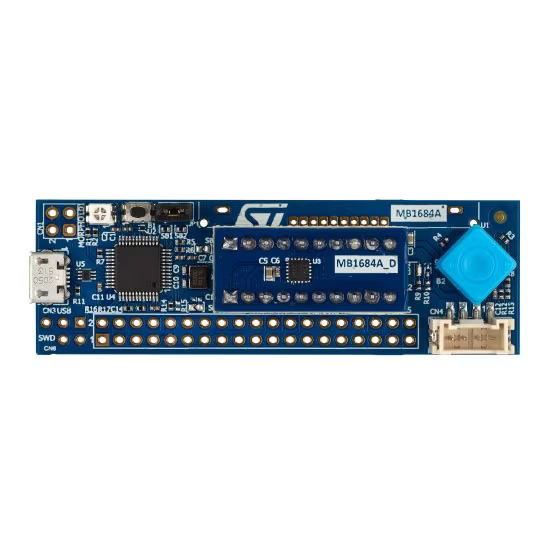

.. _stm32c0116_dk_board:

ST STM32C0116-DK Discovery Kit
##############################

Overview
********

The STM32C0116-DK Discovery kit helps to discover features of the STM32C0 Series
microcontroller in a UFQFPN20 package. This Discovery kit features one UFQFPN20
to DIL20 module designed with the STM32C011F6 microcontroller and allows the user to develop
and share applications. It includes an on-board ST-LINK/V2-1 to debug and program the embedded
STM32 microcontroller. Important board features include:

More information about the board can be found at the `STM32C0116-DK website`_.

Hardware
********

The STM32C0116-DK Discovery kit provides the following hardware components:

- STM32C011F6 microcontroller with 32 Kbytes of Flash memory and 6 Kbytes of RAM, in a UFQFPN20 package
- On-board ST-LINK/V2-1 debugger/programmer with USB re-enumeration capability: mass storage and debug port
- User LED
- Reset push-button
- 5 way joystick using a single ADC input pin
- Individual STM32 UFQFPN20 to DIL20 module
- Board connectors:

  - USB Micro-B
  - DIL20 socket
  - Dedicated LCD footprint
  - Grove (UART)
  - 2 x 10 pin headers for MCU daughterboard
  - Extension connectors

More information about STM32C011F6 can be found here:

- `STM32C011F6 on www.st.com`_
- `STM32C0x1 reference manual`_

Supported Features
==================

The Zephyr stm32c0116_dk board configuration supports the following hardware features:

+-----------+------------+-------------------------------------+
| Interface | Controller | Driver/Component                    |
+===========+============+=====================================+
| NVIC      | on-chip    | nested vector interrupt controller  |
+-----------+------------+-------------------------------------+
| UART      | on-chip    | serial port-polling;                |
|           |            | serial port-interrupt               |
+-----------+------------+-------------------------------------+
| PINMUX    | on-chip    | pinmux                              |
+-----------+------------+-------------------------------------+
| GPIO      | on-chip    | gpio                                |
+-----------+------------+-------------------------------------+
| CLOCK     | on-chip    | reset and clock control             |
+-----------+------------+-------------------------------------+
| RTC       | on-chip    | counter                             |
+-----------+------------+-------------------------------------+
| IWDG      | on-chip    | independent watchdog                |
+-----------+------------+-------------------------------------+
| WWDG      | on-chip    | window watchdog                     |
+-----------+------------+-------------------------------------+
| PWM       | on-chip    | pwm                                 |
+-----------+------------+-------------------------------------+
| ADC       | on-chip    | ADC Controller                      |
+-----------+------------+-------------------------------------+
| die-temp  | on-chip    | die temperature sensor              |
+-----------+------------+-------------------------------------+
| I2C       | on-chip    | i2c                                 |
+-----------+------------+-------------------------------------+
| DMA       | on-chip    | Direct Memory Access                |
+-----------+------------+-------------------------------------+

Other hardware features are not yet supported on Zephyr porting.

The default configuration can be found in
:zephyr_file:`boards/st/stm32c0116_dk/stm32c0116_dk_defconfig`

Pin Mapping
===========

STM32C0116-DK Discovery kit has 4 GPIO controllers. These controllers are responsible for pin muxing,
input/output, pull-up, etc.

For more details please refer to `STM32C0116-DK board User Manual`_.

Default Zephyr Peripheral Mapping:
----------------------------------

The STM32C0116 Discovery board is configured as follows:

- UART_2 TX/RX : PA2/PA3
- UART_1 TX/RX : PA9/PA10 (ST-Link Virtual Port Com)
- PWM_1_CH3 : PB6
- ADC1_CH8 : PA8
- LD3 : PB6

Programming and Debugging
*************************

STM32C0116-DK Discovery kit includes an ST-LINK/V2 embedded debug tool interface.

Applications for the ``stm32c0116_dk`` board configuration can be built and
flashed in the usual way (see :ref:`build_an_application` and
:ref:`application_run` for more details).

Flashing
========

The board is configured to be flashed using west `STM32CubeProgrammer`_ runner,
so its :ref:`installation <stm32cubeprog-flash-host-tools>` is required.

Alternatively, JLink can also be used to flash the board using
the ``--runner`` (or ``-r``) option:

.. code-block:: console

   $ west flash --runner jlink

Flashing an application to STM32C0116-DK
-------------------------------------------

First, connect the STM32C0116 Discovery kit to your host computer using
the USB port to prepare it for flashing. Then build and flash your application.

Here is an example for the :zephyr:code-sample:`hello_world` application.

.. zephyr-app-commands::
   :zephyr-app: samples/hello_world
   :board: stm32c0116_dk
   :goals: build flash

Run a serial host program to connect with your board:

.. code-block:: console

   $ minicom -D /dev/ttyACM0

You should see the following message on the console:

.. code-block:: console

   Hello World! arm

.. _STM32C0116-DK website:
   https://www.st.com/en/evaluation-tools/stm32c0116-dk.html

.. _STM32C0116-DK board User Manual:
   https://www.st.com/resource/en/user_manual/um2970-discovery-kit-with-stm32c011f6-mcu-stmicroelectronics.pdf

.. _STM32C011F6 on www.st.com:
   https://www.st.com/resource/en/datasheet/stm32c011f6.pdf

.. _STM32C0x1 reference manual:
   https://www.st.com/resource/en/reference_manual/rm0490-stm32c0x1-advanced-armbased-64bit-mcus-stmicroelectronics.pdf

.. _STM32CubeProgrammer:
   https://www.st.com/en/development-tools/stm32cubeprog.html
