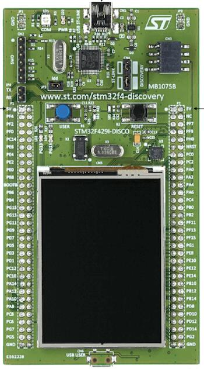

.. _stm32f429i_disc1_board:

ST STM32F429I Discovery
#######################

Overview
********

The STM32F429I-DISC1 Discovery kit features an ARM Cortex-M4 based STM32F429ZI MCU
with a wide range of connectivity support and configurations. Here are
some highlights of the STM32F429I-DISC1 board:

- STM32 microcontroller in LQFP144 package
- Extension header for all LQFP144 I/Os for quick connection to prototyping board and easy probing
- On-board ST-LINK/V2-B debugger/programmer with SWD connector
- Flexible board power supply:

       - ST-LINK/V2-1 USB connector
       - User USB FS connector
       - VIN from Arduino* compatible connectors

- Two push-buttons: USER and RESET
- USB OTG FS with micro-AB connector
- 2.4-inch QVGA LCD with MIPI DSI interface and capacitive touch screen
- 64Mbit SDRAM
- L3GD20, ST-MEMS motion sensor 3-axis digital output gyroscope
- Six LEDs

	- LD1 (red/green) for USB communication
	- LD2 (red) for 3.3 V power-on
	- Two user LEDs: LD3 (green), LD4 (red)
	- Two USB OTG LEDs: LD5 (green) VBUS and LD6 (red) OC (over-current)

More information about the board can be found at the `STM32F429I-DISC1 website`_.

Hardware
********

The STM32F429I-DISC1 Discovery kit provides the following hardware components:

- STM32F429ZIT6 in LQFP144 package
- ARM |reg| 32-bit Cortex |reg| -M4 CPU with FPU
- 180 MHz max CPU frequency
- VDD from 1.8 V to 3.6 V
- 2 MB Flash
- 256+4 KB SRAM including 64-Kbyte of core coupled memory
- GPIO with external interrupt capability
- 3x12-bit ADC with 24 channels
- 2x12-bit D/A converters
- RTC
- Advanced-control Timer
- General Purpose Timers (17)
- Watchdog Timers (2)
- USART/UART (4/4)
- I2C (3)
- SPI (6)
- SDIO
- 2xCAN
- USB 2.0 OTG FS with on-chip PHY
- USB 2.0 OTG HS/FS with dedicated DMA, on-chip full-speed PHY and ULPI
- 10/100 Ethernet MAC with dedicated DMA
- 8- to 14-bit parallel camera
- CRC calculation unit
- True random number generator
- DMA Controller

More information about STM32F429ZI can be found here:
       - `STM32F429ZI on www.st.com`_
       - `STM32F429 Reference Manual`_

Supported Features
==================

The Zephyr stm32f429i_disc1 board configuration supports the following hardware features:

+-----------+------------+-------------------------------------+
| Interface | Controller | Driver/Component                    |
+===========+============+=====================================+
| NVIC      | on-chip    | nested vector interrupt controller  |
+-----------+------------+-------------------------------------+
| UART      | on-chip    | serial port-polling;                |
|           |            | serial port-interrupt               |
+-----------+------------+-------------------------------------+
| PINMUX    | on-chip    | pinmux                              |
+-----------+------------+-------------------------------------+
| GPIO      | on-chip    | gpio                                |
+-----------+------------+-------------------------------------+
| PWM       | on-chip    | pwm                                 |
+-----------+------------+-------------------------------------+
| I2C       | on-chip    | i2c                                 |
+-----------+------------+-------------------------------------+
| SPI       | on-chip    | spi                                 |
+-----------+------------+-------------------------------------+
| FMC       | on-chip    | memc (SDRAM)                        |
+-----------+------------+-------------------------------------+
| OTG_HS    | on-chip    | usbotg_hs                           |
+-----------+------------+-------------------------------------+

Other hardware features are not yet supported on Zephyr porting.

The default configuration can be found in
:zephyr_file:`boards/st/stm32f429i_disc1/stm32f429i_disc1_defconfig`

Pin Mapping
===========

The STM32F429I-DISC1 Discovery kit has 8 GPIO controllers. These controllers are responsible for pin muxing,
input/output, pull-up, etc.

For more details please refer to `STM32F429I-DISC1 board User Manual`_.

Default Zephyr Peripheral Mapping:
----------------------------------
- UART_1_TX : PA9
- UART_1_RX : PA10
- USER_PB : PA0
- LD3 : PG13
- LD4 : PG12
- I2C_1_SCL : PB8
- I2C_1_SDA : PB9
- I2C_2_SCL : PB10
- I2C_2_SDA : PB11
- I2C_3_SCL : PA8
- I2C_3_SDA : PC9
- SPI_5_CS : PF6
- SPI_5_SCK : PF7
- SPI_5_MISO : PF8
- SPI_5_MOSI : PF9
- OTG_HS_ID : PB12
- OTG_HS_DM : PB14
- OTG_HS_DP : PB15

System Clock
============

The STM32F429I-DISC1 System Clock could be driven by an internal or external oscillator,
as well as by the main PLL clock. By default the system clock is driven by the PLL clock at 168MHz,
driven by an 8MHz high speed external clock.

Serial Port
===========

The STM32F429I-DISC1 Discovery kit has up to 8 UARTs. The Zephyr console output is assigned to UART1.
The default communication settings are 115200 8N1.

USB Port
===========

The STM32F429I-DISC1 Discovery kit has a USB FS capable Micro-B port. It is connected to the on-chip
OTG_HS peripheral, but operates in FS mode only since no HS PHY is present. The board supports device
and host OTG operation, but only device mode has been tested with Zephyr at this time.

Programming and Debugging
*************************

Applications for the ``stm32f429i_disc1`` board configuration can be built
and flashed in the usual way (see :ref:`build_an_application` and
:ref:`application_run` for more details).

Flashing
========

The STM32F429I-DISC1 Discovery kit includes a ST-LINK/V2-B embedded debug tool interface.
This interface is supported by the openocd version included in Zephyr SDK.

Flashing an application to STM32F429I-DISC1
-------------------------------------------

The board is configured to be flashed using west OpenOCD runner.
Alternatively, you can use `STM32CubeProgrammer`_ (after installing it) using the ``--runner``
(or ``-r``) option:

.. code-block:: console

   $ west flash --runner stm32cubeprogrammer

First, connect the STM32F429I-DISC1 Discovery kit to your host computer using
the USB port to prepare it for flashing. Then build and flash your application.

Here is an example for the :ref:`hello_world` application.

.. zephyr-app-commands::
   :zephyr-app: samples/hello_world
   :board: stm32f429i_disc1
   :goals: build flash

Run a serial host program to connect with your board:

.. code-block:: console

   $ minicom -D /dev/ttyACM0

Then, press the RESET button (The black one), you should see the following message:

.. code-block:: console

   Hello World! arm

Debugging
=========

You can debug an application in the usual way.  Here is an example for the
:ref:`hello_world` application.

.. zephyr-app-commands::
   :zephyr-app: samples/hello_world
   :board: stm32f429i_disc1
   :goals: debug

.. _STM32F429I-DISC1 website:
   https://www.st.com/en/evaluation-tools/32f429idiscovery.html

.. _STM32F429I-DISC1 board User Manual:
   https://www.st.com/web/en/resource/technical/document/user_manual/DM00097320.pdf

.. _STM32F429ZI on www.st.com:
   https://www.st.com/en/microcontrollers/stm32f429-439.html

.. _STM32F429 Reference Manual:
   https://www.st.com/content/ccc/resource/technical/document/reference_manual/3d/6d/5a/66/b4/99/40/d4/DM00031020.pdf/files/DM00031020.pdf/jcr:content/translations/en.DM00031020.pdf

.. _STM32CubeProgrammer:
   https://www.st.com/en/development-tools/stm32cubeprog.html
