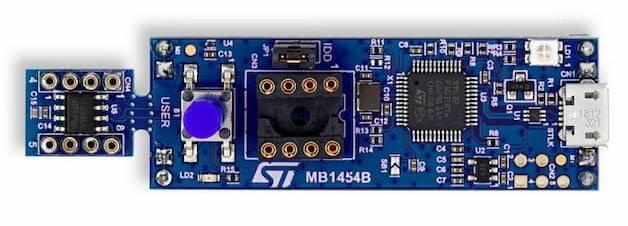

.. _stm32g0316_disco_board:

ST STM32G0316 Discovery
#######################

Overview
********

The STM32G0316-DISCO Discovery kit helps to discover features of STM32G0 in SO8 package.
This discovery kit offers an SO8 to DIL8 module designed with the STM32G031J6 microcontroller
and allows the user to develop applications. It includes an on-board ST-LINK/V2-1 to debug
and program the embedded STM32 microcontroller.

Hardware
********

- STM32G031J6 Arm |reg| Cortex |reg|-M0+ core-based microcontroller,
  featuring 32 Kbytes of Flash memory and 8 Kbytes of SRAM, in an SO8 package
- 1 user LED
- 1 reset/user push-button
- Individual and breakable STM32 SO8 to DIL8 module
- ST-LINK Micro-B USB connector
- DIL8 socket to ease programming of the STM32 MCU
- On-board ST-LINK/V2-1 debugger/programmer

For more information about the STM32G03x SoC and the STM32G0316-DISCO board, see these ST reference documents:

- `STM32G031J6 website`_
- `STM32G031 datasheet`_
- `STM32G0x1 reference manual`_
- `STM32G0316-DISCO website`_

Supported Features
==================

The Zephyr stm32g0316_disco board configuration supports the following hardware features:

+-----------+------------+-------------------------------------+
| Interface | Controller | Driver/Component                    |
+===========+============+=====================================+
| NVIC      | on-chip    | nested vector interrupt controller  |
+-----------+------------+-------------------------------------+
| UART      | on-chip    | serial port-polling;                |
|           |            | serial port-interrupt               |
+-----------+------------+-------------------------------------+
| PINMUX    | on-chip    | pinmux                              |
+-----------+------------+-------------------------------------+
| GPIO      | on-chip    | gpio                                |
+-----------+------------+-------------------------------------+
| CLOCK     | on-chip    | reset and clock control             |
+-----------+------------+-------------------------------------+
| WATCHDOG  | on-chip    | independent watchdog                |
+-----------+------------+-------------------------------------+

Other hardware features are not currently supported by the port.

The default configuration can be found in the defconfig file:
:zephyr_file:`boards/st/stm32g0316_disco/stm32g0316_disco_defconfig`

Connections and IOs
===================

Due to the small number of I/O pins on the SO8 package, multiple die I/Os are bonded
to the same package pins to maximize the number of peripherals which can be used.
Care must be taken not to set two I/Os which are connected together to conflicting
states (e.g. both as outputs, one low, the other high).

Default Zephyr Peripheral Mapping:
----------------------------------

.. rst-class:: rst-columns

- UART_1 TX/RX : PA9/PB7 (pins 5/1)
- USER_PB : PA0 (pin 4)
- LD2 : PA12 (pin 6)

Programming and Debugging
*************************

The STM32G0316-DISCO board includes an ST-LINK/V2-1 embedded debug tool interface.

Applications for the ``stm32g0316_disco`` board configuration can be built the
usual way (see :ref:`build_an_application` and :ref:`application_run` for more details).

Flashing
========

The board is configured to be flashed using west `STM32CubeProgrammer`_ runner,
so its :ref:`installation <stm32cubeprog-flash-host-tools>` is required.

Alternatively, OpenOCD or JLink can also be used to flash the board using
the ``--runner`` (or ``-r``) option:

.. code-block:: console

   $ west flash --runner openocd
   $ west flash --runner jlink

Flashing an application to the STM32G0316-DISCO
-----------------------------------------------

Here is an example for the :zephyr:code-sample:`blinky` application.

.. zephyr-app-commands::
   :zephyr-app: samples/basic/blinky
   :board: stm32g0316_disco
   :goals: build flash

You should see the LED blinking every second.

Debugging
=========

You can debug an application in the usual way.  Here is an example for the
:ref:`hello_world` application.

.. zephyr-app-commands::
   :zephyr-app: samples/hello_world
   :board: stm32g0316_disco
   :maybe-skip-config:
   :goals: debug

.. _STM32G031J6 website:
   https://www.st.com/en/microcontrollers-microprocessors/stm32g031j6.html

.. _STM32G031 datasheet:
   https://www.st.com/resource/en/datasheet/stm32g031j6.pdf

.. _STM32G0x1 reference manual:
   https://www.st.com/resource/en/reference_manual/dm00371828.pdf

.. _STM32G0316-DISCO website:
   https://www.st.com/en/evaluation-tools/stm32g0316-disco.html

.. _STM32CubeProgrammer:
   https://www.st.com/en/development-tools/stm32cubeprog.html
