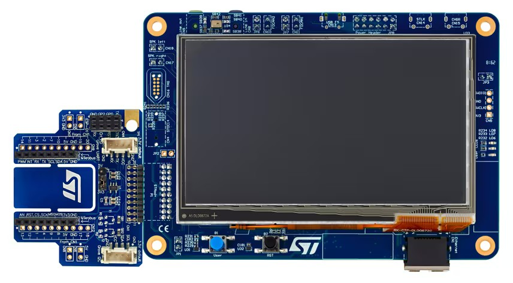

.. _stm32h745i_disco_board:

ST STM32H745I Discovery
#######################

Overview
********

The STM32H745I-DISCO Discovery kit is a complete demonstration and development
platform for STMicroelectronics Arm |reg| Cortex |reg|‑M7 and Cortex |reg|‑M4 core-based STM32H745XI microcontroller.

The full range of hardware features available on the board helps users enhance their application
development by an evaluation of almost all peripherals (such as USB OTG FS, Ethernet 10/100Mb/s,
eMMC, USART, SAI audio DAC stereo with audio jack input and output, MEMS digital microphone, SDRAM,
Quad-SPI flash memory, and RGB interface LCD with capacitive multi-touch panel). ARDUINO |reg| Uno V3
connectors provide easy connection to extension shields or daughterboards for specific applications.

STLINK-V3E is integrated into the board, as an embedded in-circuit debugger and programmer for the
STM32 MCU and the USB Virtual COM port bridge

Key Features

- Arm |reg| Cortex |reg| core-based microcontroller with 2 Mbytes of flash memory and 1 Mbyte of RAM, in a TFBGA240+25 package
- 4.3” RGB interface LCD with touch panel connector
- Ethernet compliant with IEEE-802.3-2002, and PoE
- USB OTG FS
- SAI audio codec
- One ST-MEMS digital microphone
- 2× 512-Mbit Quad-SPI NOR flash memory
- 128-Mbit SDRAM
- 4-Gbyte on-board eMMC
- 1 user and reset push-button
- Fanout daughterboard
- 2× CAN FDs
- Board connectors:

 - USB FS Micro-AB connectors
 - ST-LINK Micro-B USB connector
 - USB power Micro-B connector
 - Ethernet RJ45
 - Stereo headset jack including analog microphone input
 - Audio header for external speakers
 - Tag‑Connect |trade| (TAG) 10-pin footprint
 - Arm |reg| Cortex |reg| 10-pin 1.27 mm pitch debug connector over STDC14 footprint
 - ARDUINO |reg| Uno V3 expansion connectors
 - STMod+

- Flexible power-supply options:

 - STLINK-V3E USB connector, USB FS connector
 - 5 V delivered by RJ45 (Power over Ethernet)
 - 5 V delivered by ARDUINO |reg| or external connector
 - USB charger
 - USB power

More information about the board can be found at the `STM32H745I-DISCO website`_.
More information about STM32H747XIH6 can be found here:

- `STM32H745XI on www.st.com`_
- `STM32H745xx reference manual`_
- `STM32H745xx datasheet`_

Supported Features
==================

The current Zephyr stm32h745i_disco board configuration supports the following hardware features:

+-----------+------------+-------------------------------------+
| Interface | Controller | Driver/Component                    |
+===========+============+=====================================+
| NVIC      | on-chip    | nested vector interrupt controller  |
+-----------+------------+-------------------------------------+
| UART      | on-chip    | serial port                         |
+-----------+------------+-------------------------------------+
| PINMUX    | on-chip    | pinmux                              |
+-----------+------------+-------------------------------------+
| GPIO      | on-chip    | gpio                                |
+-----------+------------+-------------------------------------+
| RTC       | on-chip    | counter                             |
+-----------+------------+-------------------------------------+
| I2C       | on-chip    | i2c                                 |
+-----------+------------+-------------------------------------+
| PWM       | on-chip    | pwm                                 |
+-----------+------------+-------------------------------------+
| ETHERNET  | on-chip    | ethernet                            |
+-----------+------------+-------------------------------------+
| SPI       | on-chip    | spi                                 |
+-----------+------------+-------------------------------------+
| QSPI NOR  | on-chip    | off-chip flash                      |
+-----------+------------+-------------------------------------+
| FDCAN     | on-chip    | fdcan                               |
+-----------+------------+-------------------------------------+
| FMC       | on-chip    | memc (SDRAM)                        |
+-----------+------------+-------------------------------------+
| RTC       | on-chip    | rtc                                 |
+-----------+------------+-------------------------------------+

Other hardware features are not yet supported on this Zephyr port.

The default configuration per core can be found in the defconfig files:
:zephyr_file:`boards/st/stm32h745i_disco/stm32h745i_disco_stm32h745xx_m7_defconfig` and
:zephyr_file:`boards/st/stm32h745i_disco/stm32h745i_disco_stm32h745xx_m4_defconfig`

For more details please refer to `STM32H745-Disco UM`_.

Default Zephyr Peripheral Mapping:
----------------------------------

- USART_3 TX/RX : PB10/PB11 (ST-Link Virtual Port Com)
- USART_1 TX/RX : PB6/PB7 (Arduino Serial)
- SPI_2 NSS/SCK/MISO/MOSI : PB4/PD3/PI2/PB15 (Arduino SPI)
- I2C_4 SCL/SDA: PD12, PD13 (Arduino I2C)
- USER_PB : PC13
- LD1 : PI13
- LD2 : PJ2
- LD3 : PD3

System Clock
------------

STM32H745I-DISCO System Clock could be driven by an internal or external
oscillator, as well as the main PLL clock. By default, the System clock is
driven by the PLL clock at 480MHz, driven by an 25MHz high-speed external clock.

Serial Port
-----------

STM32H745I-DISCO board has 4 UARTs and 4 USARTs. The Zephyr console output is
assigned to UART3. Default settings are 115200 8N1.

Resources sharing
-----------------

The dual core nature of STM32H745 SoC requires sharing HW resources between the
two cores. This is done in 3 ways:

- **Compilation**: Clock configuration is only accessible to M7 core. M4 core only
  has access to bus clock activation and deactivation.
- **Static pre-compilation assignment**: Peripherals such as a UART are assigned in
  devicetree before compilation. The user must ensure peripherals are not assigned
  to both cores at the same time.
- **Run time protection**: Interrupt-controller and GPIO configurations could be
  accessed by both cores at run time. Accesses are protected by a hardware semaphore
  to avoid potential concurrent access issues.

Programming and Debugging
*************************

STM32H745I-DISCO board includes an ST-LINK/V3 embedded debug tool interface.

Applications for the ``stm32h745i_disco`` board should be built per core target,
using either ``stm32h745i_disco/stm32h745xx/m7`` or ``stm32h745i_disco/stm32h745xx/m4`` as the target
(see :ref:`build_an_application` and :ref:`application_run` for more details).

.. note::

   Check if the on-board ST-LINK V3 has the latest firmware version. It can be done with either `STM32CubeIDE`_ or `STM32CubeProgrammer`_

Flashing
========

The board is configured to be flashed using west `STM32CubeProgrammer`_ runner,
so its :ref:`installation <stm32cubeprog-flash-host-tools>` is required.
The target core is detected automatically.

Alternatively, OpenOCD or JLink can also be used to flash the board using
the ``--runner`` (or ``-r``) option:

.. code-block:: console

   $ west flash --runner openocd
   $ west flash --runner jlink

Flashing an application to STM32H745I-DISCO
-------------------------------------------

Flashing operation will depend on the target and the SoC option bytes configuration.

By default:

  - CPU0 (Cortex-M7) boot address is set to 0x80000000 (OB: BOOT_CM7_ADD0)
  - CPU1 (Cortex-M4) boot address is set to 0x81000000 (OB: BOOT_CM4_ADD0)

Also, the out of the box default board configuration enables CM7 and CM4 boot when
board is powered (Option bytes BCM7 and BCM4 are checked).
In that configuration, Kconfig boot option ``STM32H7_BOOT_CM4_CM7`` should be selected.
Zephyr flash configuration has been set to meet these default settings.

Flashing an application to STM32H745XI M7 Core
----------------------------------------------
First, connect the STM32H745I-DISCO to your host computer using
the USB port to prepare it for flashing. Then build and flash your application.

Here is an example for the :ref:`hello_world` application.

Run a serial host program to connect with your STM32H745I-DISCO board.

.. code-block:: console

   $ minicom -b 115200 -D /dev/ttyACM0

or use screen:

.. code-block:: console

   $ screen /dev/ttyACM0 115200

Build and flash the application:

.. zephyr-app-commands::
   :zephyr-app: samples/hello_world
   :board: stm32h745i_disco/stm32h745xx/m7
   :goals: build flash

You should see the following message on the console:

.. code-block:: console

   $ Hello World! stm32h745i_disco

.. note::
  Sometimes, flashing does not work properly. It is necessary to erase the flash
  (with STM32CubeProgrammer for example) to make it work again.

Similarly, you can build and flash samples on the M4 target. For this, please
take care of the resource sharing (UART port used for console for instance).

Here is an example for the :zephyr:code-sample:`blinky` application on M4 core.

.. zephyr-app-commands::
   :zephyr-app: samples/basic/blinky
   :board: stm32h745i_disco/stm32h745xx/m7
   :goals: build flash

.. note::

   Flashing both M4 and M7 and pushing RESTART button on the board leads
   to LD1 and LD2 flashing simultaneously.

Debugging
=========

You can debug an application in the usual way.  Here is an example for the
:ref:`hello_world` application.

.. zephyr-app-commands::
   :zephyr-app: samples/hello_world
   :board: stm32h745i_disco/stm32h745xx/m7
   :maybe-skip-config:
   :goals: debug

Debugging with west is currently not available on Cortex M4 side.
In order to debug a Zephyr application on Cortex M4 side, you can use
`STM32CubeIDE`_.

.. _STM32H745I-DISCO website:
   https://www.st.com/en/evaluation-tools/stm32h745i-disco.html

.. _STM32H745XI on www.st.com:
   https://www.st.com/en/microcontrollers-microprocessors/stm32h745xi.html

.. _STM32H745xx reference manual:
   https://www.st.com/resource/en/reference_manual/rm0399-stm32h745755-and-stm32h747757-advanced-armbased-32bit-mcus-stmicroelectronics.pdf

.. _STM32H745xx datasheet:
   https://www.st.com/resource/en/datasheet/stm32h745xi.pdf

.. _STM32H745-Disco UM:
   https://www.st.com/resource/en/user_manual/um2488-discovery-kits-with-stm32h745xi-and-stm32h750xb-mcus-stmicroelectronics.pdf

.. _STM32CubeProgrammer:
   https://www.st.com/en/development-tools/stm32cubeprog.html

.. _STM32CubeIDE:
   https://www.st.com/en/development-tools/stm32cubeide.html
