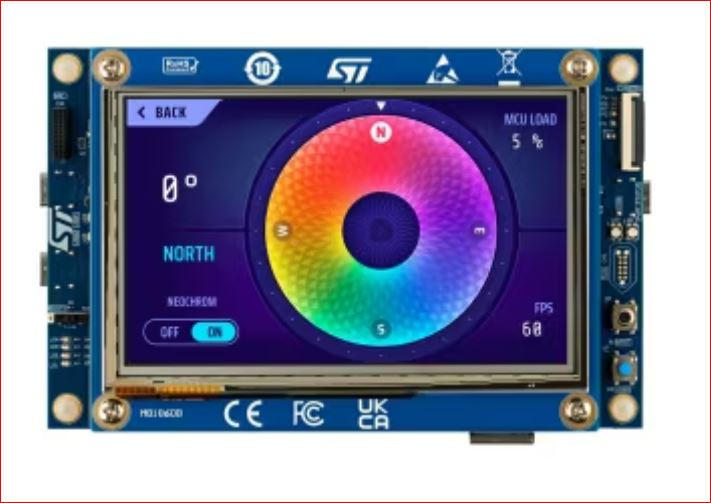

.. _stm32h7s78_dk_board:

ST STM32H7S78-DK Discovery
##########################

Overview
********

The STM32H7S78-DK Discovery kit is designed as a complete demonstration and
development platform for STMicroelectronics Arm |reg| Cortex |reg|-M7 core-based
STM32H7S7L8H6H microcontroller with TrustZone |reg|. Here are some highlights of
the STM32H7S78-DK Discovery board:

- STM32H7S7L8H6H microcontroller featuring 64Kbytes of Flash memory and 620 Kbytes of SRAM in 225-pin TFBGA package
- USB Type-C |trade| Host and device with USB power-delivery controller
- SAI Audio DAC stereo with one audio jacks for input/output,
- ST MEMS digital microphone with PDM interface
- Octo-SPI interface connected to 512Mbit Octo-SPI NORFlash memory device (MX66UW1G45GXD100 from MACRONIX)
- 10/100-Mbit Ethernet,

- Board connectors

  - STMod+ expansion connector with fan-out expansion board for Wi‑Fi |reg|, Grove and mikroBUS |trade| compatible connectors
  - Pmod |trade| expansion connector
  - Audio MEMS daughterboard expansion connector
  - ARDUINO |reg| Uno V3 expansion connector

- Flexible power-supply options

  - ST-LINK
  - USB VBUS
  - external sources

- On-board STLINK-V3E debugger/programmer with USB re-enumeration capability:

  - mass storage
  - Virtual COM port
  - debug port

- 4 user LEDs
- User and reset push-buttons

More information about the board can be found at the `STM32H7S78-DK Discovery website`_.

Hardware
********

The STM32H7S7xx devices are a high-performance microcontrollers family (STM32H7
Series) based on the high-performance Arm |reg| Cortex |reg|-M7 32-bit RISC core.
They operate at a frequency of up to 500 MHz.

- Core: ARM |reg| 32-bit Cortex |reg| -M7 CPU with TrustZone |reg| and FPU.
- Performance benchmark:

  - 1284 DMPIS/MHz (Dhrystone 2.1)

- Security

  - Arm |reg| TrustZone |reg| with ARMv8-M mainline security extension
  - Up to 8 configurable SAU regions
  - TrustZone |reg| aware and securable peripherals
  - Flexible lifecycle scheme with secure debug authentication
  - Preconfigured immutable root of trust (ST-iROT)
  - SFI (secure firmware installation)
  - Secure data storage with hardware unique key (HUK)
  - Secure firmware upgrade support with TF-M
  - 2x AES coprocessors including one with DPA resistance
  - Public key accelerator, DPA resistant
  - On-the-fly decryption of Octo-SPI external memories
  - HASH hardware accelerator
  - True random number generator, NIST SP800-90B compliant
  - 96-bit unique ID
  - Active tampers
  - True Random Number Generator (RNG) NIST SP800-90B compliant

- Clock management:

  - 24 MHz crystal oscillator (HSE)
  - 32768 Hz crystal oscillator for RTC (LSE)
  - Internal 64 MHz (HSI) trimmable by software
  - Internal low-power 32 kHz RC (LSI)( |plusminus| 5%)
  - Internal 4 MHz oscillator (CSI), trimmable by software
  - Internal 48 MHz (HSI48) with recovery system
  - 3 PLLs for system clock, USB, audio, ADC

- Power management

  - Embedded regulator (LDO) with three configurable range output to supply the digital circuitry
  - Embedded SMPS step-down converter

- RTC with HW calendar, alarms and calibration
- Up to 152 fast I/Os, most 5 V-tolerant, up to 10 I/Os with independent supply down to 1.08 V
- Up to 16 timers and 2 watchdogs

  - 16x 16-bit
  - 4x 32-bit timers with up to 4 IC/OC/PWM or pulse counter and quadrature (incremental) encoder input
  - 5x 16-bit low-power 16-bit timers (available in Stop mode)
  - 2x watchdogs
  - 1x SysTick timer

- Memories

  - Up to 64KB Flash, 2 banks read-while-write
  - 1 Kbyte OTP (one-time programmable)
  - 640 KB of SRAM including 64 KB with hardware parity check and 320 Kbytes with flexible ECC
  - 4 Kbytes of backup SRAM available in the lowest power modes
  - Flexible external memory controller with up to 16-bit data bus: SRAM, PSRAM, FRAM, SDRAM/LPSDR SDRAM, NOR/NAND memories
  - 2x OCTOSPI memory interface with on-the-fly decryption and support for serial PSRAM/NAND/NOR, Hyper RAM/Flash frame formats
  - 1x HEXASPI memory interface with on-the-fly decryption and support for serial PSRAM/NAND/NOR, Hyper RAM/Flash frame formats
  - 2x SD/SDIO/MMC interfaces

- Rich analog peripherals (independent supply)

  - 2x 12-bit ADC with up to 5 MSPS in 12-bit
  - 1x Digital temperature sensor

- 35x communication interfaces

  - 1x USB Type-C / USB power-delivery controller
  - 1x USB OTG full-speed with PHY
  - 1x USB OTG high-speed with PHY
  - 3x I2C FM+ interfaces (SMBus/PMBus)
  - 1x I3C interface
  - 7x U(S)ARTS (ISO7816 interface, LIN, IrDA, modem control)
  - 2x LP UART
  - 6x SPIs including 3 muxed with full-duplex I2S
  - 2x SAI
  - 2x FDCAN
  - 2x SD/SDIO/MMC interface
  - 2x 16 channel DMA controllers
  - 1x 8- to 16- bit camera interface
  - 1x HDMI-CEC
  - 1x Ethernel MAC interface with DMA controller
  - 1x 16-bit parallel slave synchronous-interface
  - 1x SPDIF-IN interface
  - 1x MDIO slave interface

- CORDIC for trigonometric functions acceleration
- FMAC (filter mathematical accelerator)
- CRC calculation unit
- Development support: serial wire debug (SWD), JTAG, Embedded Trace Macrocell |trade|

More information about STM32H7S7 can be found here:

- `STM32H7Sx on www.st.com`_
- `STM32H7Sx reference manual`_

Supported Features
==================

The Zephyr STM32H7S78_DK board configuration supports the following
hardware features:

+-----------+------------+-------------------------------------+
| Interface | Controller | Driver/Component                    |
+===========+============+=====================================+
| CLOCK     | on-chip    | reset and clock control             |
+-----------+------------+-------------------------------------+
| GPIO      | on-chip    | gpio                                |
+-----------+------------+-------------------------------------+
| NVIC      | on-chip    | nested vector interrupt controller  |
+-----------+------------+-------------------------------------+
| PINMUX    | on-chip    | pinmux                              |
+-----------+------------+-------------------------------------+
| RNG       | on-chip    | True Random number generator        |
+-----------+------------+-------------------------------------+
| UART      | on-chip    | serial port-polling;                |
|           |            | serial port-interrupt               |
+-----------+------------+-------------------------------------+
| WATCHDOG  | on-chip    | independent watchdog                |
+-----------+------------+-------------------------------------+
| ADC       | on-chip    | ADC Controller                      |
+-----------+------------+-------------------------------------+
| SPI       | on-chip    | spi bus                             |
+-----------+------------+-------------------------------------+

Other hardware features are not yet supported on this Zephyr port.

The default configuration can be found in the defconfig and dts files:

- Secure target:

  - :zephyr_file:`boards/st/stm32h7s78_dk/stm32h7s78_dk_defconfig`
  - :zephyr_file:`boards/st/stm32h7s78_dk/stm32h7s78_dk.dts`

Zephyr board options
====================

The STM32HS7 is a SoC with Cortex-M7 architecture. Zephyr provides support
for building for Secure firmware.

The BOARD options are summarized below:

+----------------------+-----------------------------------------------+
|   BOARD              | Description                                   |
+======================+===============================================+
| stm32h7s78_dk        | For building Secure firmware                  |
+----------------------+-----------------------------------------------+

Connections and IOs
===================

STM32H7S78-DK Discovery Board has 12 GPIO controllers. These controllers are responsible for pin muxing,
input/output, pull-up, etc.

For more details please refer to `STM32H7S78-DK Discovery board User Manual`_.

Default Zephyr Peripheral Mapping:
----------------------------------

- USART_4 TX/RX : PD1/PD0 (VCP)
- USART_7 TX/RX : PE8/PE7  (Arduino USART7)
- USER_PB : PC13
- LD1 (green) : PO1
- LD2 (orange) : PO5
- LD3 (red) : PM2
- LD4 (blue) : PM3
- ADC1 channel 6 input : PF12

System Clock
------------

STM32H7S78-DK System Clock could be driven by internal or external oscillator,
as well as main PLL clock. By default System clock is driven by PLL clock at
500MHz, driven by 24MHz external oscillator (HSE).

Serial Port
-----------

STM32H7S78-DK Discovery board has 2 U(S)ARTs. The Zephyr console output is
assigned to USART4. Default settings are 115200 8N1.

Programming and Debugging
*************************

STM32H7S78-DK Discovery board includes an ST-LINK/V3E embedded debug tool interface.

Applications for the ``stm32h7s78_dk`` board configuration can be built and
flashed in the usual way (see :ref:`build_an_application` and
:ref:`application_run` for more details).

Flashing
========

The board is configured to be flashed using west `STM32CubeProgrammer`_ runner,
so its :ref:`installation <stm32cubeprog-flash-host-tools>` is required.

Flashing an application to STM32H7S78-DK Discovery
--------------------------------------------------

Connect the STM32H7S78-DK Discovery to your host computer using the USB port.
Then build and flash an application. Here is an example for the
:zephyr:code-sample:`hello_world` application.

Run a serial host program to connect with your Nucleo board:

.. code-block:: console

   $ minicom -D /dev/ttyACM0

Then build and flash the application.

.. zephyr-app-commands::
   :zephyr-app: samples/hello_world
   :board: stm32h7s78_dk
   :goals: build flash

You should see the following message on the console:

.. code-block:: console

   Hello World! stm32h7s78_dk

Debugging
=========

You can debug an application in the usual way.  Here is an example for the
:zephyr:code-sample:`hello_world` application.

.. zephyr-app-commands::
   :zephyr-app: samples/hello_world
   :board: stm32h7s78_dk
   :maybe-skip-config:
   :goals: debug

.. _STM32H7S78-DK Discovery website:
   https://www.st.com/en/evaluation-tools/stm32h7s78-dk.html

.. _STM32H7S78-DK Discovery board User Manual:
   https://www.st.com/en/evaluation-tools/stm32h7s78-dk.html

.. _STM32H7Sx on www.st.com:
   https://www.st.com/en/evaluation-tools/stm32h7s78-dk.html

.. _STM32H7Sx reference manual:
   https://www.st.com/resource/en/reference_manual/rm0477-stm32h7rx7sx-armbased-32bit-mcus-stmicroelectronics.pdf

.. _STM32CubeProgrammer:
   https://www.st.com/en/development-tools/stm32cubeprog.html
