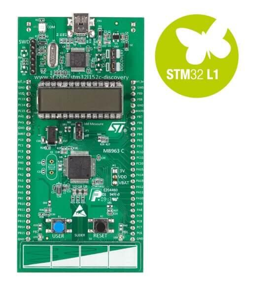

.. _stm32l1_disco_board:

ST STM32L1 Discovery
####################

Overview
********

The two generations of the STM32L1 Discovery development boards come with
an integrated ST-LINK/V2 debugger and programmer.  The boards have a
24-segment LCD and a touch slider, along with two user LEDs and a user button.
Support circuitry for measuring power consumption is also available.
It also comes with a comprehensive STM32 software HAL library and various
packaged software examples.

There
are two variants of the board:

- STM32LDISCOVERY targets STM32L152RBT6, with 128K flash, 16K RAM, 4K EEPROM
- STM32L152CDISCOVERY targets STM32L152RCT6, with 256K flash, 32K RAM, 8K EEPROM

The STM32LDISCOVERY is no longer sold, but was widely available.
stm32l1_disco configuration enables support for STM32LDISCOVERY board and
stm32l152c_disco configuration enables support for STM32L152CDISCOVERY board.

More information about the board can be found at the `STM32LDISCOVERY website`_.

Hardware
********

The STM32 Discovery board features:

- On-board ST-LINK/V2 with selection mode switch to use the kit as a standalone
  ST-LINK/V2 (with SWD connector for programming and debugging)
- Board power supply: through USB bus or from an external 5 V supply voltage
- External application power supply: 3 V and 5 V
- Four LEDs:

    - LD1 (red) for 3.3 V power on
    - LD2 (red/green) for USB communication
    - LD3 (green) for PC9 output
    - LD4 (blue) for PC8 output
- Two push buttons (user and reset)
- Extension header for all LQFP64 I/Os for quick connection to prototyping board
  and easy probing

More information about STM32L151x can be found in the `STM32L1x reference manual`_.

Supported Features
==================

The Zephyr stm32l1_disco and stm32l152c_disco board configurations support
the following hardware features:

.. list-table:: Supported hardware
   :header-rows: 1

   * - Interface
     - Controller
     - Driver/component
   * - NVIC
     - on-chip
     - nested vector interrupt controller
   * - UART
     - on-chip
     - serial port-polling
       serial port-interrupt
   * - PINMUX
     - on-chip
     - pinmux
   * - GPIO
     - on-chip
     - gpio
   * - CLOCK
     - on-chip
     - reset and clock control
   * - FLASH
     - on-chip
     - flash memory
   * - EEPROM
     - on-chip
     - eeprom
   * - WATCHDOG
     - on-chip
     - window watchdog
   * - I2C
     - on-chip
     - i2c
   * - SPI
     - on-chip
     - spi

Other hardware features are not yet supported in this Zephyr port.

The configuration of stm32l1_disco can be found in
:zephyr_file:`boards/st/stm32l1_disco/stm32l1_disco_defconfig`

Configuration of stm32l152c_disco can be found in
:zephyr_file:`boards/st/stm32l1_disco/stm32l152c_disco_defconfig`

Connections and IOs
===================

Each of the GPIO pins can be configured by software as output (push-pull or open-drain), as
input (with or without pull-up or pull-down), or as peripheral alternate function. Most of the
GPIO pins are shared with digital or analog alternate functions. All GPIOs are high current
capable except for analog inputs.

Default Zephyr Peripheral Mapping:
----------------------------------

.. rst-class:: rst-columns

- UART_1_TX : PA9
- UART_1_RX : PA10
- UART_2_TX : PA2
- UART_2_RX : PA3
- I2C1_SCL : PB6
- I2C1_SDA : PB7
- I2C2_SCL : PB10
- I2C2_SDA : PB11
- SPI1_NSS : PA4
- SPI1_SCK : PA5
- SPI1_MISO : PA6
- SPI1_MOSI : PA7
- SPI2_NSS : PB12
- SPI2_SCK : PB13
- SPI2_MISO : PB14
- SPI2_MOSI : PB15

For more details please refer to `STM32L1DISCOVERY board User Manual`_.

Programming and Debugging
*************************

STM32L1DISCOVERY and STM32L152CDISCOVERY boards include an ST-LINK/V2 embedded debug tool interface.

Applications for the ``stm32l1_disco`` board configuration can be built and
flashed in the usual way (see :ref:`build_an_application` and
:ref:`application_run` for more details).

Flashing
========

The board is configured to be flashed using west `STM32CubeProgrammer`_ runner,
so its :ref:`installation <stm32cubeprog-flash-host-tools>` is required.

Alternatively, OpenOCD or JLink can also be used to flash the board using
the ``--runner`` (or ``-r``) option:

.. code-block:: console

   $ west flash --runner openocd
   $ west flash --runner jlink

Flashing an application
-----------------------

Here is an example for the :zephyr:code-sample:`blinky` application.

.. zephyr-app-commands::
   :zephyr-app: samples/basic/blinky
   :board: stm32l1_disco
   :goals: build flash

You will see the LED blinking every second.

Debugging
=========

You can debug an application in the usual way.  Here is an example for the
:zephyr:code-sample:`blinky` application.

.. zephyr-app-commands::
   :zephyr-app: samples/basic/blinky
   :board: stm32l1_disco
   :maybe-skip-config:
   :goals: debug

References
**********

.. target-notes::

.. _STM32LDISCOVERY website:
   https://www.st.com/en/evaluation-tools/32l152cdiscovery.html

.. _STM32L1x reference manual:
   https://www.st.com/resource/en/reference_manual/cd00240193.pdf

.. _STM32L1DISCOVERY board User Manual:
   https://www.st.com/resource/en/user_manual/dm00027954.pdf

.. _STM32L152CDISCOVERY board User Manual:
   https://www.st.com/resource/en/user_manual/um1079-discovery-kit-with-stm32l152rc-mcu-stmicroelectronics.pdf

.. _STM32CubeProgrammer:
   https://www.st.com/en/development-tools/stm32cubeprog.html
